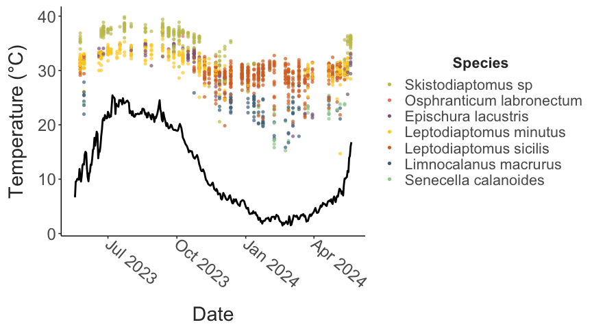
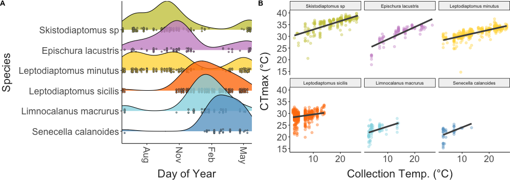
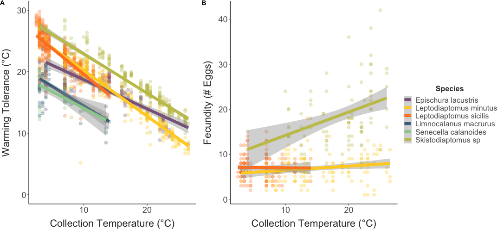
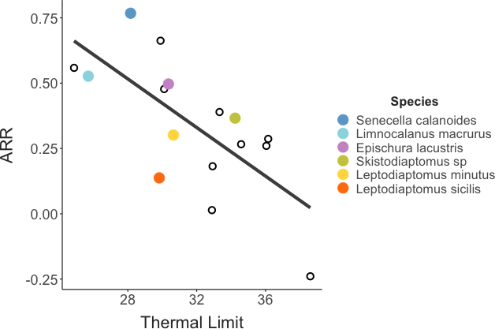
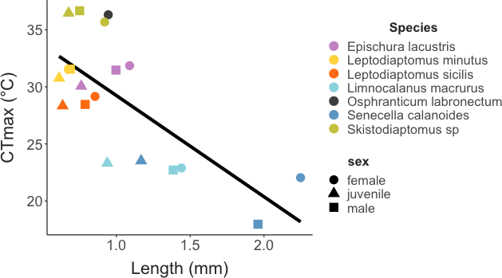
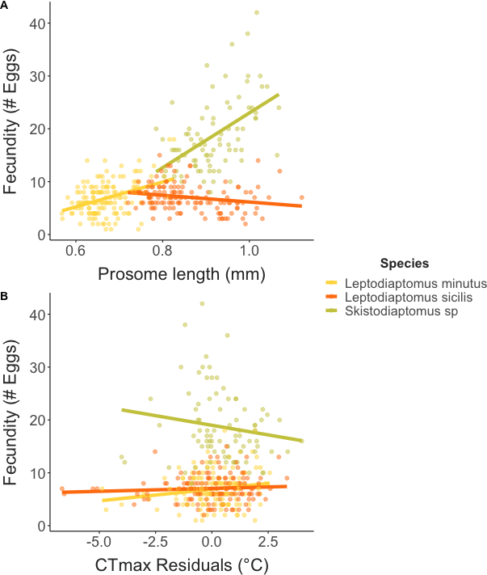

```{r echo = F}
knitr::opts_chunk$set(fig.align = "center")
```

# Introduction

Predicting the effects of climate change on biodiversity is a pressing challenge. Freshwater systems may be particularly vulnerable to anthropogenic changes (REF). SECTION ON CLIMATE CHANGE IN FRESHWATER SYSTEMS.

As temperatures increase, there have been widespread observation of shifts in community composition, population abundances, and range distributions across many groups (Khaliq et al. 2024). 
Variation in thermal performance traits across taxa may underlie these changes (Roeder ant community paper; REFS). 
Upper thermal limits are often used as proxies for thermal performance, and as a result, spatial patterns in thermal limits are often used to predict patterns in vulnerability to climate change (Pinksy paper). 

Many of these studies assume, however, that thermal limits are invariant within species. 
A growing body of literature shows this is clearly not the case. 
Local adaptation (Sasaki et al. NCC), seasonal acclimation (Bujan, Oliviere papers paper), and other processes can produce substantial intraspecific variation in thermal limits that is important to consider for robust predictions about the effects of climate change on biodiversity. 
EXPAND. 
Intraspecific variation in thermal limits, over both spatial and temporal scales, can be attributed to the effects of genetic variation and phenotypic plasticity. 
Multi-generational common garden experiments highlight that both genetic variation (Sasaki paper, Ueno paper on Drosophila) and phenotypic plasticity (Hahn and Brennan) likely play important roles in shaping how populations cope with seasonally varying temperatures. 
While these highly controlled laboratory experiments provide crucial mechanistic insight into observed variation in thermal limits, assessments under more realistic conditions are also needed. 
The idealized, stable conditions typically used in laboratory environments may mask the effects of other factors that could influence thermal limits in natural populations (e.g. food limitation, behavioral thermoregulation, photoperiod, humidity, etc.). 
Laboratory estimates of the effects of plasticity are also be subject to a number of potential methodological artifacts (Rohr et al. 2018). 
Given the important (but uncertain) role plasticity may play in mediating vulnerability to warming (Seebacher et al. 2015; Morley et al. 2019; Gunderson & Stillman ), we need to complement laboratory studies with a better understanding of thermal limits and the effects of plasticity under realistic environmental conditions. 
This is particularly important for grounding predictions about how interactions between plasticity and adaptation may shape population responses in a changing climate (Diamond and Martin 2016). 

INTRODUCE 'ACCLIMATION' HERE. 
Populations are naturally exposed to a variable environment, providing many opportunities to capture the effects of acclimation. 
Seasonal variation in temperature is particularly prominent in many locations, and may drive acclimation responses across a range of taxa (Huey and Buckley paper). 
While describing seasonal variation within a single species can provide useful insights, it is the relative acclimation capacity across community members that can best help us understand how climate change may alter ecological dynamics. 
Despite this, very few studies have examined in situ, seasonal patterns in thermal limits across community members, limiting our ability to compare the effects of acclimation. 
Those that have (REFS) suggest SUMMARIZE RESULTS HERE. 
This variation, in both thermal limits and acclimation capacity, will likely play a major role in determining 'winners and losers' in a changing climate (Somero paper, Roeder paper).   

Adding to the uncertainty about responses to climate change, among previous studies examining seasonal change in thermal limits across community members, only Houghton et al. examined patterns across the full annual temperature cycle. 
There is, in general, a need for a better understanding of the biological processes that affect winter active species, especially in aquatic taxa (Winter is coming paper, Winter grab paper, Ecology under ice paper). 
SOMETHING ABOUT GRADIENT AND SCALE IN ECOLOGY? 

Here we examine seasonal patterns in upper thermal limits of the calanoid copepod community in Lake Champlain, a large North American temperate lake, sampling at approximately weekly intervals across the entire annual temperature cycle. 
Copepods are a useful model system for studying variation in thermal limits; Widespread, diverse, and abundant throughout the year. 
This group is also ecologically important in their own right; Key ecological roles as grazers and prey, Bioindicators in freshwater systems. 
Describe Lake Champlain role specifically. 
We test the hypotheses that: 1) Species differences in thermal limits will reflect variation in the season of occurrence (winter active species will have lower thermal limits than summer active species); and 2) Within species, thermal limits will increase with increasing water temperature reflecting acclimation to the changing conditions.   

# Methods
### Field Collections and Environmental Data
Plankton were collected within the top 3 meters of Lake Champlain (coordinates) with horizontal and vertical tows of a 500 um mesh plankton net. 
These collections were not intended for quantitative measurement of abundance, so the precise volume of water filtered was not tracked. 
Surface water temperature was measured at the time of collection using a handheld thermometer. 
Plankton were transferred to an insulated flask and immediately transported to the laboratory, where the sample was divided among several 500 mL beakers and placed in a benchtop incubator (manufacturer) set to the temperature recorded at the time of collection. 
The USGS maintains a continuous temperature record at a nearby site (<500 m CHECK THIS), which we accessed to obtain records from the entire collection period for this project (DATE RANGE HERE).
Temperatures recorded at the time of collection closely matched the maximum daily temperatures from the continuous temperature record (Supp. Fig. 1). 


### Trait Measurements 
Thermal limits were measured as the critical thermal maximum (CTmax), the temperature at which individuals no longer responded to stimuli (i.e. onset of heat coma), using a previously developed method (Sasaki et al. 2023). 
The experimental set-up includes a reservoir containing a heating element and two aquarium pumps, a plexiglass water bath, and a continuous temperature recorder. 
One aquarium pump circulates water within the reservoir, while the other pumps water into the water bath. 
The water bath contains thirteen 50 mL flat-bottom glass vials, each with 10 mL of bottled spring water. 
Small temperature sensors connected to an Arduino logger were placed into three of these vials. 
Temperature was recorded every five seconds during the experimental assays. 
To begin each CTmax assay, the water in the reservoir was adjusted to match the collection temperature using either the heating elements or by adding ice. 
When the water bath was holding steady at the collection temperature, calanoid copepods were sorted from the bulk plankton tow contents and placed individually in the remaining vials. 
Assays typically measured thermal limits for 10 individuals at a time. 
After all vials were filled, copepods were given a 15 minute resting period, then the heating element was turned on to initiate the temperature ramp.
Individuals that were not active after this resting period were excluded from the assay. 
The rate of temperature increase was 0.3°C per minute at the beginning of the assay, and gradually decreased to ~0.1°C per minute. 
Individuals were monitored continuously during the ramp until normal movement ceased and the individual no longer responded to gentle stimulus (slight water movement generated by turning the vials). 
The time at that point was recorded and the vial removed from the water bath. 
The continuous temperature record was used to determine CTmax from the recorded time. 
After all individuals had reached their CTmax, the copepods were transferred to the lid of a 96 well plate and examined using a stereoscope (Olympus SZX7). 
Individuals were identified to the species level (REF), and categorized as either male, female, or juvenile. 
For females bearing egg sacs, clutch size was also recorded. 
Finally, each individual was photographed along with a scale micrometer for body size measurements. 
Body size was measured using ImageJ (REF) as prosome length. 
After the entire data set was collected, these images were also used to identify other potential traits of interest (the presence of developing eggs, the presence of lipid droplets, and visually apparent internal parasites or pathogens). 
These additional traits were scored by a single individual (MCS) to ensure consistency across the entire set of samples. 

### Data Analysis

Primary model examined the effects of species, collection temperature, and individual sex on CTmax. 

This primary model was used to estimate acclimation response ratios for each species (the species-specific slope of CTmax ~ collection temperature). 
The residuals from this model were also used to examine potential fitness costs associated with increased thermal limits. 

A secondary model for just females examined the effect of species, collection temperature, the presence of developing eggs, the presence of lipid droplets, and the presence of potential pathogens. 

We also used two approaches to examine potential drivers of acclimation. 
First, we examined the correlation between CTmax and a number of predictors (the mean, median, minimum, and maximum temperature; the mean daily minimum, maximum, and range; and the temperature range and variance) calculated for periods of time ranging from 1-60 days before collection. 
This analysis is largely speculative, so we identified the top predictor-duration combination for each species based on the correlation coefficient. 
For two species that appear to acclimate rapidly changes in temperature (the temperature measured at the time of collection was the best predictor), we also used a distributed lag non-linear model to examine potential timescales of this rapid response. 

# Results

Main figures: 
1. CTmax and lake temperature time series
2. Occurrence ridge plot and CTmax vs. temp. figure with size histogram? 
3. Warming tolerance vs. collection temp.
4. Fecundity vs. collection temperature with marginal density plots
5. ARR in the context of other measurements
6. Fecundity vs. body size and CTmax
7. Predictor duration and correlation coefficients

Main figure (CTmax vs. date)

```{r, figure1, echo = F, out.width = "450px"}
#| fig.cap = "CAPTION HERE."

 
```

Ridge plot of collection frequencies + CTmax vs. Collection Temperature

```{r, figure2, echo = F, out.width = "450px"}
#| fig.cap = "CAPTION HERE."

 #Use this when filling in figures from analysis 
```

Collection temp. regressions

```{r, figure3, echo = F, out.width = "400px"}
#| fig.cap = "CAPTION HERE."

 #Use this when filling in figures from analysis 
```

Plasticity-tolerance trade-off plot

```{r, figure4, echo = F, out.width = "300px"}
#| fig.cap = "CAPTION HERE."

 #Use this when filling in figures from analysis 
```

CTmax and Size

```{r, figure5, echo = F, out.width = "300px"}
#| fig.cap = "CAPTION HERE."

 #Use this when filling in figures from analysis 
```

Fecundity relationships (CTmax and size)

```{r, figure6, echo = F, out.width = "400px"}
#| fig.cap = "CAPTION HERE."

 #Use this when filling in figures from analysis 
```

Predictor duration and correlation comparison 

```{r, figure7, echo = F, out.width = "400px"}
#| fig.cap = "CAPTION HERE."

knitr::include_graphics("../Output/Figures/markdown/main-fig-acc-correlations-1.png") #Use this when filling in figures from analysis 
```

```{r, table, echo = F}
knitr::kable(x = 1, #Replace 1 with whatever object you want included as a table
      digits = 3, align = "c",
      caption = "CAPTION HERE")
```

# Discussion


\newpage

```{=tex}
\beginsupplement
```
# Supplementary Material

Size plots

Frequency of pathogens / egg development

```{r supp-fig-1, echo = F}
#| fig.cap = "CAPTION HERE."

plot(1)
#knitr::include_graphics("../Output/Figures/_PATH_") #Use this when filling in figures from analysis 
```
