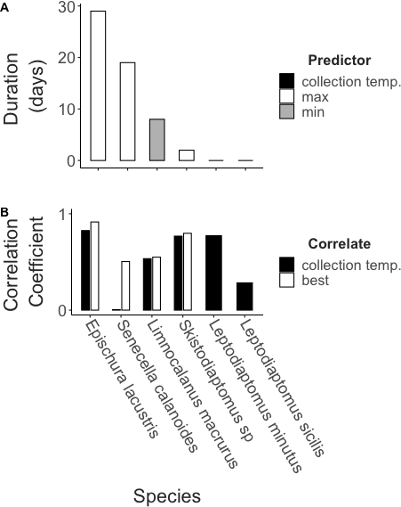

```{r echo = F}
knitr::opts_chunk$set(fig.align = "center")
```

# Introduction

Predicting the effects of climate change on biodiversity is a pressing challenge. 
Freshwater taxa may be particularly vulnerable to anthropogenic changes (REF). 
Lakes and standing waters across many regions are rapidly warming (Woolway, Woolway, Kraemer papers).
As temperatures increase, there have been widespread observation of shifts in community composition, population abundances, and range distributions across many groups (Khaliq et al. 2024). 
Variation in thermal performance traits across taxa may underlie these changes (Roeder ant community paper; REFS). 
Upper thermal limits in particualr are often used as proxies for thermal performance, and as a result, spatial patterns in thermal limits are often used to predict patterns in vulnerability to climate change (Pinksy paper). 

Many of these studies assume, however, that thermal limits are invariant within species. 
A growing body of literature shows this is clearly not the case. 
Local adaptation (Sasaki et al. NCC), seasonal acclimation (Hahn and Brennan, Bujan, Oliviere papers paper), and other processes can produce substantial intraspecific variation in thermal limits that is important to consider for robust predictions about the effects of climate change on biodiversity. 
EXPAND. 

Multi-generational common garden experiments highlight that both genetic variation and phenotypic plasticity play important roles in shaping how populations cope with seasonally varying temperatures (Hahn and Brennan; Sasaki paper, Ueno paper on Drosophila). 
Driven by both genetic and plastic mechanisms, seasonal variation in thermal limits might mediate vulnerability to both acute and long-term warming events (e.g. heatwaves and climate warming, respectively). 
While highly controlled laboratory experiments provide crucial mechanistic insight into observed variation in thermal limits, assessments under more realistic conditions are also needed. 
The idealized, stable conditions typically used in laboratory environments may mask the effects of other factors that could influence thermal limits in natural populations (e.g. food limitation, behavioral thermoregulation, photoperiod, humidity, etc.). 
Laboratory estimates of the effects of plasticity are also be subject to a number of potential methodological artifacts (Rohr et al. 2018). 
Given the important (but uncertain) role plasticity may play in mediating vulnerability to warming (Seebacher et al. 2015; Morley et al. 2019; Gunderson & Stillman 2015), we need to complement laboratory studies with a better understanding of thermal limits and the effects of plasticity under realistic environmental conditions. 
This is particularly important for grounding predictions about how interactions between plasticity and adaptation may shape population responses in a changing climate (Diamond and Martin 2016). 

INTRODUCE 'ACCLIMATION' HERE. 
Populations are naturally exposed to a variable environment, which can be leveraged to capture the effects of acclimation under realistic conditions. 
Seasonal variation in temperature is particularly prominent in many locations, and may drive acclimation responses across a range of taxa (Huey and Buckley paper). 
While describing seasonal variation within a single species can provide useful insights, it is the relative acclimation capacity across community members that can best help us understand how climate change may alter ecological dynamics. 
Despite this, very few studies have examined in situ, seasonal patterns in thermal limits across community members, limiting our ability to compare the effects of acclimation. 
Those that have (REFS) suggest SUMMARIZE RESULTS HERE. 
This variation, in both thermal limits and acclimation capacity, will likely play a major role in determining 'winners and losers' in a changing climate (Somero paper, Roeder paper).   

There is also a general need for a better understanding of the biological processes that affect winter active species, especially in aquatic taxa (Winter is coming paper, Winter grab paper, Ecology under ice paper). 
Among previous studies examining seasonal change in thermal limits across community members, only Houghton et al. examined patterns across the full annual temperature cycle. 
This has led to a limited understanding of how variation in physiological thermal limits affects ecological patterns like seasonal changes in community composition. 

Copepods are a useful model system for studying variation in thermal limits; Widespread, diverse, and abundant throughout the year. 
This group is also ecologically important in their own right; Key ecological roles as grazers and prey, Bioindicators in freshwater systems. 

Here we examine seasonal patterns in upper thermal limits of the calanoid copepod community in Lake Champlain, a large North American temperate lake, with substantial seasonal variation in temperature (REF).
Sampling at approximately weekly intervals, our study examines patterns across the entire annual temperature cycle. 
We test the hypotheses that: 1) Species differences in thermal limits will reflect variation in the season of occurrence (winter active species will have lower thermal limits than summer active species); and 2) Within species, thermal limits will increase with increasing water temperature reflecting acclimation to the changing conditions.   

# Methods
### Field Collections and Environmental Data
Plankton were collected within the top 3 meters of Lake Champlain (coordinates) with horizontal and vertical tows of a 500 um mesh plankton net. 
These collections were not intended for quantitative measurement of abundance, so the precise volume of water filtered was not tracked. 
Surface water temperature was measured at the time of collection using a handheld thermometer. 
Plankton were transferred to an insulated flask and immediately transported to the laboratory, where the sample was divided among several 500 mL beakers and placed in a benchtop incubator (manufacturer) set to the temperature recorded at the time of collection. 
The USGS maintains a continuous temperature record at a nearby site (<500 m CHECK THIS), which we accessed to obtain records from the entire collection period for this project (`r paste(range(collection_summary$collection_date), collapse = " to ")`).
Temperatures recorded at the time of collection closely matched the maximum daily temperatures from the continuous temperature record (Supp. Fig. 1). 


### Trait Measurements 
Thermal limits were measured as the critical thermal maximum (CTmax), the temperature at which individuals no longer responded to stimuli (i.e. onset of heat coma), using a previously developed method (Sasaki et al. 2023). 
The experimental set-up includes a reservoir containing a heating element and two aquarium pumps, a plexiglass water bath, and a continuous temperature recorder. 
One aquarium pump circulates water within the reservoir, while the other pumps water into the water bath. 
The water bath contains thirteen 50 mL flat-bottom glass vials, each with 10 mL of bottled spring water. 
Small temperature sensors connected to an Arduino logger were placed into three of these vials. 
Temperature was recorded every five seconds during the experimental assays. 
To begin each CTmax assay, the water in the reservoir was adjusted to match the collection temperature using either the heating elements or by adding ice. 
When the water bath was holding steady at the collection temperature, calanoid copepods were sorted from the bulk plankton tow contents and placed individually in the remaining vials. 
Assays typically measured thermal limits for 10 individuals at a time. 
After all vials were filled, copepods were given a 15 minute resting period, then the heating element was turned on to initiate the temperature ramp.
Individuals that were not active after this resting period were excluded from the assay. 
The rate of temperature increase was 0.3°C per minute at the beginning of the assay, and gradually decreased to ~0.1°C per minute. 
Individuals were monitored continuously during the ramp until normal movement ceased and the individual no longer responded to gentle stimulus (slight water movement generated by turning the vials). 
The time at that point was recorded and the vial removed from the water bath. 
The continuous temperature record was used to determine CTmax from the recorded time. 
After all individuals had reached their CTmax, the copepods were transferred to the lid of a 96 well plate and examined using a stereoscope (Olympus SZX7). 
Individuals were identified to the species level (REF), and categorized as either male, female, or juvenile. 
For females bearing egg sacs, clutch size was also recorded. 
Finally, each individual was photographed along with a scale micrometer for body size measurements. 
Body size was measured using ImageJ (REF) as prosome length. 
After the entire data set was collected, these images were also used to identify other potential traits of interest (the presence of developing eggs, the presence of lipid droplets, and visually apparent internal parasites or pathogens). 
These additional traits were scored by a single individual (MCS) to ensure consistency across the entire set of samples. 

### Data Analysis
All analyses were conducted with R version XXXX (REF). 
We used a linear mixed effects model to examine the influence of species, collection temperature, and individual sex on CTmax. Since CTmax assays were often performed over the course of several days after collection, we included the number of days in the lab as a random effect. 

This primary model was used to estimate acclimation response ratios (ARR) for each species (the species-specific slope of CTmax against collection temperature). 
The estimates of ARR obtained here were compared against a collection of estimates from a previous data synthesis on copepod thermal limits (JPR piece). 
For the three diaptomid species (Skistodiaptomus, Leptodiaptomus minutus, and L. sicilis) the residuals from this model were regressed against clutch size to examine potential fitness costs associated with increased thermal limits. Tt was not possible to examine fecundity for the remaining four species, which release their eggs directly into the water column. 

A secondary model for just females examined the effect of species, collection temperature, the presence of developing eggs, the presence of lipid droplets, and the presence of potential pathogens. 

We also used two approaches to examine potential drivers of acclimation. 
First, we examined the correlation between CTmax and a number of predictors (the mean, median, minimum, and maximum temperature; the mean daily minimum, maximum, and range; and the temperature range and variance) calculated for periods of time ranging from 1-60 days before collection. 
This analysis is largely speculative, so we identified the top predictor-duration combination for each species based on the maximum correlation coefficient. 
For two species, Leptodiaptomus minutus and L. sicilis, that appear to acclimate rapidly to changes in temperature (i.e. the temperature measured at the time of collection was the best predictor), we also used a distributed lag non-linear model to examine potential timescales of this rapid response (Redana paper). 
This approach examined how the magnitude and timing of fluctuations in temperature over the 200 hours prior to collection, based on the USGS continuous temperature record, affected organismal thermal limits. 

# Results
## Community composition
Our weekly sampling method yielded complete coverage of the calanoid community. Over the course of the year, we identified the six species of calanoid copepods commonly observed in Lake Champlain (REF) - *Skistodiaptomus sp.*, *Leptodiaptomus minutus*, *L. sicilis*, *Epischura lacustris*, *Senecella calanoides*, and *Limnocalanus macrurus*. 
We also collected a single individual of *Osphranticum labronectum* in early October 2023 - to our knowledge, this is the first observation of this species in Lake Champlain. 
There is some uncertainty regarding the *Skistodiaptomus* species we collected. In Lake Champlain, this has historically been identified as *Skistodiaptomus oregonensis*. A small number of individuals we collected in Summer 2024 were, however, identified as *S. pallidus* via genetic barcoding (Cytochrome oxidase I) as part of a separate project. As we did not preserve material from earlier assays, and it is not possible to differentiate these species in the images taken, we will refer to *Skistodiaptomus sp.* throughout this study. We acknowledge that the data reported is likely for a combination of the two species. A targeted study could resolve whether this represents a species replacement in the community or whether these congeners coexist (or occupy different seasonal niches).

## Seasonality, Phenology, and Thermal limits
Surface temperature ranged from `r min(collection_summary$collection_temp)`°C to `r max(collection_summary$collection_temp)`°C during the sampling period, which included `r length(unique(collection_summary$collection_date))` unique collection events (Fig. 1). 
We measured a total of `r dim(full_data)[1]` individual thermal limits during this period.
The number of thermal limits varied across species, ranging from a minimum of 42 for *Senecella calanoides* (not including the single *Osphranticum* individual) to a maximum of 482 for *Leptodiaptomus sicilis* (Table 1).


```{r, table1, echo = F}
full_data %>% group_by(sp_name) %>% count() %>% arrange(n) %>% select("Species" = sp_name, "CTmax Measurements" = n) %>% 
knitr::kable(digits = 3, align = "c",
      caption = "Samples sizes for each of the seven species examined in this study.")
```


```{r, figure1, echo = F, out.width = "450px"}
#| fig.cap = "CTmax and surface temperature vs. date"

knitr::include_graphics("../Output/Figures/markdown/main-fig-ctmax-timeseries-1.png") 
```

The calanoid copepod community could be divided into a Summer-Fall group (*E. lacustris*, *Skistodiaptomus sp.*, and *L. minutus*) and a Winter-Spring group (*S. calanoides*, *Limnocalanus macrurus*, and *L. sicilis*) (Fig. 2a).
The Summer-Fall group is characterized by smaller body size and higher thermal limits, while the Winter-Spring group included species with both small and large body sizes, but lower thermal limits (Fig. 3). 
*O. labronectum* had a relatively high upper thermal limit (`r round(filter(full_data, sp_name == "Osphranticum labronectum")$ctmax, 1)`°C), and groups with the Summer-Fall group. 
With only a single observation, however, this affinity is tentative. 
Across all species, CTmax increased with increasing collection temperatures (Fig. 2b). 
Despite this, warming tolerance (the difference between CTmax and collection temperature) decreased with increasing collection temperatures for all species, suggesting increasing vulnerability at higher temperatures (Fig. 4a).    

```{r, figure2, echo = F, out.width = "450px"}
#| fig.cap = "Ridge plot of collection frequencies + CTmax vs. Collection Temperature"

knitr::include_graphics("../Output/Figures/markdown/main-fig-sp-summaries-1.png") #Use this when filling in figures from analysis 
```

```{r, figure3, echo = F, out.width = "300px"}
#| fig.cap = "CTmax and Size"

knitr::include_graphics("../Output/Figures/markdown/main-fig-mean-ctmax-mean-size-plot-1.png") #Use this when filling in figures from analysis 
```

Clutch size was not related to collection temperature in the two *Leptodiaptomus* species, but increased with collection temperature in the *Skistodiaptomus sp.* (Fig. 4b). 
Clutch sizes tended to increase with female body size in *Skistodiaptomus sp.* and *L. minutus*, but not in *L. sicilis* (Fig. 5a). 
There were no strong relationships between CTmax residuals and clutch size, indicating that increases in thermal limits were not associated with changes in reproductive output (Fig. 5b). 

```{r, figure4, echo = F, out.width = "400px"}
#| fig.cap = "Collection temp. regressions"

knitr::include_graphics("../Output/Figures/markdown/main-fig-trait-coll-temp-plots-1.png") #Use this when filling in figures from analysis 
```

```{r, figure5, echo = F, out.width = "200px"}
#| fig.cap = "Fecundity relationships (CTmax and size)"

knitr::include_graphics("../Output/Figures/markdown/main-fig-fecundity-plots-1.png") #Use this when filling in figures from analysis 
```

## Acclimation Responses, Drivers, and Timescales
While all species exhibited a positive acclimation response (CTmax increased with increases in collection temperature), the species ARR estimates (change in CTmax per degree change in collection temperature) varied in magnitude from `r paste(round(min(arr_data$arr), 2), "to", round(max(arr_data$arr), 2))` (*L. sicilis* and *S. calanoides*, respectively). 
The magnitude of the ARR estimates tended to decrease with increasing average thermal limits, in line with other estimates from copepods (Fig. 6). 
Note, the estimates of ARR from Sasaki & Dam 2021 are based on a data synthesis approach, and 1) exclude a single polar genus with a large negative ARR, and 2) examine variation in thermal limits at the genus level. 
Patterns were, however, qualitatively the same at the population, species, and genus level (Sasaki & Dam 2021).     

```{r, figure6, echo = F, out.width = "300px"}
#| fig.cap = "Plasticity-tolerance trade-off plot"

knitr::include_graphics("../Output/Figures/markdown/main-fig-ARR-synth-plot-1.png") #Use this when filling in figures from analysis 
```

The ARR estimates above are based on the relationship between collection temperature and CTmax. We also examined other potential drivers of acclimation responses (Fig. 7). 
For three of the species (*Epischura lacustris*, *Senecella calanoides*, and *Skistodiaptomus sp.*), the maximum temperature was most strongly correlated with CTmax. 
Minimum temperature was most strongly correlated with CTmax for *Limnocalanus macrurus*. 
The two *Leptodiaptomus* species had CTmax values that were most strongly correlated with collection temperature. 
There was also substantial variation in the duration of time that best explained CTmax variation, ranging from an almost 30 day period in *Epischura lacustris* to <1 day in the two *Leptodiaptomus* species.
We note, however, that for all species except *Senecella calanoides* the difference in correlation coefficients between the best predictor and collection temperature were negligible. 

```{r, figure7, echo = F, out.width = "300px"}
#| fig.cap = "Predictor duration and correlation comparison"

 #Use this when filling in figures from analysis 
```

# Discussion

By capturing the full seasonal temperature cycle, we also maximize the gradient examined, providing a better understanding of how ecological patterns may scale across systems (Gradient and scale paper).


\newpage

```{=tex}
\beginsupplement
```
# Supplementary Material

Size plots

Frequency of pathogens / egg development

```{r supp-fig-1, echo = F}
#| fig.cap = "CAPTION HERE."

plot(1)
#knitr::include_graphics("../Output/Figures/_PATH_") #Use this when filling in figures from analysis 
```
