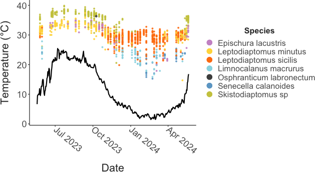
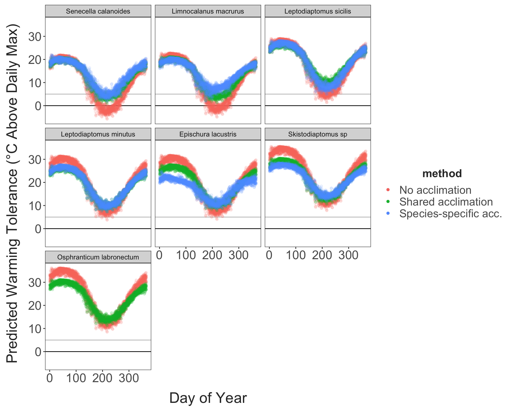

```{r echo = F}
knitr::opts_chunk$set(fig.align = "center")
```

# Introduction

Predicting the effects of climate change on biodiversity is a pressing challenge. Faced with rapid warming across lakes and standing waters in many regions [@woolway2020; @kraemer2021], freshwater aquatic organisms may be particularly vulnerable to anthropogenic changes [@sayer2025]. As temperatures increase, there have been widespread observations of shifts in community composition, population abundances, and range distributions across many taxa [@khaliq2024]. Diverse physiological and ecological mechanisms may underlie these changes, but variation in thermal performance traits (and upper thermal limits in particular) across taxa has received particular attention [@roeder2021; @calosi2007]. As a result, spatial patterns in thermal limits are often used to predict patterns in vulnerability to climate change [@pinsky2019].

Many of these studies assume, however, that thermal limits are invariant within species. A growing body of literature shows this is clearly not the case. Local adaptation [@sasaki2022] and acclimation [@morley2019] can produce substantial intraspecific variation in thermal limits that is important to consider for robust predictions about the effects of climate change on biodiversity [@jacob2021]. Population responses to temperature seasonality can also entail substantial and rapid shifts in organismal performance [@huey2022; @leclair2020; @harada2018; @hahn2024; @garton1990]. Importantly, both adaptation and plasticity may play important roles in shaping how populations of short-lived taxa cope with seasonally varying temperatures [@hahn2024; @ueno2023; @sasaki2020; @bergland2014; @rudman2022; @elmer2025]. This temporal variation in thermal limits may mediate vulnerability to both acute and long-term warming events [@dowd2020]. Understanding the extent to which populations rely on these different mechanisms to persist in variable environments can provide key insights into how long-term climatic changes may affect biodiversity.

While highly controlled laboratory experiments can provide crucial mechanistic insight into seasonal variation in thermal limits (i.e. determining whether phenotypic variation is genetic or plastic in origin), assessments under more realistic conditions are also needed. The idealized, stable conditions and experimental designs typically used in laboratory environments may, for example, mask how other factors like food limitation, behavioral thermoregulation, photoperiod, humidity, etc. influence thermal limits in natural populations [@ueno2023]. Laboratory estimates of the effects of plasticity are also subject to a number of potential methodological artifacts [@rohr2018]. Given the important (but uncertain) role plasticity may play in mediating vulnerability to warming [@seebacher2015; @morley2019; @gunderson2015], we need to complement laboratory studies with a better understanding of potential constraints on thermal limits and the effects of plasticity under realistic environmental conditions. These constraints (including natural seasonal variation in organismal condition) may be particularly important for contextualizing environmental stress [@dowd2020] and grounding predictions about how interactions between plasticity and adaptation may shape population responses in a changing climate [@diamond2016; @delisle2023]

Further, while describing seasonal variation within a single species can provide useful insights, variation in both thermal limits and acclimation capacity across community members will likely play a major role in determining 'winners and losers' in a changing climate [@somero2010; @roeder2021]. These dynamics are important to understand in order to predict how climate change may alter ecological dynamics at a larger scale. Despite this, very few studies have examined in situ, seasonal patterns in thermal limits across community members, limiting our ability to compare the effects of acclimation. Those that have [@bujan2020; @oliveira2021; @haque2025; @garcia2024; @redana2024; @hu2004; @houghton2014; @hopkin2006] often uncover different magnitudes of variation in thermal limits across species, indicating variable acclimation capacity across community members. These studies have, however, tended to focus on a small number of community members, just a portion of the annual temperature cycle, or have covered the entire year with fairly coarse (i.e. monthly) sampling intervals. This limits insights into patterns of acclimation under natural conditions and how winter active species respond to warming [@dinh2023; @hampton2017; @pu2025]. This has also resulted in a limited understanding of how variation in physiological thermal limits affects ecological patterns like seasonal community turnover, long-term shifts in community composition and changes in phenologies observed in various aquatic systems [@corona2024; @khaliq2024]. A high temporal resolution, community-wide examination of acclimation under natural conditions, spanning the full annual temperature cycle, may help to establish a mechanistic foundation for understanding population responses to changing seasonality [@hernandez-carrasco2025; @williams2017]

Planktonic copepods are a useful model system for studying variation in thermal limits and acclimation capacity. These taxa are widespread, diverse, and abundant throughout the year in many freshwater systems. This group is also ecologically important, as grazers of phytoplankton and microzooplankton and prey for early life stages of many fish species. While historically thermal limits and acclimation capacity in freshwater copepods have been largely overlooked [@sasaki2021], there has been renewed interest in these systems [@nowakowski2024; @bonadonna2025]. Here we examine seasonal patterns in upper thermal limits of the entire calanoid copepod community in Lake Champlain, a large, highly seasonal lake in temperate North America. Sampling at approximately weekly intervals, we generated a physiological time series to examine both across and within species variation in thermal limits, and examine whether these differences may contribute to seasonal changes in copepod community composition. We also use this high-resolution data set to quantify species-specific acclimation capacities under natural conditions.

# Methods

### Field Collections and Environmental Data

Plankton were collected within the top three meters of Lake Champlain (coordinates: 44.481149, -73.225451) with a combination of horizontal and vertical tows of a 500 um mesh plankton net. These collections were not intended for quantitative measurement of abundance, so the precise volume of water filtered was not tracked. Surface water temperature was measured at the time of collection using a handheld thermometer. Plankton were transferred to an insulated flask and immediately transported to the laboratory at the University of Vermont, where the tow contents were divided among several 500 mL beakers and placed in a benchtop incubator (IVYX Scientific) set to the temperature recorded at the time of collection. The USGS maintains a continuous temperature record at a nearby site (\~650 meters from our sampling site; coordinates: 44.47616017, -73.2215166), which allowed us to examine more fine-scale patterns across the entire collection period for this project (`r paste(range(collection_summary$collection_date), collapse = " to ")`). Temperatures recorded at the time of collection closely matched the maximum daily temperatures from the continuous temperature record (Supp. Fig. 1).

### Trait Measurements

Thermal limits were measured as the critical thermal maximum (CTmax), the temperature at which an individual no longer responded to stimuli (i.e., onset of heat coma), using a previously developed method [@sasaki2023]. The experimental set-up includes a reservoir containing a heating element and two aquarium pumps, a plexiglass water bath, and a continuous temperature recorder. One aquarium pump circulates water within the reservoir, while the other pumps water into the water bath. The water bath contains thirteen 50 mL flat-bottom glass vials, each with 10 mL of bottled spring water. Small temperature sensors connected to an Arduino logger were placed into three of these vials. Temperature was recorded every five seconds during the experimental assays. To begin each CTmax assay, the water in the reservoir was adjusted to match the collection temperature using either the heating element or by adding ice. When the water bath was holding steady at the collection temperature, calanoid copepods were sorted from the bulk plankton tow contents and placed individually into the remaining ten vials. After all vials were filled, copepods were given a 15-minute resting period, then the heating element was turned on to initiate the temperature ramp. Individuals that were not active after this resting period were excluded from the assay. The rate of temperature increase was around 0.3°C per minute at the beginning of the assay, and gradually decreased to \~0.1°C per minute (Supp. Fig. 2). Individuals were monitored continuously during the ramp until normal movement ceased and the individual no longer responded to gentle stimulus (slight water movement generated by turning the vials). The time at that point was recorded and the vial removed from the water bath. The continuous temperature record from the Arduino loggers was used to determine CTmax based on these recorded times. After all individuals had reached their CTmax, the copepods were transferred to the lid of a 96 well plate and examined using a stereoscope (Olympus SZX7). Individuals were identified to the species level [@lamay2013; @ward1959], and categorized as either male, female, or juvenile. For females bearing egg sacs, clutch size (the number of eggs contained) was also recorded. Finally, each individual was photographed along with a scale micrometer for body size measurements. Body size was measured using ImageJ [@schindelin2012] as prosome length. After the entire data set was collected, these images were also re-analyzed to identify three other potential traits of interest (the presence of developing eggs as a proxy for active energetic investment in reproduction, the presence of lipid droplets as a proxy for individual condition and the presence of energetic reserves, and visually apparent internal parasites or pathogens). There were several diverse pathogen classes observed across the sampling period. Since specific identification was not possible from the images, we grouped these pathogen phenotypes into three visual classes, a 'spot' phenotype, a 'cloudy' phenotype, and an 'other' group that contained the remaining individuals (Supp. Fig. 3). Identification of the pathogenic species / physiological processes underlying the infection was not possible with our photo-based approach, but this analysis provides preliminary evidence of which pathogen classes may impact these copepod populations, which can be followed up with more targeted mechanistic investigations [@eliassen2024]. These additional traits were scored by a single investigator to ensure consistency across the entire set of

### Data Analysis

All analyses were conducted with R version 4.1.3 [@rcoreteam2022]. We used a linear mixed effects model to examine the influence of species, collection temperature, and individual sex on CTmax. All interactions were included in this model. Temperature was centered but not scaled before analysis. Since CTmax assays were often performed over the course of several days after collection, we included the number of days copepods spent in the lab before CTmax was measured as a random effect. The species-specific acclimation response ratios (ARR) were estimated from this initial model as the marginal mean of the linear trend (emmeans package; @lenth2025) . The relationship between a species' mean CTmax and the estimates of ARR obtained here were compared against a collection of estimates from a previous data synthesis on copepod thermal limits [@sasaki2021]. For the three diaptomid species (*Skistodiaptomus*, *Leptodiaptomus minutus*, and *L. sicilis*) the residuals from this model were regressed against clutch size to examine potential fitness costs associated with increased thermal limits. It was not possible to examine fecundity for the remaining four species, which release their eggs directly into the water column. A secondary model including data just for females examined the effect on CTmax of species and collection temperature (with their interaction), along with the presence of developing eggs, the presence of lipid droplets, and the presence of potential pathogens.

We also used two approaches to examine the potential environmental drivers of acclimation. First, we examined the correlation between CTmax and a number of predictors (the overall mean, median, minimum, and maximum temperature; the mean daily minimum, maximum, and range; and the temperature range and variance) calculated for periods of time ranging from 1 to 60 days before collection. This analysis is largely speculative, so we identified the top predictor-duration combination for each species based on the maximum correlation coefficient between the predictor and CTmax values. For two species, *Leptodiaptomus minutus* and *L. sicilis*, that appear to acclimate rapidly to changes in temperature (i.e., the temperature measured at the time of collection was the best predictor), we also used a distributed lag non-linear model to examine potential timescales of this rapid response [@redana2024]. This approach examined how the magnitude and timing of fluctuations in temperature over the 200 hours prior to collection, based on the USGS continuous temperature record, affected organismal thermal limits.

### Vulnerability Hindcast

Continuous temperature data was retrieved from the USGS sensor for the time period of 2014-10-01 to 2025-01-09. This data was used to generate a hindcast of thermal limits for this community of copepods based on three scenarios: 1) no acclimation, 2) shared acclimation capacity across community members, and 3) species-specific acclimation capacities. In the “no acclimation” scenario, warming tolerance was calculated based on a fixed thermal limit for each species (mean CTmax value). For the “shared acclimation” capacity, a linear regression of CTmax against species and collection temperature (without interaction) was used to predict thermal limits based on the average daily temperature. This scenario therefore allows for variation in thermal limits but not acclimation capacity across species. The final scenario estimated CTmax for each species using the best predictor-duration combination as determined by the correlation analysis. For each of the three scenarios, warming tolerance was calculated as the difference between these predicted thermal limits and the maximum daily water temperature. The average minimum annual warming tolerance (i.e. the maximum vulnerability) was calculated for each of the three scenarios to examine the effect on estimates of vulnerability.

# Results

## Community composition

Our weekly sampling method yielded thermal limit data for all six species of calanoid copepods observed in Lake Champlain - *Skistodiaptomus sp.*, *Leptodiaptomus minutus*, *L. sicilis*, *Epischura lacustris*, *Senecella calanoides*, and *Limnocalanus macrurus*. We also collected a single individual of *Osphranticum labronectum* in early October 2023 - to our knowledge, this is the first observation of this species in Lake Champlain. There is also some uncertainty regarding the *Skistodiaptomus* species we collected. In Lake Champlain, this has historically been identified as *Skistodiaptomus oregonensis* [@lamay2013], but a small number of individuals we collected in Summer 2024 were identified as *S. pallidus* via genetic barcoding (Cytochrome oxidase I) as part of a separate project. *S. pallidus* does occur in nearby water bodies [@chiapella2021], and has previously been noted for its potential to invade Lake Champlain from adjacent water bodies [@malchoff2005]. As we did not preserve material from our CTmax assays and it is not possible to differentiate these two species in the images taken, we will refer to *Skistodiaptomus sp.* throughout this study. We acknowledge that the data reported is likely for a combination of the two species. Finally, for one of the winter species, *L. sicilis*, we detected the presence of two distinct size morphs (Supp. Fig. 4). Dissection of several adult individuals from both morphs confirmed a shared species identity [@ward1959]; instead, the presence of these distinct size classes likely indicates the transition between different generations in the population [@lai1977; @herzig1980].

## Seasonality, Phenology, and Thermal limits

Surface temperatures measured at the time of collection ranged from `r min(collection_summary$collection_temp)`°C to `r max(collection_summary$collection_temp)`°C during the sampling period, which included `r length(unique(collection_summary$collection_date))` unique collection events (Fig. 1). We measured a total of `r dim(full_data)[1]` individual thermal limits during this period. The number of thermal limits varied across species, ranging from a minimum of 42 for *Senecella calanoides* (not including the single *Osphranticum* individual) to a maximum of 482 for *Leptodiaptomus sicilis* (Table 1). While our sampling approach precludes quantitative estimates of abundance, the number of CTmax measurements made for each species does qualitatively reflect their relative abundance in the samples collected.

```{r, table1, echo = F}
full_data %>% group_by(sp_name) %>% count() %>% arrange(n) %>% select("Species" = sp_name, "CTmax Measurements" = n) %>% 
knitr::kable(digits = 3, align = "c",
      caption = "Samples sizes for each of the seven species examined in this study.")
```

```{r, figure1, echo = F, out.width = "450px"}
#| fig.cap = "Seasonality in CTmax and lake surface temperature. Individual CTmax measurements are shown as points, with the different species shown in different colors. Lake surface temperature from a USGS continuous temperature sensor is shown with the solid line."

 
```

The calanoid copepod community could be divided into a Summer-Fall group (*E. lacustris*, *Skistodiaptomus sp.*, and *L. minutus*) and a Winter-Spring group (*S. calanoides*, *Limnocalanus macrurus*, and *L. sicilis*) (Fig. 2a). The Summer-Fall group is characterized by smaller body size and higher thermal limits, while the Winter-Spring group included species with both small and large body sizes, but lower thermal limits (Supp. Fig. 5). *O. labronectum* had a relatively high upper thermal limit (`r round(filter(full_data, sp_name == "Osphranticum labronectum")$ctmax, 1)`°C), and groups with the Summer-Fall assemblage. With only a single observation, however, this affinity is tentative. Across all species, CTmax increased with increasing collection temperatures (discussed more in the following section; Fig. 2b). A notable exception to this trend is the increase in *L. sicilis* CTmax during mid-Winter, associated with the transition between the two generations. This is potentially related to differences in developmental temperature between the different generations. Warming tolerance (the difference between CTmax and collection temperature) decreased with increasing collection temperatures for all species, suggesting increasing vulnerability at higher temperatures in both assemblages (Fig. 3a).

```{r, figure2, echo = F, out.width = "420px"}
#| fig.cap = "A) Ridge plots showing the seasonal occurrence of the six major species of calanoid copepods in Lake Champlain. B) The relationship between CTmax and the surface temperature recorded at the time of collection. CTmax values for each species are shown separately, along with a linear regression describing the relationship between measured thermal limits and collection temperature. C) The negative relationship between Acclimation Response Ratios and upper thermal limits. Values from Lake Champlain species measured in this study are shown in color, while values from a previous data synthesis study (Sasaki and Dam 2021) are shown as empty circles."

knitr::include_graphics("../Output/Figures/markdown/main-fig-sp-summaries-1.png") #Use this when filling in figures from analysis 
```

Clutch size was not related to collection temperature in the two *Leptodiaptomus* species, but increased with collection temperature in the *Skistodiaptomus sp.* (Fig. 3b). Clutch sizes tended to increase with female body size in *Skistodiaptomus sp.* and *L. minutus*, but not in *L. sicilis* (Fig. 3c). There were no strong relationships between CTmax residuals and clutch size in any species, indicating that increases in thermal limits were not influenced by a trade-off with reproductive output (Fig. 3d).

```{r, figure3, echo = F, out.width = "400px"}
#| fig.cap = "Observed values for warming tolerance (A) and egg clutch size (B) plotted against collection temperature, along with the relationships between fecundity and collection temperature (C) and thermal limit residuals (D). Each point represents an individual measurement, with different species shown in different colors. A regression line is included for each species. CTmax residuals show variation in CTmax after controlling for the effect of collection temperature. Fecundity data is shown for only the three egg-sac bearing species in the data set."

 #Use this when filling in figures from analysis 
```

The second model examined the effect of developing eggs, lipid reserves, and visible pathogens on female CTmax. Model selection indicated no change in model fit when the presence of developing eggs and the presence of lipid droplets were removed as factors. Analysis of just the model including species, collection temperature, their interaction, and the presence of visible pathogens indicated a significant effect of pathogen presence on female CTmax. Estimated marginal means for the three different pathogen classes indicates variability in the effect on CTmax relative to individuals without visible pathogens (Supp. Fig. 6). There was no change in CTmax in individuals exhibiting the 'spot' phenotype whereas copepods exhibiting phenotypes in the other two classes exhibited a decrease in CTmax of \~2°C, although the effect of the 'other' pathogen class had a large estimated standard error.

## Acclimation Responses Ratios (ARR), Drivers, and Timescales

CTmax increased with increasing collection temperatures for all species, suggesting widespread effects of acclimation (Fig. 2b). These acclimation effects varied in magnitude, however, across species. Species-specific ARR estimates, or the change in CTmax per degree change in collection temperature, varied from `r paste(round(min(arr_data$arr), 2), "to", round(max(arr_data$arr), 2))` (*L. sicilis* and *S. calanoides*, respectively). The magnitude of the ARR estimates tended to decrease with increasing average thermal limits (Fig. 2c), mirroring the pattern observed across other copepod taxa [@sasaki2021], suggesting a potential trade-off between acclimation capacity and baseline thermal tolerance.

The ARR estimates are based on the relationship between collection temperature and CTmax. We also examined more specific potential drivers of acclimation responses (Fig. 4). For three of the species (*Epischura lacustris*, *Senecella calanoides*, and *Skistodiaptomus sp.*), CTmax was most strongly correlated with the maximum temperature. In contrast, for *Limnocalanus macrurus*, CTmax was most strongly correlated with minimum temperature, while the two *Leptodiaptomus* species had CTmax values that were most strongly correlated with collection temperature. There was also substantial variation in the duration of time that best explained CTmax variation, ranging from an almost 30-day period in *Epischura lacustris* to \<1 day in the two *Leptodiaptomus* species. We note, however, that for all species except *Senecella calanoides* the difference in correlation coefficients between the strongest predictor and collection temperature were negligible (Fig. 4b).

The two *Leptodiaptomus* species present in Lake Champlain both appear to adjust CTmax rapidly, with CTmax most closely correlated with temperature at the time of collection. We used a distributed lag non-linear model to examine the potential timescales of this rapid acclimation. For both species, these models indicated acclimation to short-term deviations (spikes or drops in temperature) occurring during the 200 hours leading up to collection, with the change in CTmax depending on both the magnitude of the deviation and the timing (Supp. Fig. 7). Large deviations (+4°C or -4°C) during the two days leading up to collection increased or decreased CTmax by \~0.5°C, respectively. The effect of these large deviations diminished as timing prior to collection increased. The effect also decreased as the magnitude of deviation decreased — changes of +/- 1°C had only minor effects on CTmax even when the deviation occurred near the time of collection.

```{r, figure4, echo = F, out.width = "300px"}
#| fig.cap = "Panel A - The duration of potential acclimation periods (days prior to collection) shown for each of the species. Bar fill color indicates the potential cue (collection temperature, maximum temperature during the acclimation period, or minimum temperature during the acclimation period). Panel B - The observed correlation coefficients between the best predictor (white bars) and the temperature measured at the time of collection (black bars)."

knitr::include_graphics("../Output/Figures/markdown/main-fig-acc-correlations-1.png") #Use this when filling in figures from analysis 
```

### Vulnerability Hindcast

The three acclimation scenarios (no acclimation, shared acclimation, species-specific acclimation) yielded different estimates of vulnerability across the community (Figure 5; Supp. Fig. 8). In all cases, warming tolerance was lowest in the “no acclimation” scenario. Acclimation increased warming tolerance in all species, but there was variation in how species-specific acclimation capacity affected vulnerability. While species-specific acclimation capacities increased warming tolerance (reduced estimated vulnerability) in some species, the effect was minimal or negative in others. Within the winter-dominant species, for example, *Leptodiaptomus sicilis* had a reduced warming tolerance when species-specific acclimation capacity was included while *S. calanoides* and *L. macrurus* both had a slightly increased warming tolerance.

```{r, figure5, echo = F, out.width = "300px"}
#| fig.cap = "Average annual minimum warming tolerance estimated for each species in the community based on three thermal limit hindcast scenarios. The “no acclimation” scenario assumes fixed thermal limits for each species. A shared acclimation capacity scenario assumes thermal limits vary across species as well as in response to average daily temperature, with a shared acclimation capacity across all community members. The species-specific acclimation scenario allows both thermal limits and acclimation capacity to vary across species based on the predictor-duration analysis described in Figure 7."

 #Use this when filling in figures from analysis 
```

# Discussion

We examined seasonal variation in the upper thermal limits of the community of calanoid copepods in Lake Champlain. By sampling across the entire annual temperature range we revealed substantial variation in thermal limits between the seasonal community assemblages as well as within-species variation in thermal limits, providing estimates of acclimation capacity under natural conditions. Our results show that acclimation has a significant but variable effect on thermal limits across the entire community, and reinforce that temporal variation in thermal limits can mediate population vulnerability to warming. At the community level, variation in both thermal limits and acclimation capacity are important factors to consider when assessing ecological vulnerability.

There are clear differences in thermal limits between the seasonal assemblages of calanoid copepods in Lake Champlain. Differences in thermal limits may be informative about long-term trends in competitive interactions [@martin2023] and abundance under warming [@roeder2021]. If, as in other systems [@fitzgerald2021], the winter-active species in Lake Champlain are most vulnerable in warming climates (due to low thermal limits), we might expect significant changes in the ecology of Lake Champlain and similar systems. The winter-active species tend to be relatively large and lipid rich [@vanderploeg1998; @cavaletto1989] and play diverse ecological roles, both grazing on phytoplankton and microzooplankton and predating other zooplankton [@nasworthy2020]. Loss of these species would have profound effects on the food web structure of this system. While there have been large changes in the abundance of calanoid copepods in Lake Champlain over the past decades [@mihuc2012], the patterns we observed here suggest that the copepod populations are not directly limited by temperature, with warming tolerance (the difference between thermal limits and environmental temperatures) remaining above 10°C, even during the transition between assemblages. As a metric, however, CTmax can be difficult to directly link to patterns in temperature-driven mortality in the field; instead it may be more useful to generate 'thermal tolerance landscapes' for these species [@rezende2014], in order to better understand the degree to which temperature directly limits population occurrences [@rezende2020].

This disconnect between observed thermal limits and seasonal occurrence does, however, highlight the complex interactions between species’ life history, ecology, acclimation, and adaptation that may ultimately shape the response of these taxa to long-term climate change in natural systems. Temperature, for example, has strong impacts on copepod generation times [@mauchline1998; @winder2009]. A warming-induced increase in the number of generations per year across the calanoid community in Lake Champlain may increase evolutionary capacity, potentially reducing long-term vulnerability to warming. These effects may, however, be mediated by how seasonal specialization of life history alters the experienced thermal environments [@vonschmalensee2023a; @munoz2018], with diverging long-term responses for the species in the two seasonal assemblages. For the Summer-Fall assemblage, we may expect increases in the number of generations per year and an expansion of seasonal occurrence as Spring and Fall water temperatures increase. Further, while warming tolerance is currently relatively high during the summer, increasing temperatures and more frequent, more extreme heatwaves [@smeltzer2012; @woolway2021; @sullivan2025] may select for increases in thermal performance given the large population sizes in these species. By contrast, the apparent avoidance of even sub-lethal seasonal warming by the Winter-Spring assemblage may keep seasonal occurrence limited to the temperature range currently experienced. Paired with the strong acclimation capacity observed, this can dampen physiological stress in the near future, but may increase the long-term vulnerability of this group by shielding sensitive genotypes from selection, inhibiting evolutionary adaptation [@fox2019]. The ecological and evolutionary interactions driven by warming are difficult to predict, but baseline measurements of thermal limits and acclimation responses in these natural populations can provide insights into some of the ecophysiological underpinnings of these processes in a changing climate. Similar surveys over the coming years may provide key insights into population responses to climate change [@ardelan2023; @buckley2025].

Also important for making robust predictions about the role of acclimation in shaping responses to warming is identifying the environmental driver of acclimation responses [@dowd2020]. Our results suggest that different cues over different time spans drive the patterns in thermal acclimation we observed. Across the species we examined, thermal limits correlated with different aspects of the thermal environment (e.g., the minimum or maximum temperatures) over timescales from less than one to thirty days. For the two *Leptodiaptomus* species, which appear to acclimate most rapidly, distributed lag non-linear models suggest responses to temperature variation on the order of hours. These drivers and time spans provide hypotheses that can be tested in laboratory acclimation experiments [@kraskura2024], but already point to the importance of understanding the species-specific drivers of acclimation to accurately predict the role of plasticity in mediating vulnerability over short and long timescales. Indeed, the hindcasted warming tolerance values highlight how species-specific acclimation dynamics can alter estimated vulnerability across this community. Interestingly, our results also indicate aspects of temperature variability (range, variance, etc.) are not the primary drivers of acclimation in these copepods. Similar results were obtained for another freshwater calanoid in a set of mesocosm experiments [@bonadonna2025]. These manipulative experiments balance experimental feasibility and environmental realism [@sasaki2025], and may play a large role in testing both species- and community-level hypotheses about the interactions between environmental variation and plasticity.

The strong effects of temperature acclimation under natural conditions we've shown here also highlight the key role plasticity will play in shaping not only species but community responses to warming. Two commonly predicted community responses to warming are phenological shifts and thermophilization (replacement of cold-adapted species by warm-adapted species) [@mclean2021; @inouye2022]. Both predictions are rooted in the assumption that species tend to exhibit niche conservatism, or that seasonal and geographic occurrences will shift to maintain species within a consistent thermal niche [@wiens2010]. Rapid acclimation to changes in temperature violates this assumption, or at the very least requires a more dynamic perspective on the processes underlying potential niche conservatism, particularly as large-scale examinations suggest intraspecific niche divergence may be common in planktonic copepods [@mcginty2021]. Populations with strong acclimation capacity may not respond to warming by shifting seasonal or geographic occurrence, relying instead on acclimation to rapidly shift the bounds of the fundamental or realized niche. From this perspective, the importance of examining population and species variation in acclimation responses is clear - if acclimation capacity mediates these dynamics at the population level, variation in acclimation capacity across community members may result in inconsistent patterns in changes in abundance, with the magnitude of spatial or temporal shifts of the individual community members inversely correlated with the magnitude of their ability to acclimate to new conditions. In accordance with this, strong acclimation capacity may influence the observed complexity in phenological shifts in copepod communities over the past several decades [@corona2024]. This might also contribute to surprising observations of 'borealization' (increasing presence of cold-adapted species) in zooplankton communities [@khaliq2024], if acclimation capacity increases with decreasing thermal limits (as observed here as well as across copepod taxa more generally; @sasaki2021). Studies examining acclimation capacity for species assemblages across environmental gradients are needed in order to better understand the interactions between climate change, plasticity, and community dynamics, and in particular are needed to better understand the relative contributions of short- and long-term processes in 'ecological acclimation' to climatic changes [@stemkovski2025; @lovell2023].

Finally, we note that the fairly intensive sampling regime we employed had clear benefits, capturing data for all species of calanoid copepods previously reported in Lake Champlain, with additional observations of potentially newly introduced species. One of these novel species, *Osphranticum labronectum*, is widely distributed throughout freshwater systems across North America, with a range extending from Central America into Canada [@gutierrez-aguirre1999]. This broad distribution suggests this species is able to tolerate a wide range of conditions, although the role of local adaptation is unknown. The data point we've collected (for whatever a single measurement is worth), suggests a relatively high upper thermal limit, with a higher CTmax value than all but one other species in Lake Champlain. In addition to the observation of *O. labronectum*, we also found evidence for the presence of *Skistodiaptomus pallidus* in Lake Champlain. *S. pallidus* is comprised of multiple divergent mitochondrial lineages [@thum2008]. The lineage we observed is widespread in the Eastern US, and is known to be invasive in freshwater systems in New Zealand, Mexico, and Germany [@branford2017]. What proportion (if any) of the *Skistodiaptomus* individuals we examined belong to *S. pallidus* as opposed to the historically dominant *S. oregonensis* we are unable to determine. A targeted study combining COI barcoding with individual thermal limits could disentangle any species-specific patterns in CTmax and examine the realized seasonal/thermal niche of *S. oregonensis* and *S. pallidus* in Lake Champlain, providing insights into invasion dynamics with congeneric species. It's worth noting that both novel observations (*O. labronectum* and *S. pallidus*) appear to have the highest thermal limits of the calanoid species in this community - high upper thermal limits may play a role in the success of invasive or newly introduced species [@kelley2014]. It would be interesting to compare upper thermal limits for notable invasive calanoid copepod species in other regions (e.g. *Arctodiaptomus dorsalis*, *Pseudodiaptomus marinus* and *P. forbesi*, and *Sinodiaptomus sarsi*; @svetlichny2021; @reid2007; @uttieri2020; @orsi1991) with those of the copepod communities in their native and invaded ranges.

### Conclusions

The effects of climate change on the distribution of biodiversity across the planet is a major concern. Acclimation has major effects on organismal thermal limits under natural conditions and can drive seasonal changes that mediate vulnerability to warming over both short and long timescales. Only a handful of studies, however, have examined community-wide variation in acclimation responses over the full annual temperature range. Our results show strong divergence of thermal limits in line with expectations about seasonal occurrence - thermal limits are lower in winter-dominant species than summer-dominant species. Most importantly, we show that acclimation produces substantial intra-specific variation under natural conditions that can play a key role in shaping community responses to climate change. Seasonal acclimation links individual, population, and community level processes, and needs to be incorporated into predictions about responses to climate change.

\newpage

```{=tex}
\beginsupplement
```
# Supplementary Material

```{r supp-fig-1, echo = F, out.width="80%"}
#| fig.cap = "Correlation between the temperature measured at the time of collection and the maximum daily temperature recorded by the nearby USGS continuous temperature sensor."

knitr::include_graphics("../Output/Figures/markdown/supp-fig-temp-acc-1.png") 
```

```{r supp-fig-2, echo = F, fig.show="hold", out.width="75%"}
#| fig.cap = "A summary of the temperature ramping rates observed over the course of the experiments. Ramping rates were calculated over minute intervals for each assay. Assays were binned into four groups based on their starting temperatures. Ramping rates are plotted over time, with shading representing the number of observations. Bins with a single observation are omitted."

knitr::include_graphics("../Output/Figures/markdown/supp-fig-ramp-rate-1.png")
```

```{r supp-fig-3, echo = F, fig.show="hold", out.width="75%"}
#| fig.cap = "Pictures of the different pathogen phenotypes. Arrows were added to highlight the relevant features."

knitr::include_graphics(c("../Output/Figures/markdown/pathogen_spot.jpeg", "../Output/Figures/markdown/pathogen_cloudy.jpeg"))
```

```{r supp-fig-4, echo = F, out.width="80%"}
#| fig.cap = "Leptodiaptomus sicilis size distributions for each sample date, highlighting the presence of the two distinct size morphs throughout the sampling period."

knitr::include_graphics("../Output/Figures/markdown/supp-fig-lsic-morph-size-1.png") 
```

```{r, supp-fig-5, echo = F, out.width = "300px"}
#| fig.cap = "CTmax tends to decrease with increasing size. Mean values for both CTmax and size (measured as prosome length) are shown here for male, female, and juvenile individuals from each species."

 #Use this when filling in figures from analysis 
```

```{r supp-fig-6, echo = F, out.width="75%"}
#| fig.cap = "Pathogen effect sizes (i.e. potential effect of the pathogen on CTmax). Contrasts between individuals with and without pathogen phenotypes, based on the estimated marginal means from a mixed effects model examining CTmax as a function of species and collection temperature (with interaction), along with the pathogen phenotype."

 
```

```{r supp-fig-7, echo = F, fig.show="hold", out.width="75%"}
#| fig.cap = "Response surfaces from the distributed lag non-linear model showing the deviation of CTmax (color of the shading) as a result of temperature deviation (x-axis) and the time before collection (y-axis), for the two Leptodiaptomus species."

knitr::include_graphics(c("../Output/Figures/markdown/supp-fig-dlnm-plot-1.png", "../Output/Figures/markdown/supp-fig-dlnm-plot-2.png")) #Use this when filling in figures from analysis 
```

```{r supp-fig-8, echo = F, fig.show="hold", out.width="75%"}
#| fig.cap = "Hindcasted warming tolerance estimates based on three acclimation scenarios. Estimated warming tolerance is shown against day of the year."


```
