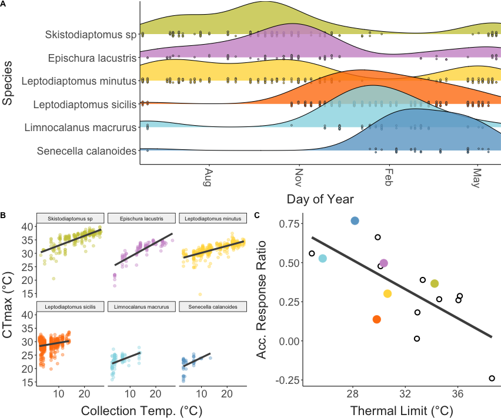

```{r echo = F}
knitr::opts_chunk$set(fig.align = "center")
```

# Introduction

Predicting the effects of climate change on biodiversity is a pressing challenge. SECTION ON CLIMATE CHANGE IN FRESHWATER SYSTEMS.

As temperatures increase, there have been widespread observation of shifts in community composition, population abundances, and range distributions across many groups (Khaliq et al. 2024). Variation in thermal performance traits across taxa may underlie these changes (Roeder ant community paper; REFS). Upper thermal limits are often used as proxies for thermal performance - as such spatial patterns in thermal limits are often used to predict patterns in vulnerability to climate change. (Pinksy paper). 

Many of these studies assume, however, that thermal limits are invariant within species. A growing body of literature shows clearly this is not the case. Local adaptation (Sasaki et al. NCC), seasonal acclimation (Bujan, Oliviere papers paper), and other processes can produce substantial intraspecific variation in thermal limits that is important to consider for robust predictions about the effects of climate change on biodiversity. EXPAND. Intraspecific variation in thermal limits can be attributed to the effects of genetic variation and phenotypic plasticity. In addition to spatial patterns, multi-generational common garden experiments can also be used to examine temporal patterns in thermal limits. Studies targeting even short-term variation like seasonality highlight the importance of both genetic variation (Sasaki paper, Ueno paper on Drosophila) and phenotypic plasticity (Hahn and Brennan) for population persistence. 

While these highly controlled laboratory experiments provide crucial mechanistic insight into observed variation in thermal limits, assessments under more realistic conditions are also needed. The idealized, stable conditions typically used in laboratory environments may mask the effects of other factors that could influence thermal limits in natural populations (e.g. food limitation, behavioral thermoregulation, photoperiod, humidity, etc.). Laboratory estimates of acclimation can also be subject to a number of potential methodological artifacts (Rohr et al. 2018). Given the important (but uncertain) role acclimation may play in mediating vulnerability to warming (Seebacher et al. 2015; Morley et al. 2019; Gunderson & Stillman ), we need to complement laboratory studies with a better understanding of thermal limits and the effects of acclimation under realistic environmental conditions. This is particularly important for grounding predictions about how interactions between plasticity and adaptation may shape populations responses in a changing climate (Diamond and Martin 2016). 

Populations are naturally exposed to a variable environment, providing many opportunities to capture the effects of acclimation. Seasonal variation in temperature is particularly prominent in many locations, and may drive acclimation responses across a range of taxa (Huey and Buckley paper). While describing seasonal variation within a single species can provide useful insights, it's the relative capacity for responses across community members that can best help us understand how climate change may alter ecological dynamics. Despite this, very few studies have examined in situ, seasonal patterns across community members. Those that have (REFS) suggest SUMMARIZE RESULTS HERE. Not only do these studies provide insights into variation in thermal limits, they also enable estimation of the relative acclimation capacities of community members. This variation, in both thermal limits and acclimation capacity, will likely play a major role in determining 'winner and losers' in a changing climate (Somero paper, Roeder paper). Note, however, that among these previous studies, only Houghton et al. examined patterns across the full annual temperature cycle. There is, in general, a need for a better understanding of the biological processes that affect winter active species, especially in aquatic taxa (Winter is coming paper, Winter grab paper, Ecology under ice paper). SOMETHING ABOUT GRADIENT AND SCALE IN ECOLOGY? 

Here we examine seasonal patterns in upper thermal limits across the entire community of calanoid copepods from Lake Champlain, sampling at approximately weekly intervals covering the entire annual temperature cycle. Copepods are a useful model system for studying variation in thermal limits; Widespread, diverse, and abundant throughout the year. This group is also ecologically important in their own right; Key ecological roles as grazers and prey, Bioindicators in freshwater systems. Describe Lake Champlain role specifically. We test the hypotheses that: 1) Species differences in thermal limits will reflect variation in the season of occurrence (winter active species will have lower thermal limits than summer active species); 2) Within species thermal limits will increase with increasing water temperature.   

# Methods
### Field Collections and Environmental Data

### Trait Measurements 

### Data Analysis

Primary model examined the effects of species, collection temperature, and individual sex on CTmax. 

This primary model was used to estimate acclimation response ratios for each species (the species-specific slope of CTmax ~ collection temperature). The residuals from this model were also used to examine potential fitness costs associated with increased thermal limits. 

A secondary model for just females examined the effect of species, collection temperature, the presence of developing eggs, the presence of lipid droplets, and the presence of potential pathogens. 

We also used two approaches to examine potential drivers of acclimation. First, we examined the correlation between CTmax and a number of predictors (list here) calculated for periods of time ranging from 1-60 days before collection. This analysis is largely speculative, so we identified the top predictor-duration combination for each species based on the correlation coefficient. For two species that appear to acclimate rapidly changes in temperature (the temperature measured at the time of collection was the best predictor), we also used a distributed lag non-linear model to examine potential timescales of this rapid response. 

# Results

Main figures: 
1. CTmax and lake temperature time series
2. Occurrence ridge plot and CTmax vs. temp. figure with size histogram? 
3. Warming tolerance vs. collection temp.
4. Fecundity vs. collection temperature with marginal density plots
5. ARR in the context of other measurements
6. Fecundity vs. body size and CTmax
7. Predictor duration and correlation coefficients

Main figure (CTmax vs. date)

```{r, figure1, echo = F, out.width = "450px"}
#| fig.cap = "CAPTION HERE."

knitr::include_graphics("../Output/Figures/markdown/main-fig-ctmax-timeseries-1.png") 
```

Ridge plot of collection frequencies + CTmax vs. Collection Temperature

```{r, figure2, echo = F, out.width = "450px"}
#| fig.cap = "CAPTION HERE."

 #Use this when filling in figures from analysis 
```

Collection temp. regressions

```{r, figure3, echo = F, out.width = "400px"}
#| fig.cap = "CAPTION HERE."

knitr::include_graphics("../Output/Figures/markdown/main-fig-trait-coll-temp-plots-1.png") #Use this when filling in figures from analysis 
```

Plasticity-tolerance trade-off plot

```{r, figure4, echo = F, out.width = "300px"}
#| fig.cap = "CAPTION HERE."

knitr::include_graphics("../Output/Figures/markdown/main-fig-ARR-synth-plot-1.png") #Use this when filling in figures from analysis 
```

CTmax and Size

```{r, figure5, echo = F, out.width = "300px"}
#| fig.cap = "CAPTION HERE."

knitr::include_graphics("../Output/Figures/markdown/main-fig-mean-ctmax-mean-size-plot-1.png") #Use this when filling in figures from analysis 
```

Fecundity relationships (CTmax and size)

```{r, figure6, echo = F, out.width = "400px"}
#| fig.cap = "CAPTION HERE."

knitr::include_graphics("../Output/Figures/markdown/main-fig-fecundity-plots-1.png") #Use this when filling in figures from analysis 
```

Predictor duration and correlation comparison 

```{r, figure7, echo = F, out.width = "400px"}
#| fig.cap = "CAPTION HERE."

knitr::include_graphics("../Output/Figures/markdown/main-fig-acc-correlations-1.png") #Use this when filling in figures from analysis 
```

```{r, table, echo = F}
knitr::kable(x = 1, #Replace 1 with whatever object you want included as a table
      digits = 3, align = "c",
      caption = "CAPTION HERE")
```

# Discussion


\newpage

```{=tex}
\beginsupplement
```
# Supplementary Material

Size plots

Frequency of pathogens / egg development

```{r supp-fig-1, echo = F}
#| fig.cap = "CAPTION HERE."

plot(1)
#knitr::include_graphics("../Output/Figures/_PATH_") #Use this when filling in figures from analysis 
```
