Seasonality in Lake Champlain Copepod Thermal Limits
================
2023-09-12

- [Copepod Collection](#copepod-collection)
- [Temperature Variation](#temperature-variation)
- [Trait Variation](#trait-variation)
  - [Variation with temperature](#variation-with-temperature)
- [Sex and stage variation in thermal
  limits](#sex-and-stage-variation-in-thermal-limits)
- [Trait Correlations](#trait-correlations)

``` r
### To Do 

# Actual statistics for relationships between temperature and CTmax, size, and fecundity
# Pull residuals from CTmax ~ temperature model, and examine the change over time in lab and the relationship with fecundity
```

## Copepod Collection

Copepods were collected at approximately weekly intervals from Lake
Champlain (Burlington Fishing Pier). Plankton was collected from the top
3 meters using a 250 um mesh net. Copepods from 14 collections were used
to make a total of 283 thermal limit measurements. Over this time
period, collection temperatures ranged from 10.5 to 26.5°C.

## Temperature Variation

Water temperatures in Lake Champlain reached a minimum in February.
Sampling for this project began during the Spring warming period.
Temperature variability (both ranges and variance) increase with
temperature, but are strongly affected by the length of time period
examined.

``` r
# Lake Champlain near Burlington, VT
siteNumber = "04294500"
ChamplainInfo = readNWISsite(siteNumber)
parameterCd = "00010"
startDate = "2023-01-01"
endDate = ""
#statCd = c("00001", "00002","00003", "00011") # 1 - max, 2 - min, 3 = mean

# Constructs the URL for the data wanted then downloads the data
url = constructNWISURL(siteNumbers = siteNumber, parameterCd = parameterCd, 
                       startDate = startDate, endDate = endDate, service = "uv")

temp_data = importWaterML1(url, asDateTime = T) %>% 
  mutate("date" = as.Date(dateTime)) %>% 
  select(date, "temp" = X_00010_00000)


## Daily values
daily_temp_data = temp_data %>%
  ungroup() %>% 
  group_by(date) %>% 
  summarise(mean_temp = mean(temp),
            med_temp = median(temp),
            var_temp = var(temp), 
            min_temp = min(temp), 
            max_temp = max(temp)) %>% 
  mutate("range_temp" = max_temp - min_temp)

daily_plot = daily_temp_data %>% 
  pivot_longer(cols = c(-date),
               names_to = "parameter", 
               values_to = "temp") %>% 
  ggplot(aes(x = date, y = temp, colour = parameter)) + 
  geom_line(linewidth = 1) + 
  scale_colour_manual(values = c(
    "mean_temp" = "olivedrab3",
    "med_temp" = "seagreen3",
    "max_temp" = "tomato",  
    "min_temp" = "dodgerblue",
    "range_temp" = "goldenrod3",
    "var_temp" = "darkgoldenrod1"
  )) + 
  scale_x_continuous(breaks = as.Date(c("2023-01-01", "2023-04-01", "2023-07-01"))) + 
  ggtitle("Daily Values") + 
  labs(y = "Temperature (°C)",
       x = "") + 
  theme_bw(base_size = 20) + 
  theme(panel.grid = element_blank(),
        axis.text.x = element_text(angle = 270, hjust = 0, vjust = 0.5))
```

``` r
## Defining the function to get predictor values for periods of different lengths
get_predictors = function(daily_values, raw_temp, n_days){
  prefix = str_replace_all(xfun::numbers_to_words(n_days), pattern = " ", replacement = "-")
  
  mean_values = daily_values %>% 
    ungroup() %>% 
    mutate(mean_max = slide_vec(.x = max_temp, .f = mean, .before = n_days, .complete = T),
           mean_min = slide_vec(.x = min_temp, .f = mean, .before = n_days, .complete = T),
           mean_range = slide_vec(.x = range_temp, .f = mean, .before = n_days, .complete = T)) %>% 
    select(date, mean_max, mean_min, mean_range) %>% 
    rename_with( ~ paste(prefix, "day", .x, sep = "_"), .cols = c(-date))
  
  period_values = raw_temp %>% 
    mutate(mean = slide_index_mean(temp, i = date, before = days(n_days), 
                                   na_rm = T),
           max = slide_index_max(temp, i = date, before = days(n_days), 
                                 na_rm = T),
           min = slide_index_min(temp, i = date, before = days(n_days),
                                 na_rm = T),
           med = slide_index_dbl(temp, .i = date, .before = days(n_days), 
                                 na_rm = T, .f = median),
           var = slide_index_dbl(temp, .i = date, .before = days(n_days), 
                                 .f = var),
           range = max - min) %>%  
    select(-temp) %>%  
    distinct() %>% 
    rename_with( ~ paste(prefix, "day", .x, sep = "_"), .cols = c(-date))%>% 
    inner_join(mean_values, by = c("date")) %>%  
    drop_na()
  
  return(period_values)
}
```

``` r
## Getting predictor variables for different periods

### ONE WEEK
week_temps = get_predictors(daily_values = daily_temp_data, 
                            raw_temp = temp_data, 
                            n_days = 7)

week_plot = week_temps %>% 
  pivot_longer(cols = c(-date),
               names_to = "parameter", 
               values_to = "temp") %>% 
  filter(parameter %in% c("seven_day_mean",
                          "seven_day_med",
                          "seven_day_max", 
                          "seven_day_min", 
                          "seven_day_var",
                          "seven_day_range")) %>% 
  mutate(parameter = paste(word(parameter, start = 3, sep = fixed("_")), "_temp", sep = "")) %>% 
  ggplot(aes(x = date, y = temp, colour = parameter)) + 
  geom_line(linewidth = 1) + 
  scale_colour_manual(values = c(
    "mean_temp" = "olivedrab3",
    "med_temp" = "seagreen3",
    "max_temp" = "tomato",  
    "min_temp" = "dodgerblue",
    "range_temp" = "goldenrod3",
    "var_temp" = "darkgoldenrod1"
  )) + 
  scale_x_continuous(breaks = as.Date(c("2023-01-01", "2023-04-01", "2023-07-01"))) + 
  ggtitle("One Week") + 
  labs(y = "Temperature (°C)",
       x = "") + 
  theme_bw(base_size = 20) + 
  theme(panel.grid = element_blank(),
        axis.text.x = element_text(angle = 270, hjust = 0, vjust = 0.5))


### TWO WEEKS
two_week_temps = get_predictors(daily_values = daily_temp_data, 
                                raw_temp = temp_data, 
                                n_days = 14)

two_week_plot = two_week_temps %>% 
  pivot_longer(cols = c(-date),
               names_to = "parameter", 
               values_to = "temp") %>% 
  filter(parameter %in% c("fourteen_day_mean",
                          "fourteen_day_med",
                          "fourteen_day_max", 
                          "fourteen_day_min", 
                          "fourteen_day_var",
                          "fourteen_day_range")) %>% 
  mutate(parameter = paste(word(parameter, start = 3, sep = fixed("_")), "_temp", sep = "")) %>% 
  ggplot(aes(x = date, y = temp, colour = parameter)) + 
  geom_line(linewidth = 1) + 
  scale_colour_manual(values = c(
    "mean_temp" = "olivedrab3",
    "med_temp" = "seagreen3",
    "max_temp" = "tomato",  
    "min_temp" = "dodgerblue",
    "range_temp" = "goldenrod3",
    "var_temp" = "darkgoldenrod1"
  )) + 
  scale_x_continuous(breaks = as.Date(c("2023-01-01", "2023-04-01", "2023-07-01"))) + 
  ggtitle("Two Weeks") + 
  labs(y = "Temperature (°C)",
       x = "") + 
  theme_bw(base_size = 20) + 
  theme(panel.grid = element_blank(),
        axis.text.x = element_text(angle = 270, hjust = 0, vjust = 0.5))


### FOUR WEEKS
four_week_temps = get_predictors(daily_values = daily_temp_data, 
                                 raw_temp = temp_data, 
                                 n_days = 28)

four_week_plot = four_week_temps %>% 
  pivot_longer(cols = c(-date),
               names_to = "parameter", 
               values_to = "temp") %>% 
  filter(parameter %in% c("twenty-eight_day_mean",
                          "twenty-eight_day_med",
                          "twenty-eight_day_max", 
                          "twenty-eight_day_min", 
                          "twenty-eight_day_var",
                          "twenty-eight_day_range")) %>% 
  mutate(parameter = paste(word(parameter, start = 3, sep = fixed("_")), "_temp", sep = "")) %>% 
  ggplot(aes(x = date, y = temp, colour = parameter)) + 
  geom_line(linewidth = 1) + 
  scale_colour_manual(values = c(
    "mean_temp" = "olivedrab3",
    "med_temp" = "seagreen3",
    "max_temp" = "tomato",  
    "min_temp" = "dodgerblue",
    "range_temp" = "goldenrod3",
    "var_temp" = "darkgoldenrod1"
  )) + 
  scale_x_continuous(breaks = as.Date(c("2023-01-01", "2023-04-01", "2023-07-01"))) + 
  ggtitle("Four Weeks") + 
  labs(y = "Temperature (°C)",
       x = "") + 
  theme_bw(base_size = 20) + 
  theme(panel.grid = element_blank(),
        axis.text.x = element_text(angle = 270, hjust = 0, vjust = 0.5))


### EIGHT WEEKS
eight_week_temps = get_predictors(daily_values = daily_temp_data, 
                                  raw_temp = temp_data, 
                                  n_days = 56)

eight_week_plot = eight_week_temps %>% 
  pivot_longer(cols = c(-date),
               names_to = "parameter", 
               values_to = "temp") %>% 
  filter(parameter %in% c("fifty-six_day_mean",
                          "fifty-six_day_med",
                          "fifty-six_day_max", 
                          "fifty-six_day_min", 
                          "fifty-six_day_var",
                          "fifty-six_day_range")) %>% 
  mutate(parameter = paste(word(parameter, start = 3, sep = fixed("_")), "_temp", sep = "")) %>% 
  ggplot(aes(x = date, y = temp, colour = parameter)) + 
  geom_line(linewidth = 1) + 
  scale_colour_manual(values = c(
    "mean_temp" = "olivedrab3",
    "med_temp" = "seagreen3",
    "max_temp" = "tomato",  
    "min_temp" = "dodgerblue",
    "range_temp" = "goldenrod3",
    "var_temp" = "darkgoldenrod1"
  )) + 
  scale_x_continuous(breaks = as.Date(c("2023-01-01", "2023-04-01", "2023-07-01"))) + 
  ggtitle("Eight Weeks") + 
  labs(y = "Temperature (°C)",
       x = "") + 
  theme_bw(base_size = 20) + 
  theme(panel.grid = element_blank(),
        axis.text.x = element_text(angle = 270, hjust = 0, vjust = 0.5))

ggarrange(daily_plot, week_plot, two_week_plot, four_week_plot, eight_week_plot, 
          common.legend = T, nrow = 1, legend = "bottom")
```

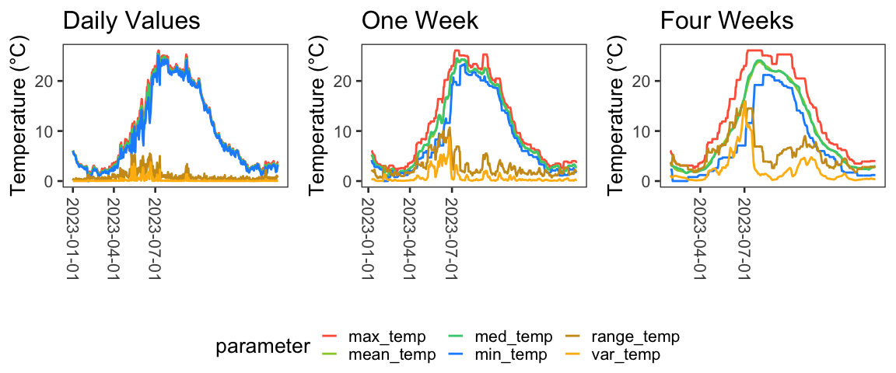

``` r
one_week_doy_data = week_temps %>% 
  mutate(doy = yday(date))

one_week_temp_circle = ggplot(one_week_doy_data, aes(x = seven_day_mean_max, y = seven_day_mean_min, colour = doy)) + 
  geom_point() + 
  labs(x = "Max. Temp. (°C)",
       y = "Min. Temp. (°C)") + 
  ggtitle("One Week") + 
  theme_matt()
```

The different time periods examined by this climate data highlights that
the relationship between minimum and maximum temperatures changes based
on the window examined. For example, minimum and maximum temperatures
experienced over weekly intervals are closely linked, whereas there is a
distinct seasonal cycle in the relationship between minimum and maximum
temperatures experienced over periods of four weeks.

``` r
four_week_doy_data = four_week_temps %>% 
  mutate(doy = yday(date))

four_week_temp_circle = ggplot(four_week_doy_data, aes(x = `twenty-eight_day_max`, y = `twenty-eight_day_min`, colour = doy)) + 
  geom_point() + 
  labs(x = "Max. Temp. (°C)",
       y = "Min. Temp. (°C)") + 
  ggtitle("Four Week") + 
  theme_matt()

ggarrange(one_week_temp_circle, four_week_temp_circle,
          common.legend = T, legend = "bottom")
```

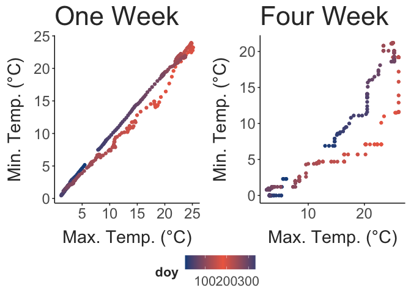

``` r
## Daily values for the period examined by dataset
collection_conditions = temp_data %>%
  ungroup() %>% 
  group_by(date) %>% 
  summarise(mean_temp = mean(temp),
            med_temp = median(temp),
            var_temp = var(temp), 
            min_temp = min(temp), 
            max_temp = max(temp)) %>% 
  mutate("range_temp" = max_temp - min_temp,
         date = as.Date(date)) %>% 
  ungroup() %>%  
  filter(date >= (min(as.Date(full_data$collection_date)) - 7))

## Mean female thermal limits for each species, grouped by collection
species_summaries = full_data %>%  
  #filter(sex == "female") %>% 
  group_by(sp_name, collection_date, collection_temp) %>%  
  summarise("mean_ctmax" = mean(ctmax),
            "sample_size" = n(),
            "ctmax_st_err" = (sd(ctmax) / sqrt(sample_size)),
            "ctmax_var" = var(ctmax), 
            "mean_size" = mean(size),
            "size_st_err" = (sd(size) / sqrt(sample_size)),
            "size_var" = var(size)) %>%  
  ungroup() %>% 
  complete(sp_name, collection_date) %>% 
  arrange(desc(sample_size))

ggplot() + 
  geom_vline(data = unique(select(full_data, collection_date)), 
             aes(xintercept = as.Date(collection_date)),
             colour = "grey90",
             linewidth = 1) + 
  geom_line(data = collection_conditions, 
            aes(x = as.Date(date), y = mean_temp),
            colour = "black", 
            linewidth = 2) + 
  # geom_errorbar(data = species_summaries,
  #               aes(x = as.Date(collection_date),
  #                   ymin = mean_ctmax - ctmax_st_err, ymax = mean_ctmax + ctmax_st_err,
  #                   colour = sp_name),
  #               position = position_dodge(width = 1),
  #               width = 5, linewidth = 1) +
  geom_point(data = species_summaries, 
             aes(x = as.Date(collection_date), y = mean_ctmax, colour = sp_name, size = sample_size)) + 
  scale_colour_manual(values = species_cols) + 
  labs(x = "Date", 
       y = "Temperature (°C)", 
       colour = "Species",
       size = "Sample Size") + 
  theme_matt() + 
  theme(legend.position = "right")
```

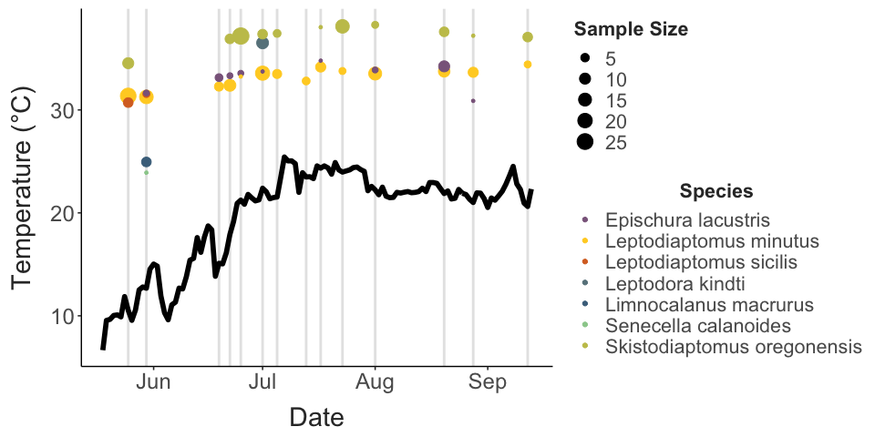

``` r

size_timeseries = ggplot() + 
  geom_vline(data = unique(select(full_data, collection_date)), 
             aes(xintercept = as.Date(collection_date)),
             colour = "grey90",
             linewidth = 1) + 
  geom_line(data = collection_conditions, 
            aes(x = as.Date(date), y = mean_temp),
            colour = "black", 
            linewidth = 2) + 
  # geom_errorbar(data = species_summaries,
  #               aes(x = as.Date(collection_date), 
  #                   ymin = mean_ctmax - ctmax_st_err, ymax = mean_ctmax + ctmax_st_err,
  #                   colour = sp_name),
  #               position = position_dodge(width = 1),
  #               width = 5, linewidth = 1) + 
  geom_point(data = species_summaries, 
             aes(x = as.Date(collection_date), y = mean_size * 40, colour = sp_name),
             position = position_dodge(width = 1),
             size = 4) + 
  scale_colour_manual(values = species_cols) + 
  scale_y_continuous(
    name = "Temperature", # Features of the first axis
    sec.axis = sec_axis(~./40, name="Prosome Length (mm)"), # Add a second axis and specify its features
    breaks = c(0,5,10,15,20,25,30)
  ) + 
  labs(x = "Date", 
       y = "Temperature (°C)", 
       colour = "Species") + 
  theme_matt() + 
  theme(legend.position = "right")

#ggarrange(ctmax_timeseries, size_timeseries, common.legend = T, legend = "bottom")
```

``` r
## Combine data, then pull out values for each collection date
date_list = as.Date(unique(full_data$collection_date))

temp_predictors = daily_temp_data %>% 
  full_join(week_temps, by = c("date")) %>% 
  full_join(two_week_temps, by = c("date")) %>% 
  full_join(four_week_temps, by = c("date")) %>% 
  full_join(eight_week_temps, by = c("date")) %>% 
  filter(date %in% date_list)
```

A set of predictors variables were assembled from the continuous
temperature data set based on conditions during the day of collection,
the week before collections, and the preceding two, four, and eight week
periods. This is a preliminary analysis for now. Shown here are the top
three factors. Species with no significant predictor or limited
collection date distributions were excluded.

``` r
corr_vals = full_data %>%  
  filter(sp_name != "Senecella calanoides") %>%
  filter(sp_name != "Limnocalanus macrurus") %>%
  mutate(collection_date = as.Date(collection_date)) %>% 
  full_join(temp_predictors, join_by(collection_date == date)) %>% 
  pivot_longer(cols = c(collection_temp, mean_temp:tail(names(.), 1)),
               values_to = "value", 
               names_to = "predictor") %>%  
  group_by(sp_name, predictor) %>% 
  summarise(correlation = cor.test(ctmax, value)$estimate,
            p.value = cor.test(ctmax, value)$p.value,
            ci_low = cor.test(ctmax, value)$conf.int[1],
            ci_high = cor.test(ctmax, value)$conf.int[2]) %>% 
  mutate(sig = ifelse(p.value <0.05, "Sig.", "Non Sig."))

corr_vals %>%  
  filter(sig == "Sig.") %>% 
  drop_na(correlation) %>% 
  group_by(sp_name) %>%
  arrange(desc(correlation)) %>% 
  slice_head(n = 3) %>% 
  select("Species" = sp_name, "Predictor" = predictor, "Correlation" = correlation, "P-Value" = p.value) %>% 
  knitr::kable(align = "c")
```

|           Species           |      Predictor       | Correlation |  P-Value  |
|:---------------------------:|:--------------------:|:-----------:|:---------:|
|     Epischura lacustris     | twenty-eight_day_max |  0.6492748  | 0.0004452 |
|     Epischura lacustris     |    seven_day_max     |  0.6415380  | 0.0005476 |
|     Epischura lacustris     |  seven_day_mean_max  |  0.6256773  | 0.0008228 |
|   Leptodiaptomus minutus    |   fourteen_day_med   |  0.7061519  | 0.0000000 |
|   Leptodiaptomus minutus    |  seven_day_mean_min  |  0.7050832  | 0.0000000 |
|   Leptodiaptomus minutus    |    seven_day_mean    |  0.7030745  | 0.0000000 |
| Skistodiaptomus oregonensis |       max_temp       |  0.6852416  | 0.0000000 |
| Skistodiaptomus oregonensis |       med_temp       |  0.6848968  | 0.0000000 |
| Skistodiaptomus oregonensis |      mean_temp       |  0.6843249  | 0.0000000 |

## Trait Variation

``` r
ctmax_plot = full_data %>% 
  mutate( #sp_name = str_replace(sp_name, pattern = " ",
    #                              replacement = "\n"),
    sp_name = fct_reorder(sp_name, ctmax, mean)) %>% 
  ggplot(aes(y = sp_name, x = ctmax)) + 
  geom_point(aes(colour= sp_name_sub),
             position = position_dodge(width = 0.3),
             size = 4) + 
  scale_colour_manual(values = species_cols) + 
  xlab(NULL) + 
  labs(y = "",
       x = "CTmax (°C)",
       colour = "Group") + 
  theme_matt() + 
  theme(legend.position = "none")

size_plot = full_data %>% 
  mutate(sp_name = fct_reorder(sp_name, ctmax, mean)) %>% 
  ggplot(aes(y = sp_name, x = size)) + 
  geom_point(aes(colour= sp_name_sub),
             position = position_dodge(width = 0.3),
             size = 4) + 
  scale_colour_manual(values = species_cols) + 
  labs(x = "Prosome Length (mm)",
       y = "", 
       colour = "Group") + 
  guides(color = guide_legend(ncol = 1)) +
  theme_matt(base_size = ) + 
  theme(legend.position = "right",
        axis.text.y = element_blank(),
        plot.margin = margin(0, 0, 0, 0,"cm"))

trait_plot = ctmax_plot + size_plot
trait_plot
```

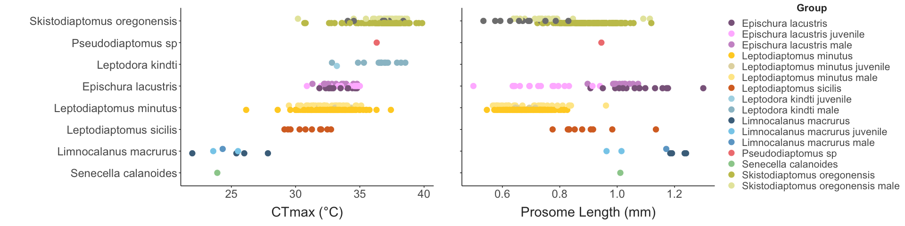

``` r
full_data %>%  
  drop_na(fecundity) %>%  
  ggplot(aes(x = fecundity, fill = sp_name_sub)) + 
  facet_wrap(.~sp_name_sub, ncol = 1) + 
  geom_histogram(binwidth = 2) + 
  scale_fill_manual(values = species_cols) + 
  labs(x = "Fecundity (# Eggs)") +
  theme_matt_facets() + 
  theme(legend.position = "none")
```

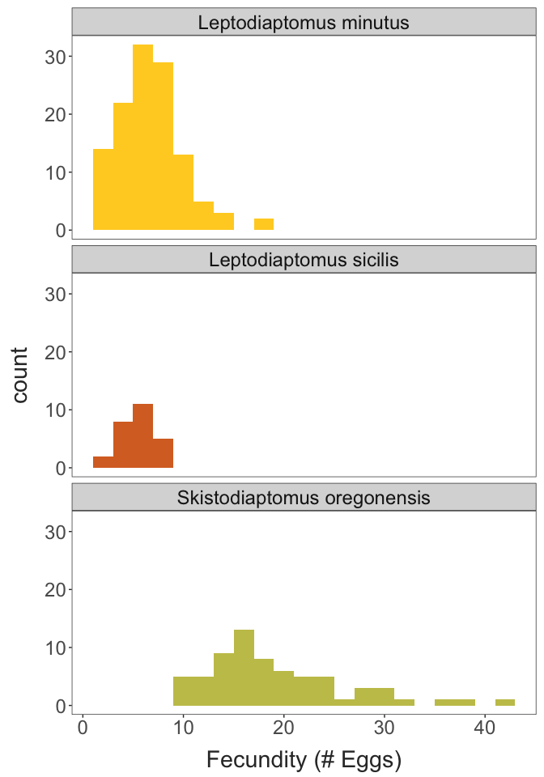

### Variation with temperature

``` r
ctmax_temp = ggplot(full_data, aes(x = collection_temp, y = ctmax, colour = sp_name)) + 
  geom_smooth(method = "lm", linewidth = 3) +
  geom_point(size = 3) + 
  labs(x = "Collection Temperature (°C)", 
       y = "CTmax (°C)",
       colour = "Species") + 
  scale_colour_manual(values = species_cols) + 
  theme_matt() + 
  theme(legend.position = "right")

size_temp = ggplot(filter(full_data, sex != "juvenile"), aes(x = collection_temp, y = size, colour = sp_name)) + 
  geom_smooth(method = "lm", linewidth = 3) +
  geom_point(size = 3) + 
  labs(x = "Collection Temperature (°C)", 
       y = "Length (mm)",
       colour = "Species")  + 
  scale_colour_manual(values = species_cols) + 
  theme_matt() + 
  theme(legend.position = "right")

wt_temp = ggplot(full_data, aes(x = collection_temp, y = warming_tol, colour = sp_name)) + 
  geom_smooth(method = "lm", linewidth = 3) +
  geom_point(size = 3) + 
  labs(x = "Collection Temperature (°C)", 
       y = "Warming Tolerance (°C)",
       colour = "Species")  + 
  scale_colour_manual(values = species_cols) + 
  theme_matt() + 
  theme(legend.position = "right")

eggs_temp = ggplot(full_data, aes(x = collection_temp, y = fecundity, colour = sp_name)) + 
  geom_smooth(method = "lm", linewidth = 3) +
  geom_point(size = 3) + 
  labs(x = "Collection Temperature (°C)", 
       y = "Fecundity (# Eggs)",
       colour = "Species")  + 
  scale_colour_manual(values = species_cols) + 
  theme_matt() + 
  theme(legend.position = "right")

ggarrange(ctmax_temp, size_temp, wt_temp, eggs_temp, 
          common.legend = T, legend = "right")
```

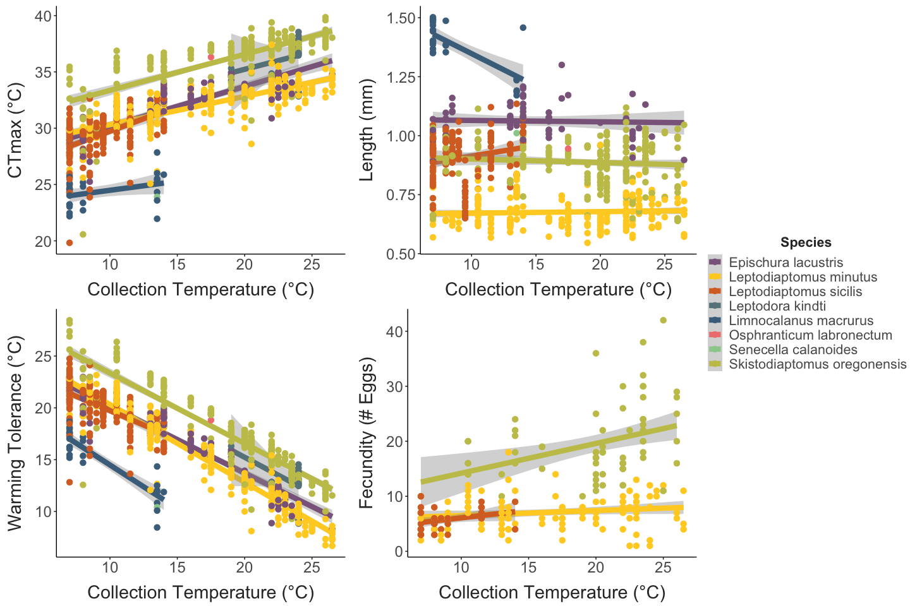

``` r
ctmax_temp.model = lm(data = full_data, ctmax ~ collection_temp * sp_name)

knitr::kable(car::Anova(ctmax_temp.model))
```

|                         |      Sum Sq |  Df |     F value |   Pr(\>F) |
|:------------------------|------------:|----:|------------:|----------:|
| collection_temp         |  233.080807 |   1 | 183.8847418 | 0.0000000 |
| sp_name                 | 1228.963969 |   6 | 161.5946879 | 0.0000000 |
| collection_temp:sp_name |    1.693666 |   3 |   0.4453953 | 0.7207541 |
| Residuals               |  344.770202 | 272 |          NA |        NA |

``` r

ctmax_resids = cbind(full_data, "resids" = ctmax_temp.model$residuals)
```

``` r
ggplot(ctmax_resids, aes(x = days_in_lab, y = resids, colour = sp_name)) + 
  facet_wrap(sp_name~.) + 
  geom_point(size = 4) + 
  geom_smooth(method = "lm", se = F, linewidth = 2) + 
  scale_x_continuous(breaks = c(0:3)) + 
  labs(x = "Days in lab", 
       y = "CTmax Residuals") + 
  scale_colour_manual(values = species_cols) + 
  theme_matt_facets() + 
  theme(legend.position = "none")
```

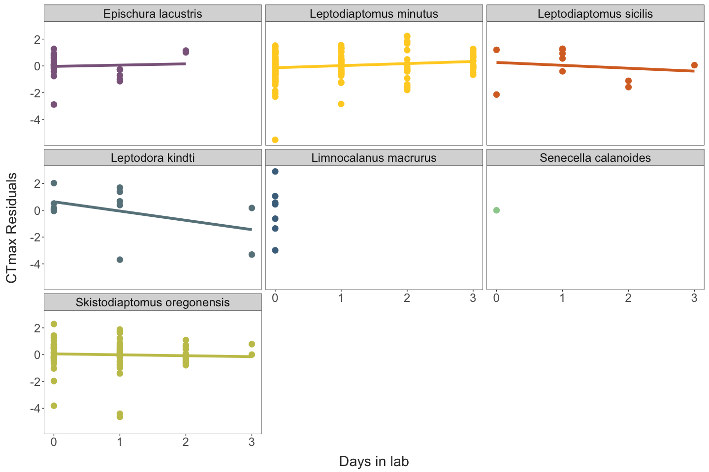

Given the long generation times of these copepods, decreases in trait
variance may indicate selection over the seasonal cycle. Shown below are
the variance in observed CTmax and size, plotted against collection
date. Variance decreases in *Skistodiaptomus*, but this pattern is
driven by a single collection with high variance early in the year. Size
variance increases slightly in *Skistodiaptomus*. Variance in both CTmax
and size is fairly constant in *Leptodiaptomus minutus*, the only other
species collected across the entire set of samples thus far.

``` r
ggplot(drop_na(species_summaries, ctmax_var), aes(x = as.Date(collection_date), y = ctmax_var, colour = sp_name)) + 
  facet_wrap(sp_name~.) + 
  geom_point(size = 2) + 
  geom_smooth(method = "lm", se = F) + 
  labs(x = "Collection Temp. (°C)", 
       y = "CTmax Variance") + 
  scale_colour_manual(values = species_cols) + 
  theme_matt_facets() + 
  theme(legend.position = "none")
```

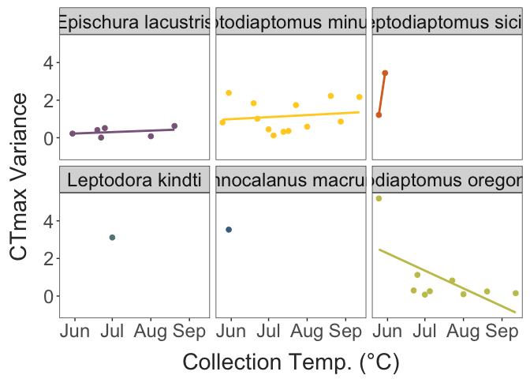

``` r

ggplot(drop_na(species_summaries, size_var), aes(x = as.Date(collection_date), y = size_var, colour = sp_name)) + 
  facet_wrap(sp_name~.) + 
  geom_point(size = 2) + 
  geom_smooth(method = "lm", se = F) + 
  labs(x = "Collection Temp. (°C)", 
       y = "Size Variance") + 
  scale_colour_manual(values = species_cols) + 
  theme_matt_facets() + 
  theme(legend.position = "none")
```

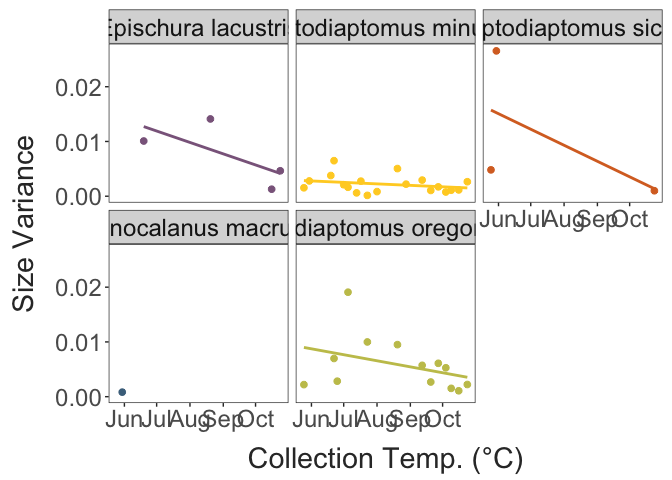

## Sex and stage variation in thermal limits

Previous sections have generally lumped juvenile, female, and male
individuals together. There may be important stage- or sex-specific
differences in CTmax though. For several species, we have measurements
for individuals in different stages or of different sexes.

``` r
sex_sample_sizes = ctmax_resids %>%  
  group_by(sp_name, sex) %>%  
  summarise(num = n()) %>%  
  pivot_wider(id_cols = sp_name,
              names_from = sex, 
              values_from = num,
              values_fill = 0) %>% 
  select("Species" = sp_name, "Juvenile" = juvenile, "Female" = female, "Male" = male)

knitr::kable(sex_sample_sizes, align = "c")
```

|           Species           | Juvenile | Female | Male |
|:---------------------------:|:--------:|:------:|:----:|
|     Epischura lacustris     |    10    |   8    |  7   |
|   Leptodiaptomus minutus    |    5     |  105   |  27  |
|   Leptodiaptomus sicilis    |    0     |   10   |  0   |
|      Leptodora kindti       |    1     |   0    |  11  |
|    Limnocalanus macrurus    |    2     |   4    |  1   |
|    Senecella calanoides     |    0     |   1    |  0   |
| Skistodiaptomus oregonensis |    2     |   73   |  16  |

The female-male and female-juvenile comparisons show that there are
generally no differences in thermal limits between these groups.

``` r
ctmax_resids %>% 
  filter(sp_name %in% filter(sex_sample_sizes, Male > 0, Female > 0)$Species & 
           sex != "juvenile") %>% 
  ggplot(aes(x = sex, y = resids, colour = sp_name, group = sp_name)) + 
  facet_wrap(sp_name~., ncol = 2) + 
  geom_smooth(method = "lm", se = F, linewidth = 1) + 
  geom_point(size = 3,
             alpha = 0.5,
             position = position_jitter(height = 0, width = 0.05)) +  
  labs(x = "Sex", 
       y = "CTmax Residuals") + 
  scale_colour_manual(values = species_cols) + 
  theme_bw(base_size = 18) + 
  theme(legend.position = "none", 
        panel.grid = element_blank())
```

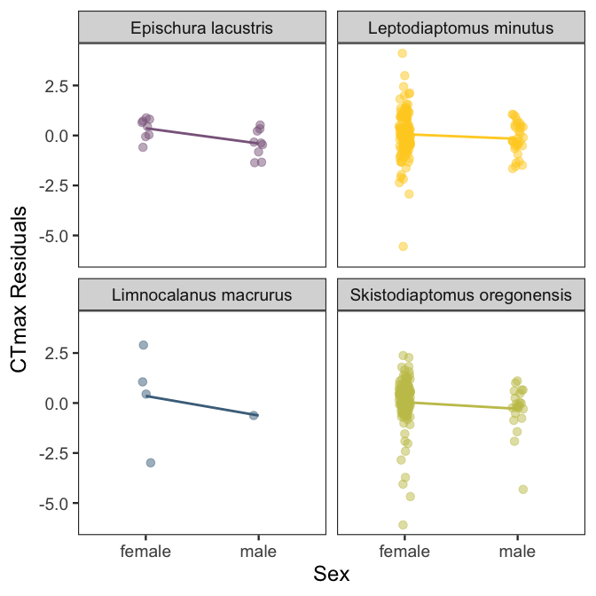

``` r
ctmax_resids %>% 
  filter(sp_name %in% filter(sex_sample_sizes, Juvenile > 0 & Female > 0)$Species & 
           sex != "male") %>% 
  ggplot(aes(x = sex, y = resids, colour = sp_name, group = sp_name)) + 
  facet_wrap(sp_name~., ncol = 1) + 
  geom_smooth(method = "lm", se = F, linewidth = 1) + 
  geom_point(size = 3,
             alpha = 0.5,
             position = position_jitter(height = 0, width = 0.05)) +  
  labs(x = "Sex", 
       y = "CTmax (°C)") + 
  scale_colour_manual(values = species_cols) + 
  theme_bw(base_size = 18) + 
  theme(legend.position = "none", 
        panel.grid = element_blank())
```

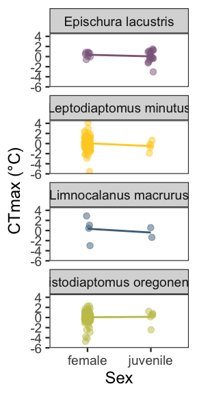

## Trait Correlations

``` r
ggplot(full_data, aes(x = size, y = ctmax, colour = sp_name)) + 
  geom_smooth(data = full_data, 
              aes(x = size, y = ctmax),
              method = "lm", 
              colour ="black", 
              linewidth = 2.5) + 
  geom_smooth(method = "lm", se = F, linewidth = 2) + 
  geom_point(size = 4) + 
  labs(x = "Length (mm)", 
       y = "CTmax (°C)",
       colour = "Species") + 
  scale_colour_manual(values = species_cols) + 
  theme_matt() + 
  theme(legend.position = "right")
```

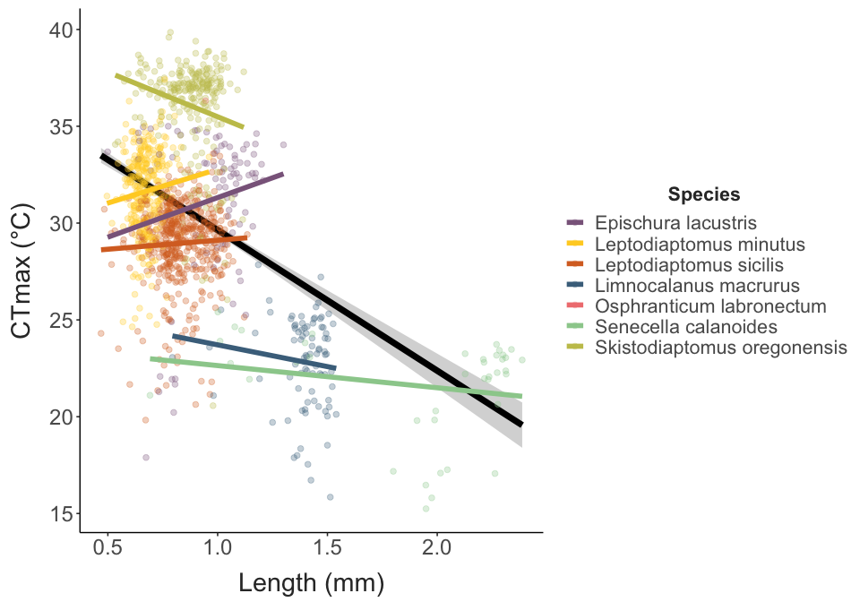

``` r
ggplot(ctmax_resids, aes(x = size, y = fecundity, colour = sp_name)) + 
  geom_smooth(method = "lm", se = F, linewidth = 2) + 
  geom_point(size = 4) + 
  labs(x = "Prosome length (mm)", 
       y = "Fecundity (# Eggs)",
       colour = "Species") + 
  scale_colour_manual(values = species_cols) + 
  theme_matt() + 
  theme(legend.position = "right")
```

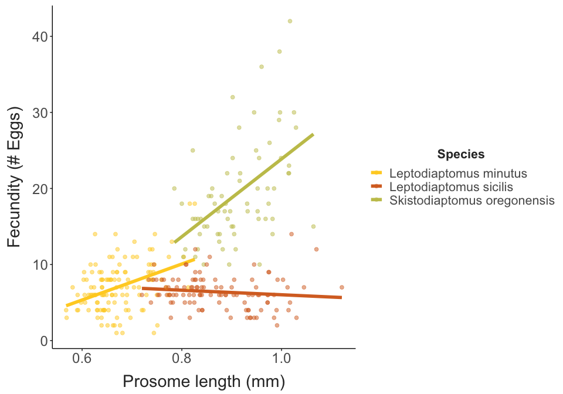

``` r
ggplot(ctmax_resids, aes(x = ctmax, y = fecundity, colour = sp_name)) + 
  geom_smooth(method = "lm", se = F, linewidth = 2) + 
  geom_point(size = 4) + 
  labs(x = "CTmax (°C)", 
       y = "Fecundity (# Eggs)") + 
  scale_colour_manual(values = species_cols) + 
  theme_matt() + 
  theme(legend.position = "right")
```


