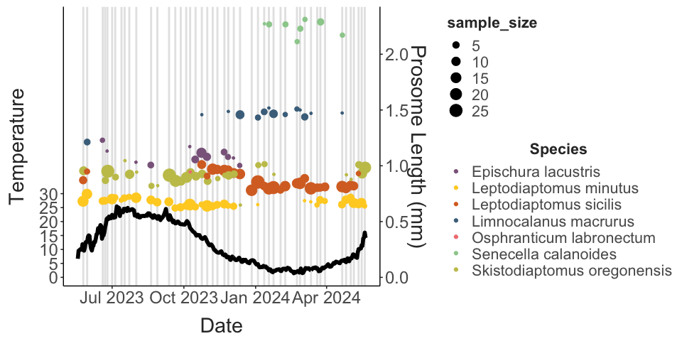
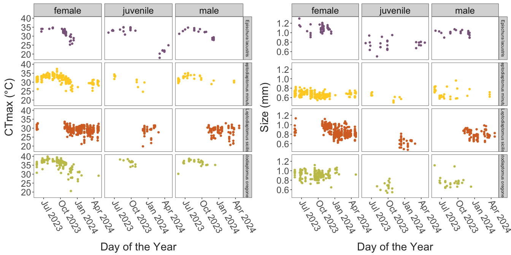
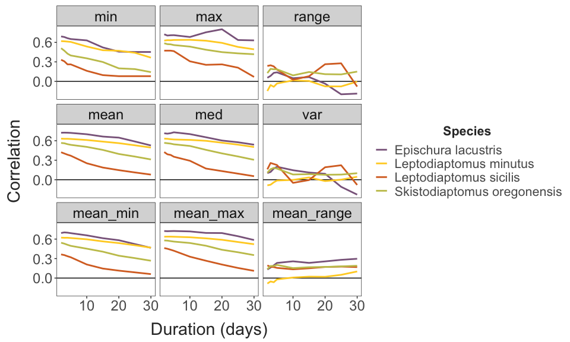
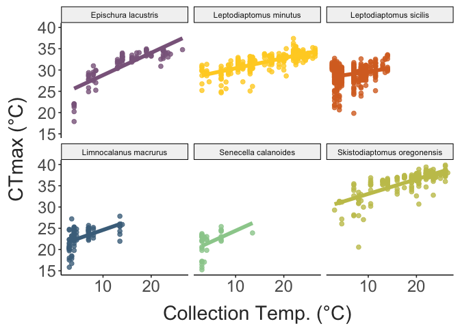
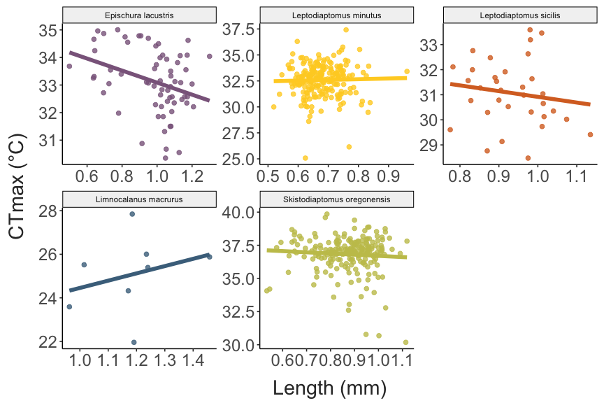
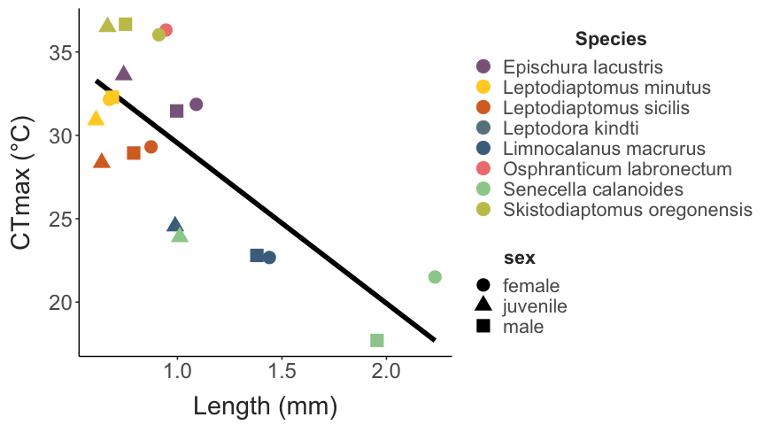

Seasonality in Lake Champlain Copepod Thermal Limits
================
2023-11-03

- [Copepod Collection](#copepod-collection)
- [Temperature Variability](#temperature-variability)
- [Trait Variation](#trait-variation)
  - [Variation with temperature](#variation-with-temperature)
  - [Sex and stage variation in thermal
    limits](#sex-and-stage-variation-in-thermal-limits)
  - [Trait Correlations and
    Trade-offs](#trait-correlations-and-trade-offs)

## Copepod Collection

Copepods were collected at approximately weekly intervals from Lake
Champlain (Burlington Fishing Pier). Plankton was collected from the top
3 meters using a 250 um mesh net.

``` r
# Lake Champlain near Burlington, VT
siteNumber = "04294500"
ChamplainInfo = readNWISsite(siteNumber)
parameterCd = "00010"
startDate = "2023-01-01"
endDate = ""
#statCd = c("00001", "00002","00003", "00011") # 1 - max, 2 - min, 3 = mean

# Constructs the URL for the data wanted then downloads the data
url = constructNWISURL(siteNumbers = siteNumber, parameterCd = parameterCd, 
                       startDate = startDate, endDate = endDate, service = "uv")

temp_data = importWaterML1(url, asDateTime = T) %>% 
  mutate("date" = as.Date(dateTime)) %>% 
  select(date, "temp" = X_00010_00000)
```

Collections began in late May 2023. Several gaps are present, but
collections have continued at roughly weekly intervals since then.
Copepods from 21 collections were used to make a total of 534 thermal
limit measurements. Over this time period, collection temperatures
ranged from 10.5 to 26.5°C.

There is substantial variation in thermal limits across the species
collected. There is also some degree of variation within the species,
with thermal limits increasing slightly during the summer.

``` r
## Daily values for the period examined by dataset
collection_conditions = temp_data %>%
  ungroup() %>% 
  group_by(date) %>% 
  summarise(mean_temp = mean(temp),
            med_temp = median(temp),
            var_temp = var(temp), 
            min_temp = min(temp), 
            max_temp = max(temp)) %>% 
  mutate("range_temp" = max_temp - min_temp,
         date = as.Date(date)) %>% 
  ungroup() %>%  
  filter(date >= (min(as.Date(full_data$collection_date)) - 7))

## Mean female thermal limits for each species, grouped by collection
species_summaries = full_data %>%  
  #filter(sex == "female") %>% 
  group_by(sp_name, collection_date, collection_temp) %>%  
  summarise("mean_ctmax" = mean(ctmax),
            "sample_size" = n(),
            "ctmax_st_err" = (sd(ctmax) / sqrt(sample_size)),
            "ctmax_var" = var(ctmax), 
            "mean_size" = mean(size),
            "size_st_err" = (sd(size) / sqrt(sample_size)),
            "size_var" = var(size)) %>%  
  ungroup() %>% 
  complete(sp_name, collection_date) %>% 
  arrange(desc(sample_size))

adult_summaries = full_data %>%  
  filter(sex == "female") %>% 
  group_by(sp_name, collection_date, collection_temp) %>%  
  summarise("mean_ctmax" = mean(ctmax),
            "sample_size" = n(),
            "ctmax_st_err" = (sd(ctmax) / sqrt(sample_size)),
            "ctmax_var" = var(ctmax), 
            "mean_size" = mean(size),
            "size_st_err" = (sd(size) / sqrt(sample_size)),
            "size_var" = var(size)) %>%  
  ungroup() %>% 
  complete(sp_name, collection_date) %>% 
  arrange(desc(sample_size))


ggplot() + 
  geom_vline(data = unique(select(full_data, collection_date)), 
             aes(xintercept = as.Date(collection_date)),
             colour = "grey90",
             linewidth = 1) + 
  geom_line(data = collection_conditions, 
            aes(x = as.Date(date), y = mean_temp),
            colour = "black", 
            linewidth = 2) + 
  # geom_errorbar(data = species_summaries,
  #               aes(x = as.Date(collection_date),
  #                   ymin = mean_ctmax - ctmax_st_err, ymax = mean_ctmax + ctmax_st_err,
  #                   colour = sp_name),
  #               position = position_dodge(width = 1),
  #               width = 5, linewidth = 1) +
  geom_point(data = adult_summaries, 
             aes(x = as.Date(collection_date), y = mean_ctmax, colour = sp_name, size = sample_size)) + 
  scale_colour_manual(values = species_cols) + 
  labs(x = "Date", 
       y = "Temperature (°C)", 
       colour = "Species",
       size = "Sample Size") + 
  theme_matt() + 
  theme(legend.position = "right")
```


Size also varied both between and within species.

``` r
ggplot() + 
  geom_vline(data = unique(select(full_data, collection_date)), 
             aes(xintercept = as.Date(collection_date)),
             colour = "grey90",
             linewidth = 1) + 
  geom_line(data = collection_conditions, 
            aes(x = as.Date(date), y = mean_temp),
            colour = "black", 
            linewidth = 2) + 
  # geom_errorbar(data = species_summaries,
  #               aes(x = as.Date(collection_date), 
  #                   ymin = mean_ctmax - ctmax_st_err, ymax = mean_ctmax + ctmax_st_err,
  #                   colour = sp_name),
  #               position = position_dodge(width = 1),
  #               width = 5, linewidth = 1) + 
  geom_point(data = adult_summaries, 
             aes(x = as.Date(collection_date), y = mean_size * 40, colour = sp_name, size = sample_size),
             position = position_dodge(width = 1)) + 
  scale_colour_manual(values = species_cols) + 
  scale_y_continuous(
    name = "Temperature", # Features of the first axis
    sec.axis = sec_axis(~./40, name="Prosome Length (mm)"), # Add a second axis and specify its features
    breaks = c(0,5,10,15,20,25,30)
  ) + 
  labs(x = "Date", 
       y = "Temperature (°C)", 
       colour = "Species") + 
  theme_matt() + 
  theme(legend.position = "right")
```



For the three species with the most data (*Skistodiaptomus*, *L.
minutus*, *Epischura*), shown below is CTmax and body size, plotted
against the day of the year for each sex/stage separately.

``` r
ctmax_feature = full_data %>%  
  mutate(doy = yday(collection_date)) %>% 
  filter(sp_name %in% c("Skistodiaptomus oregonensis", "Leptodiaptomus minutus", "Epischura lacustris")) %>% 
  ggplot(aes(x = doy, y = ctmax, colour = sp_name)) + 
  facet_grid(sp_name~sex) + 
  geom_point() + 
  scale_colour_manual(values = species_cols) + 
  labs(x = "Day of the Year", 
       y = "CTmax (°C)") + 
  guides(color = FALSE) + 
  theme_matt_facets() +
  theme(axis.text.x = element_text(angle = 300, hjust = 0, vjust = 0.5))

size_feature = full_data %>%  
  mutate(doy = yday(collection_date)) %>% 
  filter(sp_name %in% c("Skistodiaptomus oregonensis", "Leptodiaptomus minutus", "Epischura lacustris")) %>% 
  ggplot(aes(x = doy, y = size, colour = sp_name)) + 
  facet_grid(sp_name~sex) + 
  geom_point() + 
  scale_colour_manual(values = species_cols) + 
  labs(x = "Day of the Year", 
       y = "Size (mm)") + 
  guides(color = FALSE) + 
  theme_matt_facets() +
  theme(axis.text.x = element_text(angle = 300, hjust = 0, vjust = 0.5))

ggarrange(ctmax_feature, size_feature, common.legend = T, legend = "bottom")
```



## Temperature Variability

Lake Champlain is highly seasonal, with both average temperatures and
temperature variability changing throughout the year. These patterns in
the experienced thermal environment may drive the observed variation in
copepod thermal limits. However, the time period affecting copepod
thermal limits is unknown. Depending the on the duration of time
considered, there are large changes in the experienced environment, in
particular regarding the temperature range and variance. Consider for
example three time periods: the day of collection, one week prior to
collection, and four weeks prior to collection. While the overall
pattern is similar, we can see that, unsurprisingly, considering longer
periods of time results in larger ranges and slightly changes the
pattern of variance experienced.

``` r
## Daily values
daily_temp_data = temp_data %>%
  ungroup() %>% 
  group_by(date) %>% 
  summarise(mean_temp = mean(temp),
            med_temp = median(temp),
            var_temp = var(temp), 
            min_temp = min(temp), 
            max_temp = max(temp)) %>% 
  mutate("range_temp" = max_temp - min_temp)

day_prior_temp_data = temp_data %>% 
  ungroup() %>% 
  group_by(date) %>% 
  summarise(mean_temp = mean(temp),
            med_temp = median(temp),
            var_temp = var(temp), 
            min_temp = min(temp), 
            max_temp = max(temp)) %>% 
  mutate(date = date + 1) %>% 
  rename_with(.fn = ~ paste0("prior_day_", .x), .cols = c(-date))

daily_plot = daily_temp_data %>% 
  pivot_longer(cols = c(-date),
               names_to = "parameter", 
               values_to = "temp") %>% 
  ggplot(aes(x = date, y = temp, colour = parameter)) + 
  geom_line(linewidth = 1) + 
  scale_colour_manual(values = c(
    "mean_temp" = "olivedrab3",
    "med_temp" = "seagreen3",
    "max_temp" = "tomato",  
    "min_temp" = "dodgerblue",
    "range_temp" = "goldenrod3",
    "var_temp" = "darkgoldenrod1"
  )) + 
  scale_x_continuous(breaks = as.Date(c("2023-01-01", "2023-04-01", "2023-07-01"))) + 
  ggtitle("Daily Values") + 
  labs(y = "Temperature (°C)",
       x = "") + 
  theme_bw(base_size = 20) + 
  theme(panel.grid = element_blank(),
        axis.text.x = element_text(angle = 270, hjust = 0, vjust = 0.5))
```

``` r
## Defining the function to get predictor values for periods of different lengths
get_predictors = function(daily_values, raw_temp, n_days){
  prefix = str_replace_all(xfun::numbers_to_words(n_days), pattern = " ", replacement = "-")
  
  mean_values = daily_values %>% 
    ungroup() %>% 
    mutate(mean_max = slide_vec(.x = max_temp, .f = mean, .before = n_days, .complete = T),
           mean_min = slide_vec(.x = min_temp, .f = mean, .before = n_days, .complete = T),
           mean_range = slide_vec(.x = range_temp, .f = mean, .before = n_days, .complete = T)) %>% 
    select(date, mean_max, mean_min, mean_range) %>% 
    rename_with( ~ paste(prefix, "day", .x, sep = "_"), .cols = c(-date))
  
  period_values = raw_temp %>% 
    mutate(mean = slide_index_mean(temp, i = date, before = days(n_days), 
                                   na_rm = T),
           max = slide_index_max(temp, i = date, before = days(n_days), 
                                 na_rm = T),
           min = slide_index_min(temp, i = date, before = days(n_days),
                                 na_rm = T),
           med = slide_index_dbl(temp, .i = date, .before = days(n_days), 
                                 na_rm = T, .f = median),
           var = slide_index_dbl(temp, .i = date, .before = days(n_days), 
                                 .f = var),
           range = max - min) %>%  
    select(-temp) %>%  
    distinct() %>% 
    rename_with( ~ paste(prefix, "day", .x, sep = "_"), .cols = c(-date))%>% 
    inner_join(mean_values, by = c("date")) %>%  
    drop_na()
  
  return(period_values)
}
```

``` r
# ## Getting predictor variables for different periods
# 
# ### Short (three days)
# three_day_temps = get_predictors(daily_values = daily_temp_data, 
#                                  raw_temp = temp_data, 
#                                  n_days = 3)
# 
# ### ONE WEEK
week_temps = get_predictors(daily_values = daily_temp_data,
                            raw_temp = temp_data,
                            n_days = 7)

week_plot = week_temps %>%
  pivot_longer(cols = c(-date),
               names_to = "parameter",
               values_to = "temp") %>%
  filter(parameter %in% c("seven_day_mean",
                          "seven_day_med",
                          "seven_day_max",
                          "seven_day_min",
                          "seven_day_var",
                          "seven_day_range")) %>%
  mutate(parameter = paste(word(parameter, start = 3, sep = fixed("_")), "_temp", sep = "")) %>%
  ggplot(aes(x = date, y = temp, colour = parameter)) +
  geom_line(linewidth = 1) +
  scale_colour_manual(values = c(
    "mean_temp" = "olivedrab3",
    "med_temp" = "seagreen3",
    "max_temp" = "tomato",
    "min_temp" = "dodgerblue",
    "range_temp" = "goldenrod3",
    "var_temp" = "darkgoldenrod1"
  )) +
  scale_x_continuous(breaks = as.Date(c("2023-01-01", "2023-04-01", "2023-07-01"))) +
  ggtitle("One Week") +
  labs(y = "Temperature (°C)",
       x = "") +
  theme_bw(base_size = 20) +
  theme(panel.grid = element_blank(),
        axis.text.x = element_text(angle = 270, hjust = 0, vjust = 0.5))
# 
# 
# ### TWO WEEKS
# two_week_temps = get_predictors(daily_values = daily_temp_data, 
#                                 raw_temp = temp_data, 
#                                 n_days = 14)
# 
# two_week_plot = two_week_temps %>% 
#   pivot_longer(cols = c(-date),
#                names_to = "parameter", 
#                values_to = "temp") %>% 
#   filter(parameter %in% c("fourteen_day_mean",
#                           "fourteen_day_med",
#                           "fourteen_day_max", 
#                           "fourteen_day_min", 
#                           "fourteen_day_var",
#                           "fourteen_day_range")) %>% 
#   mutate(parameter = paste(word(parameter, start = 3, sep = fixed("_")), "_temp", sep = "")) %>% 
#   ggplot(aes(x = date, y = temp, colour = parameter)) + 
#   geom_line(linewidth = 1) + 
#   scale_colour_manual(values = c(
#     "mean_temp" = "olivedrab3",
#     "med_temp" = "seagreen3",
#     "max_temp" = "tomato",  
#     "min_temp" = "dodgerblue",
#     "range_temp" = "goldenrod3",
#     "var_temp" = "darkgoldenrod1"
#   )) + 
#   scale_x_continuous(breaks = as.Date(c("2023-01-01", "2023-04-01", "2023-07-01"))) + 
#   ggtitle("Two Weeks") + 
#   labs(y = "Temperature (°C)",
#        x = "") + 
#   theme_bw(base_size = 20) + 
#   theme(panel.grid = element_blank(),
#         axis.text.x = element_text(angle = 270, hjust = 0, vjust = 0.5))
# 
# 
# ### FOUR WEEKS
four_week_temps = get_predictors(daily_values = daily_temp_data,
                                 raw_temp = temp_data,
                                 n_days = 28)

four_week_plot = four_week_temps %>%
  pivot_longer(cols = c(-date),
               names_to = "parameter",
               values_to = "temp") %>%
  filter(parameter %in% c("twenty-eight_day_mean",
                          "twenty-eight_day_med",
                          "twenty-eight_day_max",
                          "twenty-eight_day_min",
                          "twenty-eight_day_var",
                          "twenty-eight_day_range")) %>%
  mutate(parameter = paste(word(parameter, start = 3, sep = fixed("_")), "_temp", sep = "")) %>%
  ggplot(aes(x = date, y = temp, colour = parameter)) +
  geom_line(linewidth = 1) +
  scale_colour_manual(values = c(
    "mean_temp" = "olivedrab3",
    "med_temp" = "seagreen3",
    "max_temp" = "tomato",
    "min_temp" = "dodgerblue",
    "range_temp" = "goldenrod3",
    "var_temp" = "darkgoldenrod1"
  )) +
  scale_x_continuous(breaks = as.Date(c("2023-01-01", "2023-04-01", "2023-07-01"))) +
  ggtitle("Four Weeks") +
  labs(y = "Temperature (°C)",
       x = "") +
  theme_bw(base_size = 20) +
  theme(panel.grid = element_blank(),
        axis.text.x = element_text(angle = 270, hjust = 0, vjust = 0.5))
# 
# 
# ### EIGHT WEEKS
# eight_week_temps = get_predictors(daily_values = daily_temp_data, 
#                                   raw_temp = temp_data, 
#                                   n_days = 56)
# 
# eight_week_plot = eight_week_temps %>% 
#   pivot_longer(cols = c(-date),
#                names_to = "parameter", 
#                values_to = "temp") %>% 
#   filter(parameter %in% c("fifty-six_day_mean",
#                           "fifty-six_day_med",
#                           "fifty-six_day_max", 
#                           "fifty-six_day_min", 
#                           "fifty-six_day_var",
#                           "fifty-six_day_range")) %>% 
#   mutate(parameter = paste(word(parameter, start = 3, sep = fixed("_")), "_temp", sep = "")) %>% 
#   ggplot(aes(x = date, y = temp, colour = parameter)) + 
#   geom_line(linewidth = 1) + 
#   scale_colour_manual(values = c(
#     "mean_temp" = "olivedrab3",
#     "med_temp" = "seagreen3",
#     "max_temp" = "tomato",  
#     "min_temp" = "dodgerblue",
#     "range_temp" = "goldenrod3",
#     "var_temp" = "darkgoldenrod1"
#   )) + 
#   scale_x_continuous(breaks = as.Date(c("2023-01-01", "2023-04-01", "2023-07-01"))) + 
#   ggtitle("Eight Weeks") + 
#   labs(y = "Temperature (°C)",
#        x = "") + 
#   theme_bw(base_size = 20) + 
#   theme(panel.grid = element_blank(),
#         axis.text.x = element_text(angle = 270, hjust = 0, vjust = 0.5))
# 
ggarrange(daily_plot, week_plot, four_week_plot, 
          common.legend = T, nrow = 1, legend = "bottom")
```


The different time periods examined by this climate data highlights that
the relationship between minimum and maximum temperatures changes based
on the window examined. For example, minimum and maximum temperatures
experienced over weekly intervals are closely linked, whereas there is a
distinct seasonal cycle in the relationship between minimum and maximum
temperatures experienced over periods of four weeks.

``` r
one_week_doy_data = week_temps %>% 
  mutate(doy = yday(date))

one_week_temp_circle = ggplot(one_week_doy_data, aes(x = seven_day_mean_max, y = seven_day_mean_min, colour = doy)) + 
  geom_point() + 
  scale_colour_gradient2(
    high = "dodgerblue4",
    mid = "coral2",
    low = "dodgerblue4",
      midpoint = 182.5) + 
  labs(x = "Max. Temp. (°C)",
       y = "Min. Temp. (°C)") + 
  labs(x = "Max. Temp. (°C)",
       y = "Min. Temp. (°C)") + 
  ggtitle("One Week") + 
  theme_matt()

four_week_doy_data = four_week_temps %>% 
  mutate(doy = yday(date))

four_week_temp_circle = ggplot(four_week_doy_data, aes(x = `twenty-eight_day_max`, y = `twenty-eight_day_min`, colour = doy)) + 
  geom_point() + 
  scale_colour_gradient2(
    high = "dodgerblue4",
    mid = "coral2",
    low = "dodgerblue4",
      midpoint = 182.5) + 
  labs(x = "Max. Temp. (°C)",
       y = "Min. Temp. (°C)") + 
  ggtitle("Four Week") + 
  theme_matt()

ggarrange(one_week_temp_circle, four_week_temp_circle,
          common.legend = T, legend = "bottom")
```


The thermal environment over any period of time may drive patterns in
thermal acclimation. To explore the potential effects of different
acclimation windows, we examined the correlation between thermal limits
and different representations of the thermal environment for different
periods of time. Shown below are the correlation coefficients for these
relationships. Each facet shows the relationship for a different
dimension of the thermal environment. Correlation coefficients are
plotted for different durations, for species that were collected more
than five times. Only data for mature female copepods was included.

We can see that, in general, copepods are responding to proximate cues
from the thermal environment, with correlations generally dropping off
substantially as acclimation window duration increases. An exception is
*Epischura lacustris*, which appears to be responding to maximum
temperatures experienced over a 20 day time period.

``` r
### Pulling predictors and measuring correlations for much finer timescales; 1-56 days

words_to_numbers <- function(s) {
  s <- stringr::str_to_lower(s)
  for (i in 0:56)
    s <- stringr::str_replace_all(s, words(i), as.character(i))
  s
}

num_colls = full_data %>% 
  filter(sex == "female") %>% 
  select(collection_date, sp_name) %>%  
  distinct() %>%  
  count(sp_name) %>% 
  filter(n >= 5)

corr_vals = data.frame()

dur_vals = c(2, 3, 4, 5, 10, 15, 20, 25, 30)
for(i in dur_vals){
  
  duration_temps = get_predictors(daily_values = daily_temp_data, 
                             raw_temp = temp_data, 
                             n_days = i) %>% 
    filter(date %in% as_date(unique(full_data$collection_date)))
  
  corr_data = full_data %>%
    filter(sp_name %in% num_colls$sp_name) %>% 
    filter(sex == "female") %>% 
    mutate(collection_date = as.Date(collection_date)) %>% 
    inner_join(duration_temps, join_by(collection_date == date)) %>% 
    pivot_longer(cols = c(collection_temp, contains("day_")),
                 values_to = "value", 
                 names_to = "predictor") %>%  
    group_by(sp_name, predictor) %>% 
    summarise(correlation = cor.test(ctmax, value)$estimate,
              p.value = cor.test(ctmax, value)$p.value,
              ci_low = cor.test(ctmax, value)$conf.int[1],
              ci_high = cor.test(ctmax, value)$conf.int[2]) %>% 
    filter(predictor != "collection_temp") %>% 
    mutate(sig = ifelse(p.value <0.05, "Sig.", "Non Sig.")) %>% 
    separate(predictor, "_day_", into = c(NA, "parameter")) %>% 
    mutate(duration = i)
  
  corr_vals = bind_rows(corr_vals, corr_data)
}

corr_vals = corr_vals %>%  
  mutate(duration = as.numeric(duration))
```

``` r
corr_vals %>% 
mutate(parameter = fct_relevel(parameter, c("min", "max", "range",
                                            "mean", "med", "var",
                                            "mean_min", "mean_max", "mean_range"))) %>% 
ggplot(aes(x = duration, y = correlation, colour = sp_name)) + 
  facet_wrap(.~parameter) + 
  geom_hline(yintercept = 0) + 
  geom_line(linewidth = 1) + 
  scale_colour_manual(values = species_cols) + 
  labs(x = "Duration (days)",
       y = "Correlation", 
       colour = "Species") + 
  theme_matt_facets()
```



Shown here are the top three factors for each species.

``` r
# 
# corr_vals = full_data %>%
#   filter(sp_name %in% num_colls$sp_name) %>% 
#   filter(sex == "female") %>% 
#   mutate(collection_date = as.Date(collection_date)) %>% 
#   full_join(temp_predictors, join_by(collection_date == date)) %>% 
#   pivot_longer(cols = c(collection_temp, mean_temp:tail(names(.), 1)),
#                values_to = "value", 
#                names_to = "predictor") %>%  
#   group_by(sp_name, predictor) %>% 
#   summarise(correlation = cor.test(ctmax, value)$estimate,
#             p.value = cor.test(ctmax, value)$p.value,
#             ci_low = cor.test(ctmax, value)$conf.int[1],
#             ci_high = cor.test(ctmax, value)$conf.int[2]) %>% 
#   mutate(sig = ifelse(p.value <0.05, "Sig.", "Non Sig."))

corr_vals %>%  
  filter(sig == "Sig.") %>% 
  drop_na(correlation) %>% 
  group_by(sp_name) %>%
  arrange(desc(correlation)) %>% 
  slice_head(n = 3) %>% 
  select("Species" = sp_name, "Predictor" = parameter, "Duration" = duration, "Correlation" = correlation, "P-Value" = p.value) %>% 
  knitr::kable(align = "c")
```

|           Species           | Predictor | Duration | Correlation | P-Value |
|:---------------------------:|:---------:|:--------:|:-----------:|:-------:|
|     Epischura lacustris     |    max    |    20    |  0.8018430  |  0e+00  |
|     Epischura lacustris     |    max    |    15    |  0.7551468  |  2e-07  |
|     Epischura lacustris     |    med    |    5     |  0.7298558  |  7e-07  |
|   Leptodiaptomus minutus    |    max    |    10    |  0.6202459  |  0e+00  |
|   Leptodiaptomus minutus    | mean_max  |    3     |  0.6183001  |  0e+00  |
|   Leptodiaptomus minutus    | mean_max  |    4     |  0.6178094  |  0e+00  |
| Skistodiaptomus oregonensis |    max    |    2     |  0.5478622  |  0e+00  |
| Skistodiaptomus oregonensis | mean_max  |    2     |  0.5444970  |  0e+00  |
| Skistodiaptomus oregonensis | mean_max  |    3     |  0.5426651  |  0e+00  |

## Trait Variation

``` r
# ctmax_plot = full_data %>% 
#   mutate( #sp_name = str_replace(sp_name, pattern = " ",
#     #                              replacement = "\n"),
#     sp_name = fct_reorder(sp_name, ctmax, mean)) %>% 
#   ggplot(aes(y = sp_name, x = ctmax)) + 
#   geom_point(aes(colour= sp_name_sub),
#              position = position_dodge(width = 0.3),
#              size = 4) + 
#   scale_colour_manual(values = species_cols) + 
#   xlab(NULL) + 
#   labs(y = "",
#        x = "CTmax (°C)",
#        colour = "Group") + 
#   theme_matt() + 
#   theme(legend.position = "none")
# 
# size_plot = full_data %>% 
#   mutate(sp_name = fct_reorder(sp_name, ctmax, mean)) %>% 
#   ggplot(aes(y = sp_name, x = size)) + 
#   geom_point(aes(colour= sp_name_sub),
#              position = position_dodge(width = 0.3),
#              size = 4) + 
#   scale_colour_manual(values = species_cols) + 
#   labs(x = "Prosome Length (mm)",
#        y = "", 
#        colour = "Group") + 
#   guides(color = guide_legend(ncol = 1)) +
#   theme_matt(base_size = ) + 
#   theme(legend.position = "right",
#         axis.text.y = element_blank(),
#         plot.margin = margin(0, 0, 0, 0,"cm"))
# 
# trait_plot = ctmax_plot + size_plot
# trait_plot
```

Shown below are the distributions of thermal limits for each species.
This includes all data (all collections, stages, sexes, etc.). It’s
clear that there is substantial variation in thermal limits for several
species.

Shown below are the clutch size distributions for the three diaptomiid
species, which produce egg sacs that allow for easy quantification of
fecundity.

``` r
full_data %>%  
  drop_na(fecundity) %>%  
  ggplot(aes(x = fecundity, fill = sp_name_sub)) + 
  facet_wrap(.~sp_name_sub, ncol = 1) + 
  geom_histogram(binwidth = 2) + 
  scale_fill_manual(values = species_cols) + 
  labs(x = "Fecundity (# Eggs)") +
  theme_matt_facets() + 
  theme(legend.position = "none")
```


One of the main aims of this project is to examine the patterns and
processes driving variation in upper thermal limits across these species
of copepods.

### Variation with temperature

We expect one of the primary drivers of copepod thermal limits to be
temperature. The correlation analysis has shown that the copepods are
generally (although not always) responding to the recent thermal
environment. Shown below are thermal limits, body size, and fecundity
values plotted against the temperature at the time of collection. Also
shown is warming tolerance, calculated as the difference between upper
thermal limit and the collection temperature.

We generally see an increase in thermal limits with increasing
collection temperature, a slight decrease in body size, and variable
relationships between temperature and fecundity. All species maintained
some degree of buffer between environmental temperatures and upper
thermal limits, but *Epischura* and *L. minutus* approached their upper
thermal limits during the warmest collections during the summer.

``` r
ctmax_temp = ggplot(full_data, aes(x = collection_temp, y = ctmax, colour = sp_name)) + 
  geom_smooth(method = "lm", linewidth = 3) +
  geom_point(size = 3) + 
  labs(x = "Collection Temperature (°C)", 
       y = "CTmax (°C)",
       colour = "Species") + 
  scale_colour_manual(values = species_cols) + 
  theme_matt() + 
  theme(legend.position = "right")

size_temp = ggplot(filter(full_data, sex != "juvenile"), aes(x = collection_temp, y = size, colour = sp_name)) + 
  geom_smooth(method = "lm", linewidth = 3) +
  geom_point(size = 3) + 
  labs(x = "Collection Temperature (°C)", 
       y = "Length (mm)",
       colour = "Species")  + 
  scale_colour_manual(values = species_cols) + 
  theme_matt() + 
  theme(legend.position = "right")

wt_temp = ggplot(full_data, aes(x = collection_temp, y = warming_tol, colour = sp_name)) + 
  geom_smooth(method = "lm", linewidth = 3) +
  geom_point(size = 3) + 
  labs(x = "Collection Temperature (°C)", 
       y = "Warming Tolerance (°C)",
       colour = "Species")  + 
  scale_colour_manual(values = species_cols) + 
  theme_matt() + 
  theme(legend.position = "right")

eggs_temp = ggplot(full_data, aes(x = collection_temp, y = fecundity, colour = sp_name)) + 
  geom_smooth(method = "lm", linewidth = 3) +
  geom_point(size = 3) + 
  labs(x = "Collection Temperature (°C)", 
       y = "Fecundity (# Eggs)",
       colour = "Species")  + 
  scale_colour_manual(values = species_cols) + 
  theme_matt() + 
  theme(legend.position = "right")

ggarrange(ctmax_temp, size_temp, wt_temp, eggs_temp, 
          common.legend = T, legend = "right")
```


``` r
full_data %>% 
  #filter(sex == "female") %>%  
  group_by(sp_name) %>% filter(n() > 5) %>% filter(!str_detect(sp_name, pattern = "kindti")) %>% 
  ggplot(aes(x = collection_temp, y = ctmax, colour = sp_name)) + 
  facet_wrap(sp_name~.) + 
  geom_point(size = 2, alpha = 0.8) + 
  geom_smooth(method = "lm", se = F, linewidth = 2) + 
  labs(x = "Collection Temp. (°C)", 
       y = "CTmax (°C)") + 
  scale_colour_manual(values = species_cols) + 
  theme_matt() + 
  theme(legend.position = "none")
```



Copepods spent several days in lab during experiments. Shown below are
the CTmax residuals (taken from a model of CTmax against collection
temperature) plotted against the time spent in lab before measurements
were made. We can see clearly that thermal limits are fairly stable over
time.

``` r
ggplot(ctmax_resids, aes(x = days_in_lab, y = resids, colour = sp_name)) + 
  facet_wrap(sp_name~.) + 
  geom_point(size = 4, alpha = 0.5) + 
  geom_smooth(method = "lm", se = F, linewidth = 2) + 
  scale_x_continuous(breaks = c(0:5)) + 
  labs(x = "Days in lab", 
       y = "CTmax Residuals") + 
  scale_colour_manual(values = species_cols) + 
  theme_matt_facets() + 
  theme(legend.position = "none")
```


The term “acclimation response ratio” is often used to describe the
effect of temperature on thermal limits. The ARR is calculated as the
change in thermal limits per degree change in acclimation temperature.
For our data, we will estimate ARR as the slope of CTmax against
collection temperature.

``` r
coef_model_data = full_data %>% 
  group_by(sp_name, sex) %>% 
  filter(n() > 5 & !str_detect(sp_name, pattern = "kindti")) 

coef_n = full_data %>% 
  group_by(sp_name, sex) %>% 
  filter(n() > 5) %>% 
  summarise(sample_n = n(), 
            mean_ctmax = mean(ctmax))

ARR_vals = coef_model_data %>% 
  do(broom::tidy(lm(ctmax ~ collection_temp, data = .))) %>% 
  filter(term != "(Intercept)") %>% 
  select(sp_name, sex, "ARR" = estimate, std.error) %>% 
  arrange(ARR) %>% 
  inner_join(coef_n, by = c("sp_name", "sex"))
  
ARR_vals %>% 
  select("Species" = sp_name, 
         "Group" = sex, 
         "N" = sample_n,
         ARR, 
         "Error" = std.error) %>% 
  knitr::kable()
```

| Species                     | Group    |   N |       ARR |     Error |
|:----------------------------|:---------|----:|----------:|----------:|
| Epischura lacustris         | juvenile |  18 | 0.0573593 | 0.0974497 |
| Skistodiaptomus oregonensis | female   | 167 | 0.1771861 | 0.0221978 |
| Leptodiaptomus minutus      | female   | 174 | 0.2038819 | 0.0204867 |
| Epischura lacustris         | male     |  12 | 0.2039977 | 0.0410498 |
| Leptodiaptomus minutus      | male     |  31 | 0.2068073 | 0.0251894 |
| Leptodiaptomus minutus      | juvenile |   8 | 0.2305062 | 0.0677669 |
| Leptodiaptomus sicilis      | female   |  23 | 0.2374205 | 0.1856108 |
| Epischura lacustris         | female   |  35 | 0.2449800 | 0.0416285 |
| Skistodiaptomus oregonensis | male     |  27 | 0.3397684 | 0.0475937 |
| Skistodiaptomus oregonensis | juvenile |  14 | 0.3900367 | 0.0935739 |

``` r
coef_plot = ARR_vals %>% 
  mutate("abbr" = case_when(
    sp_name == "Epischura lacustris" ~ "E. lac",
    sp_name == "Leptodiaptomus minutus" ~ "L. min", 
    sp_name == "Skistodiaptomus oregonensis" ~ "S. ore",
    sp_name == "Leptodiaptomus sicilis" ~ "L. sic"
  )) %>% 
  ggplot(aes(x = abbr, y = ARR, colour = sp_name, shape = sex)) + 
  geom_errorbar(aes(ymin = ARR - std.error, ymax = ARR + std.error),
                width = 0.35, linewidth = 1, position = position_dodge(width = 0.5)) + 
  geom_point(size = 5,
    position = position_dodge(width = 0.5)) + 
  scale_colour_manual(values = species_cols) + 
  guides(colour = "none") + 
  labs(x = "Species", 
       y = "ARR", 
       shape = "Group") + 
  theme_matt() + 
  theme(legend.position = "right")

coef_lim_plot = ggplot(ARR_vals, aes(x = mean_ctmax, y = ARR)) + 
  geom_smooth(method = "lm", colour = "grey70", se = F, linewidth = 2) + 
  geom_errorbar(aes(colour = sp_name, ymin = ARR - std.error, ymax = ARR + std.error),
                width = 0.5, linewidth = 1, position = position_dodge(width = 0.5)) + 
  geom_point(aes(colour = sp_name, shape = sex ),
             size = 5,
    position = position_dodge(width = 0.5)) +
  scale_colour_manual(values = species_cols) + 
  guides(colour = "none") + 
  labs(x = "Mean CTmax (°C)", 
       y = "ARR", 
       shape = "Group") + 
  theme_matt() + 
  theme(legend.position = "right")

ggarrange(coef_plot, coef_lim_plot, common.legend = T, legend = "right")
```


### Sex and stage variation in thermal limits

Previous sections have generally lumped juvenile, female, and male
individuals together. There may be important stage- or sex-specific
differences in CTmax though. For several species, we have measurements
for individuals in different stages or of different sexes.

``` r
sex_sample_sizes = ctmax_resids %>%  
  group_by(sp_name, sex) %>%  
  summarise(num = n()) %>%  
  pivot_wider(id_cols = sp_name,
              names_from = sex, 
              values_from = num,
              values_fill = 0) %>% 
  select("Species" = sp_name, "Juvenile" = juvenile, "Female" = female, "Male" = male)

knitr::kable(sex_sample_sizes, align = "c")
```

|           Species           | Juvenile | Female | Male |
|:---------------------------:|:--------:|:------:|:----:|
|     Epischura lacustris     |    18    |   35   |  12  |
|   Leptodiaptomus minutus    |    7     |  174   |  31  |
|   Leptodiaptomus sicilis    |    0     |   23   |  1   |
|    Limnocalanus macrurus    |    2     |   5    |  1   |
|  Osphranticum labronectum   |    0     |   1    |  0   |
|    Senecella calanoides     |    0     |   1    |  0   |
| Skistodiaptomus oregonensis |    14    |  166   |  27  |

The female-male and female-juvenile comparisons show that there are
generally no differences in thermal limits between these groups.

``` r
ctmax_resids %>% 
  filter(sp_name %in% filter(sex_sample_sizes, Male > 0, Female > 0)$Species & 
           sex != "juvenile") %>% 
  ggplot(aes(x = sex, y = resids, colour = sp_name, group = sp_name)) + 
  facet_wrap(sp_name~., ncol = 2) + 
  geom_smooth(method = "lm", se = F, linewidth = 1) + 
  geom_point(size = 3,
             alpha = 0.5,
             position = position_jitter(height = 0, width = 0.05)) +  
  labs(x = "Sex", 
       y = "CTmax Residuals") + 
  scale_colour_manual(values = species_cols) + 
  theme_bw(base_size = 18) + 
  theme(legend.position = "none", 
        panel.grid = element_blank())
```


``` r
ctmax_resids %>% 
  filter(sp_name %in% filter(sex_sample_sizes, Juvenile > 0 & Female > 0)$Species & 
           sex != "male") %>% 
  ggplot(aes(x = sex, y = resids, colour = sp_name, group = sp_name)) + 
  facet_wrap(sp_name~., ncol = 1) + 
  geom_smooth(method = "lm", se = F, linewidth = 1) + 
  geom_point(size = 3,
             alpha = 0.5,
             position = position_jitter(height = 0, width = 0.05)) +  
  labs(x = "Sex", 
       y = "CTmax (°C)") + 
  scale_colour_manual(values = species_cols) + 
  theme_bw(base_size = 18) + 
  theme(legend.position = "none", 
        panel.grid = element_blank())
```


### Trait Correlations and Trade-offs

A relationship between size and upper thermal limits has been suggested
in a wide range of other taxa. Shown below are the measured upper
thermal limits plotted against prosome length. The overall relationship
(inclusive of all species) is shown as the black line in the background.
Regressions for each individual species are also shown. For the three
diaptomids and *Epischura* there is a slight negative relationship
between size and thermal limits. However, across the entire assemblage,
there is a slight increase in thermal limits with increasing size. This
may, however, be due to the relative overrepresentation of larger summer
species like *Skistodiaptomus*. Increasing the measurements on larger,
cold-water species like *L. sicilis* and *Limnocalanus* may alter this
observed pattern.

``` r

full_data %>% 
  #filter(sex == "female") %>%  
  ggplot( aes(x = size, y = ctmax, colour = sp_name)) + 
  geom_smooth(data = full_data, 
              aes(x = size, y = ctmax),
              method = "lm", 
              colour ="black", 
              linewidth = 2.5) + 
  geom_point(size = 2, alpha = 0.8) + 
  geom_smooth(method = "lm", se = F, linewidth = 2) + 
  labs(x = "Length (mm)", 
       y = "CTmax (°C)",
       colour = "Species") + 
  scale_colour_manual(values = species_cols) + 
  theme_matt() + 
  theme(legend.position = "right")
```


Shown here is the relationship for each species individually.

``` r
full_data %>% 
  #filter(sex == "female") %>%  
  group_by(sp_name) %>% filter(n() >2) %>% filter(!str_detect(sp_name, pattern = "kindti")) %>% 
  ggplot( aes(x = size, y = ctmax, colour = sp_name)) + 
  facet_wrap(sp_name~., scales = "free", nrow = 2) + 
  geom_point(size = 2, alpha = 0.8) + 
  geom_smooth(method = "lm", se = F, linewidth = 2) + 
  labs(x = "Length (mm)", 
       y = "CTmax (°C)",
       colour = "Species") + 
  scale_colour_manual(values = species_cols) + 
  theme_matt() + 
  theme(legend.position = "none")
```



``` r
full_data %>% 
  group_by(sp_name, sex) %>% 
  summarize(mean_ctmax = mean(ctmax, na.rm = T),
            mean_size = mean(size, na.rm = T)) %>% 
  #filter(sex == "female") %>% 
  ggplot(aes(x = mean_size, y = mean_ctmax)) + 
  geom_smooth(method = "lm", se = F, linewidth = 2, colour = "black") + 
  geom_point(aes(colour = sp_name, shape = sex),
             size = 5) + 
  labs(x = "Length (mm)", 
       y = "CTmax (°C)",
       colour = "Species") + 
  scale_colour_manual(values = species_cols) + 
  theme_matt() + 
  theme(legend.position = "right")
```



Shown here is the relationship between fecundity and size, showing the
classic pattern of increasing egg production with increasing size.

``` r
ctmax_resids %>%  
  drop_na(fecundity) %>% 
ggplot(aes(x = size, y = fecundity, colour = sp_name)) + 
  geom_smooth(method = "lm", se = F, linewidth = 2) + 
  geom_point(size = 2, alpha = 0.5) + 
  labs(x = "Prosome length (mm)", 
       y = "Fecundity (# Eggs)",
       colour = "Species") + 
  scale_colour_manual(values = species_cols) + 
  theme_matt() + 
  theme(legend.position = "right")
```


Individuals may also allocate energy to different fitness related
traits, prioritizing reproductive output over environmental tolerance,
for example. Shown below is the relationship between CTmax residuals
(again, controlling for the effects of collection temperature) against
fecundity. We can see clearly that individuals with increased fecundity
are not decreasing thermal limits, suggesting that there is no energetic
trade-off between these traits.

``` r
ctmax_resids %>%  
  drop_na(fecundity) %>% 
  ggplot(aes(y = resids, x = fecundity, colour = sp_name)) + 
  geom_smooth(method = "lm", se = F, linewidth = 2) + 
  geom_point(size = 2, alpha = 0.5) + 
  labs(y = "CTmax (°C)", 
       x = "Fecundity (# Eggs)") + 
  scale_colour_manual(values = species_cols) + 
  theme_matt() + 
  theme(legend.position = "right")
```


``` r
if(predict_vuln == F){
  knitr::knit_exit()
}
```
