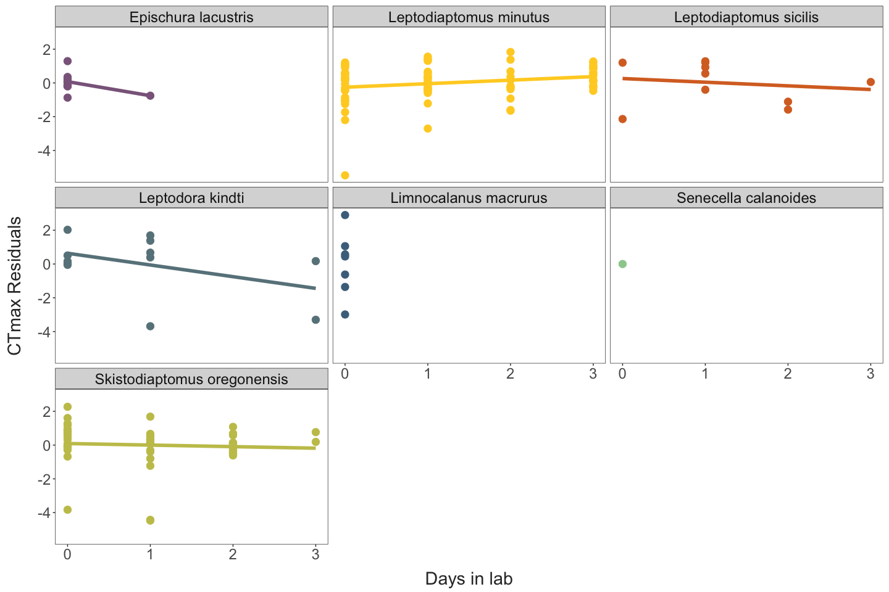

Seasonality in Lake Champlain Copepod Thermal Limits
================
2023-07-02

- [Temperature Variation](#temperature-variation)
- [Trait Variation](#trait-variation)
  - [Variation with temperature](#variation-with-temperature)
- [Sex and stage variation in thermal
  limits](#sex-and-stage-variation-in-thermal-limits)
- [Trait Correlations](#trait-correlations)

``` r
### To Do 

# Actual statistics for relationships between temperature and CTmax, size, and fecundity
# Pull residuals from CTmax ~ temperature model, and examine the change over time in lab and the relationship with fecundity
```

## Temperature Variation

Water temperatures in Lake Champlain reached a minimum in February.
Sampling for this project began during the Spring warming period.
Temperature variability (both ranges and variance) increase with
temperature, but are strongly affected by the length of time period
examined.

``` r
# Lake Champlain near Burlington, VT
siteNumber = "04294500"
ChamplainInfo = readNWISsite(siteNumber)
parameterCd = "00010"
startDate = "2023-01-01"
endDate = ""
#statCd = c("00001", "00002","00003", "00011") # 1 - max, 2 - min, 3 = mean

# Constructs the URL for the data wanted then downloads the data
url = constructNWISURL(siteNumbers = siteNumber, parameterCd = parameterCd, 
                       startDate = startDate, endDate = endDate, service = "uv")

temp_data = importWaterML1(url, asDateTime = T) %>% 
  mutate("date" = as.Date(dateTime)) %>% 
  select(date, "temp" = X_00010_00000)


## Daily values
daily_temp_data = temp_data %>%
  ungroup() %>% 
  group_by(date) %>% 
  summarise(mean_temp = mean(temp),
            med_temp = median(temp),
            var_temp = var(temp), 
            min_temp = min(temp), 
            max_temp = max(temp)) %>% 
  mutate("range_temp" = max_temp - min_temp)

daily_plot = daily_temp_data %>% 
  pivot_longer(cols = c(-date),
               names_to = "parameter", 
               values_to = "temp") %>% 
  ggplot(aes(x = date, y = temp, colour = parameter)) + 
  geom_line(linewidth = 1) + 
  scale_colour_manual(values = c(
    "mean_temp" = "olivedrab3",
    "med_temp" = "seagreen3",
    "max_temp" = "tomato",  
    "min_temp" = "dodgerblue",
    "range_temp" = "goldenrod3",
    "var_temp" = "darkgoldenrod1"
  )) + 
  scale_x_continuous(breaks = as.Date(c("2023-01-01", "2023-04-01", "2023-07-01"))) + 
  ggtitle("Daily Values") + 
  labs(y = "Temperature (°C)",
       x = "") + 
  theme_bw(base_size = 20) + 
  theme(panel.grid = element_blank(),
        axis.text.x = element_text(angle = 270, hjust = 0, vjust = 0.5))
```

``` r
## Defining the function to get predictor values for periods of different lengths
get_predictors = function(daily_values, raw_temp, n_days){
  prefix = str_replace_all(xfun::numbers_to_words(n_days), pattern = " ", replacement = "-")
  
  mean_values = daily_values %>% 
    ungroup() %>% 
    mutate(mean_max = slide_vec(.x = max_temp, .f = mean, .before = n_days, .complete = T),
           mean_min = slide_vec(.x = min_temp, .f = mean, .before = n_days, .complete = T),
           mean_range = slide_vec(.x = range_temp, .f = mean, .before = n_days, .complete = T)) %>% 
    select(date, mean_max, mean_min, mean_range) %>% 
    rename_with( ~ paste(prefix, "day", .x, sep = "_"), .cols = c(-date))
  
  period_values = raw_temp %>% 
    mutate(mean = slide_index_mean(temp, i = date, before = days(n_days), 
                                   na_rm = T),
           max = slide_index_max(temp, i = date, before = days(n_days), 
                                 na_rm = T),
           min = slide_index_min(temp, i = date, before = days(n_days),
                                 na_rm = T),
           med = slide_index_dbl(temp, .i = date, .before = days(n_days), 
                                    na_rm = T, .f = median),
           var = slide_index_dbl(temp, .i = date, .before = days(n_days), 
                                 .f = var),
           range = max - min) %>%  
    select(-temp) %>%  
    distinct() %>% 
    rename_with( ~ paste(prefix, "day", .x, sep = "_"), .cols = c(-date))%>% 
    inner_join(mean_values, by = c("date")) %>%  
    drop_na()
  
  return(period_values)
}
```

``` r
## Getting predictor variables for different periods

### ONE WEEK
week_temps = get_predictors(daily_values = daily_temp_data, 
                            raw_temp = temp_data, 
                            n_days = 7)

week_plot = week_temps %>% 
  pivot_longer(cols = c(-date),
               names_to = "parameter", 
               values_to = "temp") %>% 
  filter(parameter %in% c("seven_day_mean",
                          "seven_day_med",
                          "seven_day_max", 
                          "seven_day_min", 
                          "seven_day_var",
                          "seven_day_range")) %>% 
  mutate(parameter = paste(word(parameter, start = 3, sep = fixed("_")), "_temp", sep = "")) %>% 
  ggplot(aes(x = date, y = temp, colour = parameter)) + 
  geom_line(linewidth = 1) + 
  scale_colour_manual(values = c(
    "mean_temp" = "olivedrab3",
    "med_temp" = "seagreen3",
    "max_temp" = "tomato",  
    "min_temp" = "dodgerblue",
    "range_temp" = "goldenrod3",
    "var_temp" = "darkgoldenrod1"
  )) + 
  scale_x_continuous(breaks = as.Date(c("2023-01-01", "2023-04-01", "2023-07-01"))) + 
  ggtitle("One Week") + 
  labs(y = "Temperature (°C)",
       x = "") + 
  theme_bw(base_size = 20) + 
  theme(panel.grid = element_blank(),
        axis.text.x = element_text(angle = 270, hjust = 0, vjust = 0.5))


### TWO WEEKS
two_week_temps = get_predictors(daily_values = daily_temp_data, 
                                raw_temp = temp_data, 
                                n_days = 14)

two_week_plot = two_week_temps %>% 
  pivot_longer(cols = c(-date),
               names_to = "parameter", 
               values_to = "temp") %>% 
  filter(parameter %in% c("fourteen_day_mean",
                          "fourteen_day_med",
                          "fourteen_day_max", 
                          "fourteen_day_min", 
                          "fourteen_day_var",
                          "fourteen_day_range")) %>% 
  mutate(parameter = paste(word(parameter, start = 3, sep = fixed("_")), "_temp", sep = "")) %>% 
  ggplot(aes(x = date, y = temp, colour = parameter)) + 
  geom_line(linewidth = 1) + 
  scale_colour_manual(values = c(
    "mean_temp" = "olivedrab3",
    "med_temp" = "seagreen3",
    "max_temp" = "tomato",  
    "min_temp" = "dodgerblue",
    "range_temp" = "goldenrod3",
    "var_temp" = "darkgoldenrod1"
  )) + 
  scale_x_continuous(breaks = as.Date(c("2023-01-01", "2023-04-01", "2023-07-01"))) + 
  ggtitle("Two Weeks") + 
  labs(y = "Temperature (°C)",
       x = "") + 
  theme_bw(base_size = 20) + 
  theme(panel.grid = element_blank(),
        axis.text.x = element_text(angle = 270, hjust = 0, vjust = 0.5))


### FOUR WEEKS
four_week_temps = get_predictors(daily_values = daily_temp_data, 
                                 raw_temp = temp_data, 
                                 n_days = 28)

four_week_plot = four_week_temps %>% 
  pivot_longer(cols = c(-date),
               names_to = "parameter", 
               values_to = "temp") %>% 
  filter(parameter %in% c("twenty-eight_day_mean",
                          "twenty-eight_day_med",
                          "twenty-eight_day_max", 
                          "twenty-eight_day_min", 
                          "twenty-eight_day_var",
                          "twenty-eight_day_range")) %>% 
  mutate(parameter = paste(word(parameter, start = 3, sep = fixed("_")), "_temp", sep = "")) %>% 
  ggplot(aes(x = date, y = temp, colour = parameter)) + 
  geom_line(linewidth = 1) + 
  scale_colour_manual(values = c(
    "mean_temp" = "olivedrab3",
    "med_temp" = "seagreen3",
    "max_temp" = "tomato",  
    "min_temp" = "dodgerblue",
    "range_temp" = "goldenrod3",
    "var_temp" = "darkgoldenrod1"
  )) + 
  scale_x_continuous(breaks = as.Date(c("2023-01-01", "2023-04-01", "2023-07-01"))) + 
  ggtitle("Four Weeks") + 
  labs(y = "Temperature (°C)",
       x = "") + 
  theme_bw(base_size = 20) + 
  theme(panel.grid = element_blank(),
        axis.text.x = element_text(angle = 270, hjust = 0, vjust = 0.5))


### EIGHT WEEKS
eight_week_temps = get_predictors(daily_values = daily_temp_data, 
                                  raw_temp = temp_data, 
                                  n_days = 56)

eight_week_plot = eight_week_temps %>% 
  pivot_longer(cols = c(-date),
               names_to = "parameter", 
               values_to = "temp") %>% 
  filter(parameter %in% c("fifty-six_day_mean",
                          "fifty-six_day_med",
                          "fifty-six_day_max", 
                          "fifty-six_day_min", 
                          "fifty-six_day_var",
                          "fifty-six_day_range")) %>% 
  mutate(parameter = paste(word(parameter, start = 3, sep = fixed("_")), "_temp", sep = "")) %>% 
  ggplot(aes(x = date, y = temp, colour = parameter)) + 
  geom_line(linewidth = 1) + 
  scale_colour_manual(values = c(
    "mean_temp" = "olivedrab3",
    "med_temp" = "seagreen3",
    "max_temp" = "tomato",  
    "min_temp" = "dodgerblue",
    "range_temp" = "goldenrod3",
    "var_temp" = "darkgoldenrod1"
  )) + 
  scale_x_continuous(breaks = as.Date(c("2023-01-01", "2023-04-01", "2023-07-01"))) + 
  ggtitle("Eight Weeks") + 
  labs(y = "Temperature (°C)",
       x = "") + 
  theme_bw(base_size = 20) + 
  theme(panel.grid = element_blank(),
        axis.text.x = element_text(angle = 270, hjust = 0, vjust = 0.5))

ggarrange(daily_plot, week_plot, two_week_plot, four_week_plot, eight_week_plot, 
          common.legend = T, nrow = 1, legend = "bottom")
```


``` r
## Combine data, then pull out values for each collection date
date_list = as.Date(unique(full_data$collection_date))

temp_predictors = daily_temp_data %>% 
  full_join(week_temps, by = c("date")) %>% 
  full_join(two_week_temps, by = c("date")) %>% 
  full_join(four_week_temps, by = c("date")) %>% 
  full_join(eight_week_temps, by = c("date")) %>% 
  filter(date %in% date_list)
```

A set of predictors variables were assembled from the continuous
temperature data set based on conditions during the day of collection,
the week before collections, and the preceding two, four, and eight week
periods. This is a preliminary analysis for now. Shown here are the top
three factors. Species with no significant predictor or limited
collection date distributions were excluded.

``` r
corr_vals = full_data %>%  
  filter(sp_name != "Senecella calanoides") %>%
  filter(sp_name != "Limnocalanus macrurus") %>%
  mutate(collection_date = as.Date(collection_date)) %>% 
  full_join(temp_predictors, join_by(collection_date == date)) %>% 
  pivot_longer(cols = c(collection_temp, mean_temp:tail(names(.), 1)),
               values_to = "value", 
               names_to = "predictor") %>%  
  group_by(sp_name, predictor) %>% 
  summarise(correlation = cor.test(ctmax, value)$estimate,
            p.value = cor.test(ctmax, value)$p.value,
            ci_low = cor.test(ctmax, value)$conf.int[1],
            ci_high = cor.test(ctmax, value)$conf.int[2]) %>% 
  mutate(sig = ifelse(p.value <0.05, "Sig.", "Non Sig."))

corr_vals %>%  
  filter(sig == "Sig.") %>% 
  drop_na(correlation) %>% 
  group_by(sp_name) %>%
  arrange(desc(correlation)) %>% 
  slice_head(n = 3) %>% 
  select("Species" = sp_name, "Predictor" = predictor, "Correlation" = correlation, "P-Value" = p.value) %>% 
  knitr::kable(align = "c")
```

|           Species           |        Predictor         | Correlation |  P-Value  |
|:---------------------------:|:------------------------:|:-----------:|:---------:|
|     Epischura lacustris     | fifty-six_day_mean_range |  0.8433962  | 0.0011058 |
|     Epischura lacustris     |    fifty-six_day_max     |  0.8431410  | 0.0011135 |
|     Epischura lacustris     |     fourteen_day_max     |  0.8431410  | 0.0011135 |
|   Leptodiaptomus minutus    |    fifty-six_day_var     |  0.5225154  | 0.0000095 |
|   Leptodiaptomus minutus    |     fourteen_day_med     |  0.5209867  | 0.0000102 |
|   Leptodiaptomus minutus    |  fourteen_day_mean_min   |  0.5163355  | 0.0000126 |
| Skistodiaptomus oregonensis |      seven_day_mean      |  0.6328098  | 0.0000040 |
| Skistodiaptomus oregonensis |   twenty-eight_day_med   |  0.6327857  | 0.0000041 |
| Skistodiaptomus oregonensis |  fifty-six_day_mean_max  |  0.6327413  | 0.0000041 |

## Trait Variation

``` r
ctmax_plot = full_data %>% 
  mutate( #sp_name = str_replace(sp_name, pattern = " ",
    #                              replacement = "\n"),
    sp_name = fct_reorder(sp_name, ctmax, mean)) %>% 
  ggplot(aes(y = sp_name, x = ctmax)) + 
  geom_point(aes(colour= sp_name_sub),
             position = position_dodge(width = 0.3),
             size = 4) + 
  scale_colour_manual(values = species_cols) + 
  xlab(NULL) + 
  labs(y = "",
       x = "CTmax (°C)",
       colour = "Group") + 
  theme_matt() + 
  theme(legend.position = "none")

size_plot = full_data %>% 
  mutate(sp_name = fct_reorder(sp_name, ctmax, mean)) %>% 
  ggplot(aes(y = sp_name, x = size)) + 
  geom_point(aes(colour= sp_name_sub),
             position = position_dodge(width = 0.3),
             size = 4) + 
  scale_colour_manual(values = species_cols) + 
  labs(x = "Prosome Length (mm)",
       y = "", 
       colour = "Group") + 
  guides(color = guide_legend(ncol = 1)) +
  theme_matt(base_size = ) + 
  theme(legend.position = "right",
        axis.text.y = element_blank(),
        plot.margin = margin(0, 0, 0, 0,"cm"))

trait_plot = ctmax_plot + size_plot
trait_plot
```


``` r
full_data %>%  
  drop_na(fecundity) %>%  
  ggplot(aes(x = fecundity, fill = sp_name_sub)) + 
  facet_wrap(.~sp_name_sub, ncol = 1) + 
  geom_histogram(binwidth = 2) + 
  scale_fill_manual(values = species_cols) + 
  labs(x = "Fecundity (# Eggs)") +
  theme_matt_facets() + 
  theme(legend.position = "none")
```


### Variation with temperature

``` r
ctmax_temp = ggplot(full_data, aes(x = collection_temp, y = ctmax, colour = sp_name)) + 
  geom_smooth(method = "lm", linewidth = 3) +
  geom_point(size = 3) + 
  labs(x = "Collection Temperature (°C)", 
       y = "CTmax (°C)",
       colour = "Group") + 
  scale_colour_manual(values = species_cols) + 
  theme_matt() + 
  theme(legend.position = "right")

size_temp = ggplot(filter(full_data, sex != "juvenile"), aes(x = collection_temp, y = size, colour = sp_name)) + 
  geom_smooth(method = "lm", linewidth = 3) +
  geom_point(size = 3) + 
  labs(x = "Collection Temperature (°C)", 
       y = "Length (mm)",
       colour = "Group")  + 
  scale_colour_manual(values = species_cols) + 
  theme_matt() + 
  theme(legend.position = "right")

wt_temp = ggplot(full_data, aes(x = collection_temp, y = warming_tol, colour = sp_name)) + 
  geom_smooth(method = "lm", linewidth = 3) +
  geom_point(size = 3) + 
  labs(x = "Collection Temperature (°C)", 
       y = "Warming Tolerance (°C)",
       colour = "Group")  + 
  scale_colour_manual(values = species_cols) + 
  theme_matt() + 
  theme(legend.position = "right")

eggs_temp = ggplot(full_data, aes(x = collection_temp, y = fecundity, colour = sp_name)) + 
  geom_smooth(method = "lm", linewidth = 3) +
  geom_point(size = 3) + 
  labs(x = "Collection Temperature (°C)", 
       y = "Fecundity (# Eggs)",
       colour = "Group")  + 
  scale_colour_manual(values = species_cols) + 
  theme_matt() + 
  theme(legend.position = "right")

ggarrange(ctmax_temp, size_temp, wt_temp, eggs_temp, 
          common.legend = T, legend = "right")
```


``` r
ctmax_temp.model = lm(data = full_data, ctmax ~ collection_temp * sp_name)

knitr::kable(car::Anova(ctmax_temp.model))
```

|                         |     Sum Sq |  Df |    F value |   Pr(\>F) |
|:------------------------|-----------:|----:|-----------:|----------:|
| collection_temp         |  79.452375 |   1 | 51.3696282 | 0.0000000 |
| sp_name                 | 757.974006 |   6 | 81.6775310 | 0.0000000 |
| collection_temp:sp_name |   2.373212 |   3 |  0.5114637 | 0.6750716 |
| Residuals               | 202.615076 | 131 |         NA |        NA |

``` r

ctmax_resids = cbind(full_data, "resids" = ctmax_temp.model$residuals)
```

``` r
ggplot(ctmax_resids, aes(x = days_in_lab, y = resids, colour = sp_name)) + 
  facet_wrap(sp_name~.) + 
  geom_point(size = 4) + 
  geom_smooth(method = "lm", se = F, linewidth = 2) + 
  scale_x_continuous(breaks = c(0:3)) + 
  labs(x = "Days in lab", 
       y = "CTmax Residuals") + 
  scale_colour_manual(values = species_cols) + 
  theme_matt_facets() + 
  theme(legend.position = "none")
```



## Sex and stage variation in thermal limits

Previous sections have generally lumped juvenile, female, and male
individuals together. There may be important stage- or sex-specific
differences in CTmax though. For several species, we have measurements
for individuals in different stages or of different sexes.

``` r
sex_sample_sizes = ctmax_resids %>%  
  group_by(sp_name, sex) %>%  
  summarise(num = n()) %>%  
  pivot_wider(id_cols = sp_name,
              names_from = sex, 
              values_from = num,
              values_fill = 0) %>% 
  select("Species" = sp_name, "Juvenile" = juvenile, "Female" = female, "Male" = male)

knitr::kable(sex_sample_sizes, align = "c")
```

|           Species           | Juvenile | Female | Male |
|:---------------------------:|:--------:|:------:|:----:|
|     Epischura lacustris     |    5     |   3    |  3   |
|   Leptodiaptomus minutus    |    0     |   47   |  17  |
|   Leptodiaptomus sicilis    |    0     |   10   |  0   |
|      Leptodora kindti       |    0     |   0    |  5   |
|    Limnocalanus macrurus    |    2     |   4    |  1   |
|    Senecella calanoides     |    0     |   1    |  0   |
| Skistodiaptomus oregonensis |    0     |   39   |  5   |

The female-male and female-juvenile comparisons show that there are
generally no differences in thermal limits between these groups.

``` r
ctmax_resids %>% 
  filter(sp_name %in% filter(sex_sample_sizes, Male > 0)$Species & 
           sex != "juvenile") %>% 
  ggplot(aes(x = sex, y = resids, colour = sp_name, group = sp_name)) + 
  facet_wrap(sp_name~., ncol = 2) + 
  geom_smooth(method = "lm", se = F, linewidth = 1) + 
  geom_point(size = 3,
             alpha = 0.5,
             position = position_jitter(height = 0, width = 0.05)) +  
  labs(x = "Sex", 
       y = "CTmax Residuals") + 
  scale_colour_manual(values = species_cols) + 
  theme_bw(base_size = 18) + 
  theme(legend.position = "none", 
        panel.grid = element_blank())
```


``` r
ctmax_resids %>% 
  filter(sp_name %in% filter(sex_sample_sizes, Juvenile > 0)$Species & 
           sex != "male") %>% 
  ggplot(aes(x = sex, y = resids, colour = sp_name, group = sp_name)) + 
  facet_wrap(sp_name~., ncol = 1) + 
  geom_smooth(method = "lm", se = F, linewidth = 1) + 
  geom_point(size = 3,
             alpha = 0.5,
             position = position_jitter(height = 0, width = 0.05)) +  
  labs(x = "Sex", 
       y = "CTmax (°C)") + 
  scale_colour_manual(values = species_cols) + 
  theme_bw(base_size = 18) + 
  theme(legend.position = "none", 
        panel.grid = element_blank())
```


## Trait Correlations

``` r
ggplot(full_data, aes(x = size, y = ctmax, colour = sp_name)) + 
  geom_smooth(data = full_data, 
              aes(x = size, y = ctmax),
              method = "lm", 
              colour ="black", 
              linewidth = 2.5) + 
  geom_smooth(method = "lm", se = F, linewidth = 2) + 
  geom_point(size = 4) + 
  labs(x = "Length (mm)", 
       y = "CTmax (°C)") + 
  scale_colour_manual(values = species_cols) + 
  theme_matt() + 
  theme(legend.position = "right")
```


``` r
ggplot(ctmax_resids, aes(x = size, y = fecundity, colour = sp_name)) + 
  geom_smooth(method = "lm", se = F, linewidth = 2) + 
  geom_point(size = 4) + 
  labs(x = "Prosome length (mm)", 
       y = "Fecundity (# Eggs)") + 
  scale_colour_manual(values = species_cols) + 
  theme_matt() + 
  theme(legend.position = "right")
```


``` r
ggplot(ctmax_resids, aes(x = resids, y = fecundity, colour = sp_name)) + 
  geom_smooth(method = "lm", se = F, linewidth = 2) + 
  geom_point(size = 4) + 
  labs(x = "CTmax Residuals", 
       y = "Fecundity (# Eggs)") + 
  scale_colour_manual(values = species_cols) + 
  theme_matt() + 
  theme(legend.position = "right")
```


