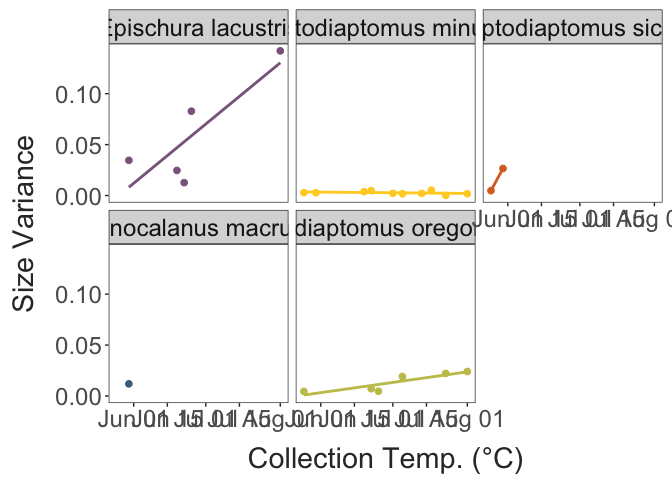
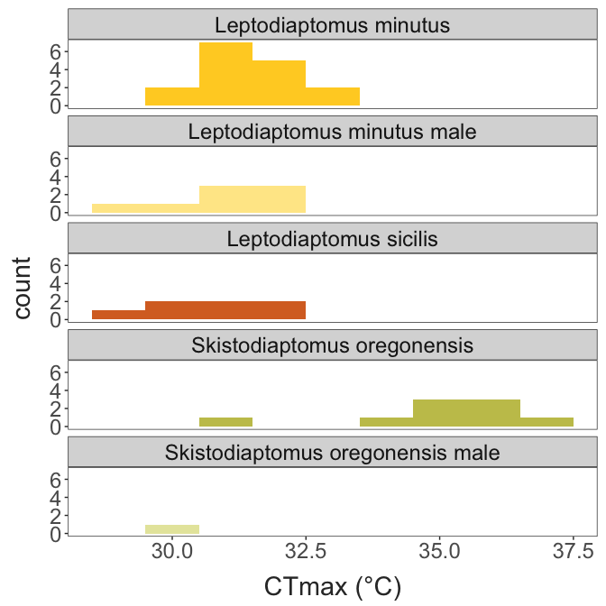

Seasonality in Lake Champlain Copepod Thermal Limits
================
2023-05-25

- <a href="#temperature-variation"
  id="toc-temperature-variation">Temperature Variation</a>
- <a href="#trait-variation" id="toc-trait-variation">Trait Variation</a>
  - <a href="#variation-with-temperature"
    id="toc-variation-with-temperature">Variation with temperature</a>
- <a href="#trait-correlations" id="toc-trait-correlations">Trait
  Correlations</a>

## Temperature Variation

## Trait Variation

``` r
ggplot(full_data, aes(x = size)) + 
  facet_wrap(.~species, ncol = 1) + 
  geom_histogram(binwidth = 0.2) + 
  theme_matt()
```


``` r

ggplot(full_data, aes(x = ctmax)) + 
  facet_wrap(.~species, ncol = 1) + 
  geom_histogram(binwidth = 1) + 
  theme_matt()
```



### Variation with temperature

``` r
ggplot(full_data, aes(x = collection_temp, y = ctmax, colour = species)) + 
  geom_point(size = 3) + 
  labs(x = "Collection Temperature (°C)", 
       y = "CTmax (°C)") + 
  theme_matt() + 
  theme(legend.position = "right")
```


``` r

ggplot(full_data, aes(x = collection_temp, y = size, colour = species)) + 
  geom_point(size = 3) + 
  labs(x = "Collection Temperature (°C)", 
       y = "Length (mm)") + 
  theme_matt() + 
  theme(legend.position = "right")
```



## Trait Correlations

``` r
ggplot(full_data, aes(x = size, y = ctmax, colour = species)) + 
  geom_point(size = 3) + 
  labs(x = "Length (mm)", 
       y = "CTmax (°C)") + 
  theme_matt() + 
  theme(legend.position = "right")
```


