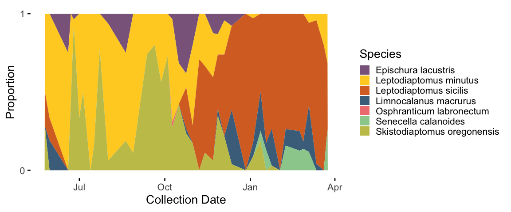
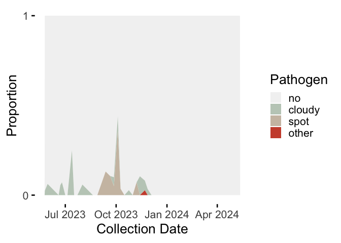
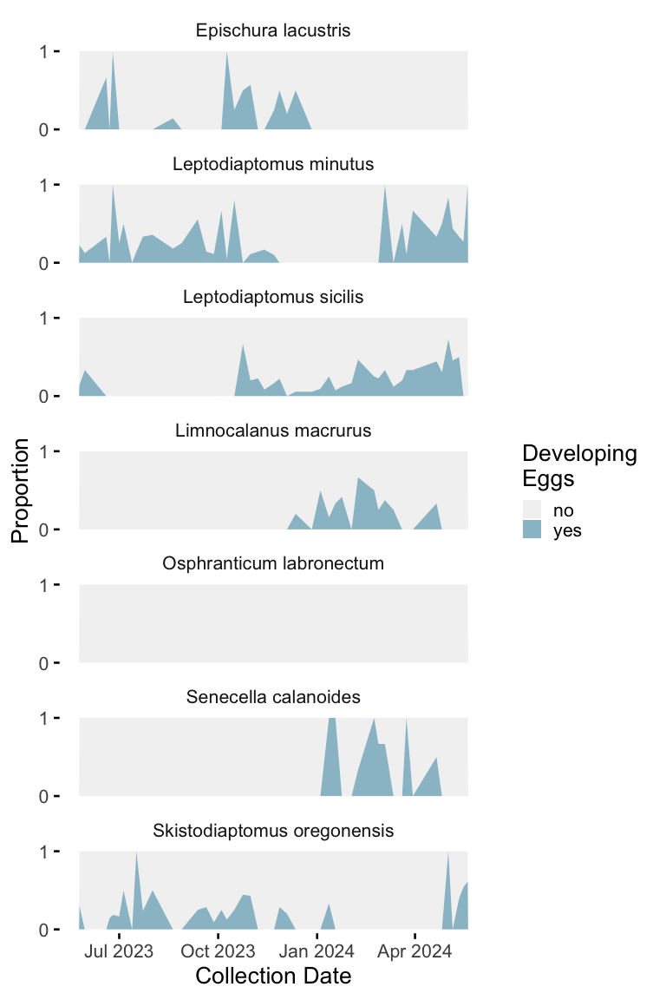
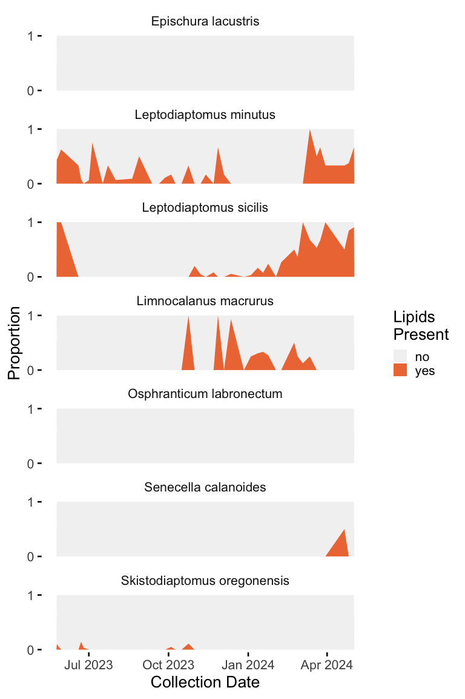
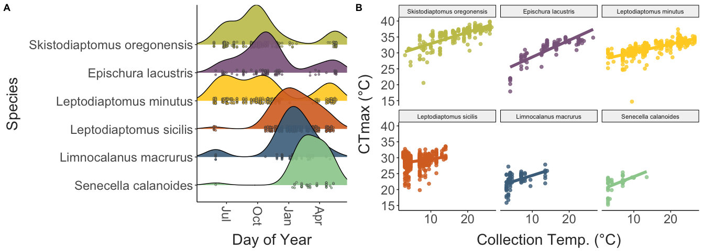
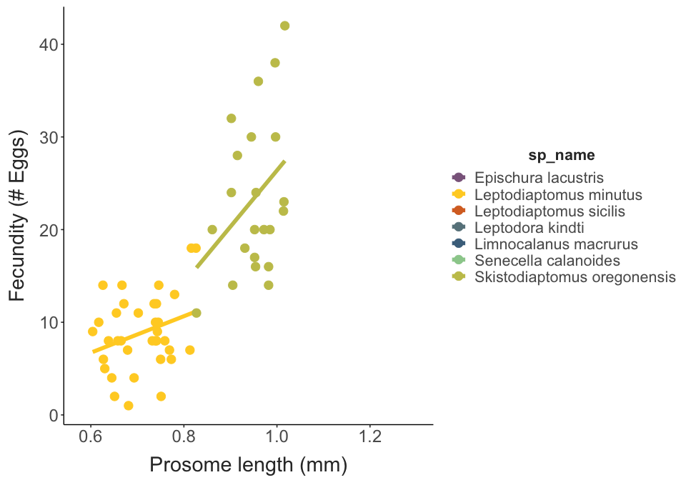
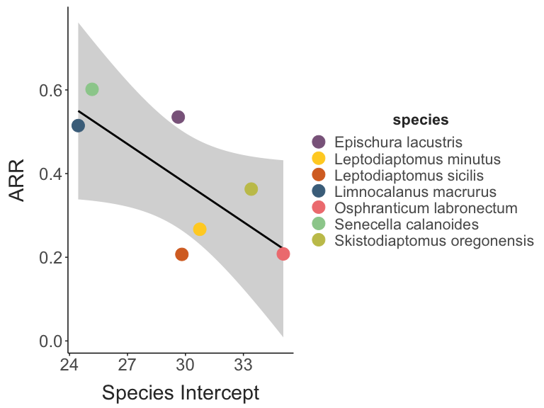
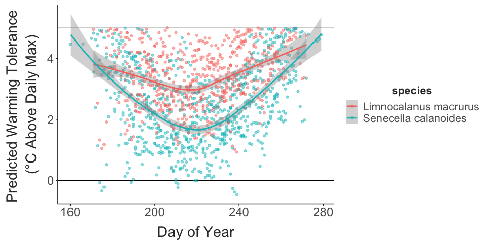
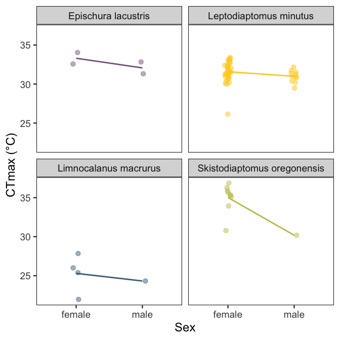
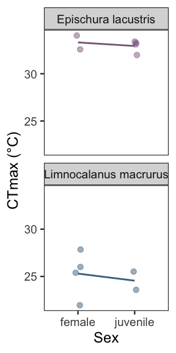

Seasonality in Lake Champlain Copepod Thermal Limits
================
2024-05-21

- [Copepod Collection](#copepod-collection)
- [Temperature Variability](#temperature-variability)
- [Trait Variation](#trait-variation)
  - [Variation with temperature](#variation-with-temperature)
  - [Sex and stage variation in thermal
    limits](#sex-and-stage-variation-in-thermal-limits)
  - [Trait Correlations and
    Trade-offs](#trait-correlations-and-trade-offs)
- [Other patterns in variation](#other-patterns-in-variation)
- [Distribution Lag Non-Linear Model (DLNM
  approach)](#distribution-lag-non-linear-model-dlnm-approach)

## Copepod Collection

Copepods were collected at approximately weekly intervals from Lake
Champlain (Burlington Fishing Pier). Plankton was collected from the top
3 meters using a 250 um mesh net.

``` r
# # Lake Champlain near Burlington, VT
# siteNumber = "04294500"
# ChamplainInfo = readNWISsite(siteNumber)
# parameterCd = "00010"
# startDate = "2023-01-01"
# endDate = ""
# #statCd = c("00001", "00002","00003", "00011") # 1 - max, 2 - min, 3 = mean
# 
# # Constructs the URL for the data wanted then downloads the data
# url = constructNWISURL(siteNumbers = siteNumber, parameterCd = parameterCd, 
#                        startDate = startDate, endDate = endDate, service = "uv")
# 
# raw_temps = importWaterML1(url, asDateTime = T) %>% 
#   mutate("date" = as.Date(dateTime)) %>% 
#   select(dateTime, tz_cd, date, degC = X_00010_00000)
# 
# temp_data =  raw_temps %>% 
#   select(date, "temp" = degC)
# 
# write.csv(temp_data, file = "./Output/Data/champlain_temps.csv", row.names = F)
```

Collections began in late May 2023. Several gaps are present, but
collections have continued at roughly weekly intervals since then.
Copepods from 48 collections were used to make a total of 1302 thermal
limit measurements. Over this time period, collection temperatures
ranged from 2.5 to 26.5°C.

There is substantial variation in thermal limits across the species
collected. There is also some degree of variation within the species,
with thermal limits increasing slightly during the summer.

``` r
## Daily values for the period examined by dataset
collection_conditions = temp_data %>%
  ungroup() %>% 
  group_by(date) %>% 
  summarise(mean_temp = mean(temp),
            med_temp = median(temp),
            var_temp = var(temp), 
            min_temp = min(temp), 
            max_temp = max(temp)) %>% 
  mutate("range_temp" = max_temp - min_temp,
         date = as.Date(date)) %>% 
  ungroup() %>%  
  filter(date >= (min(as.Date(full_data$collection_date)) - 7)) %>% 
  left_join(unique(select(full_data, collection_date, collection_temp)), by = join_by(date == collection_date))

## Mean female thermal limits for each species, grouped by collection
species_summaries = full_data %>%  
  #filter(sex == "female") %>% 
  group_by(sp_name, collection_date, collection_temp) %>%  
  summarise("mean_ctmax" = mean(ctmax),
            "sample_size" = n(),
            "ctmax_st_err" = (sd(ctmax) / sqrt(sample_size)),
            "ctmax_var" = var(ctmax), 
            "mean_size" = mean(size),
            "size_st_err" = (sd(size) / sqrt(sample_size)),
            "size_var" = var(size)) %>%  
  ungroup() %>% 
  complete(sp_name, collection_date) %>% 
  arrange(desc(sample_size))

adult_summaries = full_data %>%  
  filter(sex == "female") %>% 
  group_by(sp_name, collection_date, collection_temp) %>%  
  summarise("mean_ctmax" = mean(ctmax),
            "sample_size" = n(),
            "ctmax_st_err" = (sd(ctmax) / sqrt(sample_size)),
            "ctmax_var" = var(ctmax), 
            "mean_size" = mean(size),
            "size_st_err" = (sd(size) / sqrt(sample_size)),
            "size_var" = var(size)) %>%  
  ungroup() %>% 
  complete(sp_name, collection_date) %>% 
  arrange(desc(sample_size))


ggplot() + 
  geom_vline(data = unique(select(full_data, collection_date)), 
             aes(xintercept = as.Date(collection_date)),
             colour = "grey90",
             linewidth = 1) + 
  geom_line(data = collection_conditions, 
            aes(x = as.Date(date), y = mean_temp),
            colour = "black", 
            linewidth = 2) + 
  # geom_errorbar(data = species_summaries,
  #               aes(x = as.Date(collection_date),
  #                   ymin = mean_ctmax - ctmax_st_err, ymax = mean_ctmax + ctmax_st_err,
  #                   colour = sp_name),
  #               position = position_dodge(width = 1),
  #               width = 5, linewidth = 1) +
  # geom_point(data = adult_summaries, 
  #            aes(x = as.Date(collection_date), y = mean_ctmax, colour = sp_name, size = sample_size)) + 
  geom_point(data = full_data, 
             aes(x = as.Date(collection_date), y = ctmax, colour = sp_name),
             size = 2, position = position_jitter(width = 1, height = 0)) + 
  scale_colour_manual(values = species_cols) + 
  labs(x = "Date", 
       y = "Temperature (°C)", 
       colour = "Species",
       size = "Sample Size") + 
  theme_matt() + 
  theme(legend.position = "right")
```


Temperatures observed at the time of collection closely resembled the
maximum daily temperature from the temperature sensor data. Maximum
temperature was used as a proxy instead of mean temperature as
collections were usually made during afternoons or early evenings, just
following the warmest part of the day.

``` r
collection_conditions %>% 
  drop_na(collection_temp) %>%  
  ggplot(aes(x = max_temp, y = collection_temp)) + 
  geom_abline(intercept = 0, slope = 1,
              linewidth = 1, colour = "grey") + 
  geom_point(size = 3) +
  scale_x_continuous(breaks = c(5,15,25)) + 
  scale_y_continuous(breaks = c(5,15,25)) + 
  labs(x = "Max. Temp. from Sensor (°C)",
       y = "Collection Temp. (°C)") + 
  theme_matt()
```


Size also varied, but primarily between rather than within species.

``` r
ggplot() + 
  geom_vline(data = unique(select(full_data, collection_date)), 
             aes(xintercept = as.Date(collection_date)),
             colour = "grey90",
             linewidth = 1) + 
  geom_line(data = collection_conditions, 
            aes(x = as.Date(date), y = mean_temp),
            colour = "black", 
            linewidth = 2) + 
  # geom_errorbar(data = species_summaries,
  #               aes(x = as.Date(collection_date), 
  #                   ymin = mean_ctmax - ctmax_st_err, ymax = mean_ctmax + ctmax_st_err,
  #                   colour = sp_name),
  #               position = position_dodge(width = 1),
  #               width = 5, linewidth = 1) + 
  geom_point(data = adult_summaries, 
             aes(x = as.Date(collection_date), y = mean_size * 40, colour = sp_name, size = sample_size),
             position = position_dodge(width = 1)) + 
  scale_colour_manual(values = species_cols) + 
  scale_y_continuous(
    name = "Temperature", # Features of the first axis
    sec.axis = sec_axis(~./40, name="Prosome Length (mm)"), # Add a second axis and specify its features
    breaks = c(0,5,10,15,20,25,30)
  ) + 
  labs(x = "Date", 
       y = "Temperature (°C)", 
       colour = "Species") + 
  theme_matt() + 
  theme(legend.position = "right")
```


``` r
sample_dates_plot = full_data %>%  
  filter(sp_name != "Osphranticum labronectum") %>% 
  mutate(sp_name = as.factor(sp_name),
         sp_name = fct_reorder(sp_name, ctmax)) %>% 
  ggplot(aes(x = lubridate::as_date(collection_date), 
             y = sp_name, fill = sp_name)) + 
  # geom_vline(xintercept = as_date(
  #   c("2023-05-01",
  #     "2023-09-01",
  #     "2024-01-01",
  #     "2024-05-01")),
  #   colour = "grey",
  #   linewidth = 1) + 
  geom_density_ridges(bandwidth = 30,
                      jittered_points = TRUE, 
                      point_shape = 21,
                      point_size = 1,
                      point_colour = "grey30",
                      point_alpha = 0.6,
                      alpha = 0.9,
                      position = position_points_jitter(
                        height = 0.1, width = 0)) + 
  scale_fill_manual(values = species_cols) + 
  scale_x_date(date_breaks = "3 months",
               date_labels = "%b") + 
  coord_cartesian(xlim = lubridate::as_date(c("2023-04-25", "2024-06-01"))) + 
  labs(x = "Day of Year", 
       y = "Species") + 
  theme_matt() + 
  #theme_ridges(grid = T) + 
  theme(legend.position = "none",
        axis.text.x = element_text(angle = 270, hjust = 0, vjust = 0.5))
```

The samples captured the broad seasonal changes in calanoid copepod
community composition in the lake. We note, however, that rare species
(e.g. *Senecella* and *Limnocalanus*) were often preferentially sampled,
so are over-represented in the data set.

``` r
adult_summaries %>% 
  ungroup() %>% 
  mutate(collection_num = as.numeric(factor(collection_date))) %>% 
  group_by(collection_date) %>%  
  arrange(collection_date) %>% 
  select(sp_name, collection_date, collection_num, sample_size) %>% 
  mutate(sample_size = replace_na(sample_size, 0)) %>% 
  mutate(total = sum(sample_size),
         percentage = sample_size / total,
         collection_date = lubridate::as_date(collection_date)) %>% 
  ggplot(aes(x = collection_date, y = percentage, fill = sp_name)) + 
  geom_area() + 
  scale_fill_manual(values = species_cols) + 
  scale_y_continuous(breaks = c(0,1)) + 
  labs(x = "Collection Date", 
       y = "Proportion", 
       fill = "Species") + 
  theme_minimal(base_size = 20) + 
  theme(panel.grid = element_blank(),
        axis.ticks = element_line())
```



Throughout the season, the prevalence of various unidentified pathogens
also varied, with very little infection observed during the Winter and
Spring.

``` r
pathogen_cols = c("no" = "grey95", "cloudy" = "honeydew3", "spot" = "antiquewhite3", "other" = "tomato3")

full_data %>% 
  select(collection_date, dev_eggs, pathogen, lipids, sp_name, sex) %>% 
  group_by() %>% 
  filter(sex != "juvenile") %>% 
  group_by(collection_date) %>% 
  count(pathogen) %>% 
  filter(pathogen != "uncertain") %>% 
  pivot_wider(id_cols = "collection_date", 
              names_from = pathogen, 
              values_from = n,
              values_fill = 0) %>% 
  mutate(total = sum(no, cloudy, spot, other)) %>% 
  pivot_longer(cols = c(no, cloudy, spot, other),
               names_to = "pathogen", 
               values_to = "count") %>% 
  mutate(percent = count/total,
         collection_date = lubridate::as_date(collection_date),
         pathogen = fct_relevel(pathogen, "no", "cloudy", "spot", "other")) %>% 
  ggplot(aes(x = collection_date, y = percent, fill = pathogen)) + 
  geom_area() + 
  scale_fill_manual(values = pathogen_cols) + 
  scale_y_continuous(breaks = c(0,1)) + 
  labs(x = "Collection Date", 
       y = "Proportion", 
       fill = "Pathogen") + 
  theme_minimal(base_size = 20) + 
  theme(panel.grid = element_blank(),
        axis.ticks = element_line())
```



The transparent bodies of these copepods also allowed us to examine
seasonal patterns in lipid reserves and in the production of eggs.
Maturing oocytes are visible in female copepods before they are
released. There was no strong seasonal cycle in the production of these
eggs in any species, and instead, females were reproductively active
throughout their respective seasons of occurence.

``` r
dev_eggs_cols = c("no" = "grey95", "yes" = "lightblue3")

full_data %>% 
  select(collection_date, dev_eggs, pathogen, lipids, sp_name, sex) %>% 
  group_by(sp_name) %>% 
  filter(sex != "juvenile") %>% 
  group_by(sp_name, collection_date) %>% 
  count(dev_eggs) %>% 
  filter(dev_eggs != "uncertain") %>% 
  pivot_wider(id_cols = c("collection_date", "sp_name"), 
              names_from = dev_eggs, 
              values_from = n,
              values_fill = 0) %>% 
  mutate(total = sum(no, yes)) %>% 
  pivot_longer(cols = c(no, yes),
               names_to = "dev_eggs", 
               values_to = "count") %>% 
  mutate(percent = count/total,
         collection_date = lubridate::as_date(collection_date),
         dev_eggs = fct_relevel(dev_eggs, "no", "yes")) %>% 
  ungroup() %>% 
  complete(collection_date, nesting(sp_name, dev_eggs), fill = list(percent = 1)) %>% 
  mutate(percent = if_else(is.na(total) & dev_eggs == "yes", 0, percent)) %>% 
  ggplot(aes(x = collection_date, y = percent, fill = dev_eggs)) + 
  facet_wrap(sp_name~., ncol = 1) + 
  geom_area() + 
  scale_fill_manual(values = dev_eggs_cols) + 
  scale_y_continuous(breaks = c(0,1)) + 
  labs(x = "Collection Date", 
       y = "Proportion", 
       fill = "Developing \nEggs") + 
  theme_minimal(base_size = 20) + 
  theme(panel.grid = element_blank(),
        axis.ticks = element_line())
```



The presence of lipids varied across species, with only *L. minutus*,
*L. sicilis*, and *Limnocalanus* regularly possessing lipid stores.

``` r
lipid_cols = c("no" = "grey95", "yes" = "sienna2")

full_data %>% 
  select(collection_date, dev_eggs, pathogen, lipids, sp_name, sex) %>% 
  group_by(sp_name) %>% 
  filter(sex != "juvenile") %>% 
  group_by(sp_name, collection_date) %>% 
  count(lipids) %>% 
  filter(lipids != "uncertain") %>% 
  pivot_wider(id_cols = c("collection_date", "sp_name"), 
              names_from = lipids, 
              values_from = n,
              values_fill = 0) %>% 
  mutate(total = sum(no, yes)) %>% 
  pivot_longer(cols = c(no, yes),
               names_to = "lipids", 
               values_to = "count") %>% 
  mutate(percent = count/total,
         collection_date = lubridate::as_date(collection_date),
         lipids = fct_relevel(lipids, "no", "yes")) %>% 
  ungroup() %>% 
  complete(collection_date, nesting(sp_name, lipids), fill = list(percent = 1)) %>% 
  mutate(percent = if_else(is.na(total) & lipids == "yes", 0, percent)) %>% 
  ggplot(aes(x = collection_date, y = percent, fill = lipids)) + 
  facet_wrap(sp_name~., ncol = 1) + 
  geom_area() + 
  scale_fill_manual(values = lipid_cols) + 
  scale_y_continuous(breaks = c(0,1)) + 
  labs(x = "Collection Date", 
       y = "Proportion", 
       fill = "Lipids\nPresent") + 
  theme_minimal(base_size = 20) + 
  theme(panel.grid = element_blank(),
        axis.ticks = element_line())
```



## Temperature Variability

Lake Champlain is highly seasonal, with both average temperatures and
temperature variability changing throughout the year. These patterns in
the experienced thermal environment may drive the observed variation in
copepod thermal limits. However, the time period affecting copepod
thermal limits is unknown. Depending the on the duration of time
considered, there are large changes in the experienced environment, in
particular regarding the temperature range and variance. Consider for
example three time periods: the day of collection, one week prior to
collection, and four weeks prior to collection. While the overall
pattern is similar, we can see that, unsurprisingly, considering longer
periods of time results in larger ranges and slightly changes the
pattern of variance experienced.

``` r
## Defining the function to get predictor values for periods of different lengths
get_predictors = function(daily_values, raw_temp, n_days){
  prefix = str_replace_all(xfun::numbers_to_words(n_days), pattern = " ", replacement = "-")
  
  mean_values = daily_values %>% 
    ungroup() %>% 
    mutate(mean_max = slide_vec(.x = max_temp, .f = mean, .before = n_days, .complete = T),
           mean_min = slide_vec(.x = min_temp, .f = mean, .before = n_days, .complete = T),
           mean_range = slide_vec(.x = range_temp, .f = mean, .before = n_days, .complete = T)) %>% 
    select(date, mean_max, mean_min, mean_range) %>% 
    rename_with( ~ paste(prefix, "day", .x, sep = "_"), .cols = c(-date))
  
  period_values = raw_temp %>% 
    mutate(mean = slide_index_mean(temp, i = date, before = days(n_days), 
                                   na_rm = T),
           max = slide_index_max(temp, i = date, before = days(n_days), 
                                 na_rm = T),
           min = slide_index_min(temp, i = date, before = days(n_days),
                                 na_rm = T),
           med = slide_index_dbl(temp, .i = date, .before = days(n_days), 
                                 na_rm = T, .f = median),
           var = slide_index_dbl(temp, .i = date, .before = days(n_days), 
                                 .f = var),
           range = max - min) %>%  
    select(-temp) %>%  
    distinct() %>% 
    rename_with( ~ paste(prefix, "day", .x, sep = "_"), .cols = c(-date))%>% 
    inner_join(mean_values, by = c("date")) %>%  
    drop_na()
  
  return(period_values)
}
```

## Trait Variation

Shown below are the clutch size distributions for the three diaptomiid
species, which produce egg sacs that allow for easy quantification of
fecundity.

``` r
full_data %>%  
  drop_na(fecundity) %>%  
  ggplot(aes(x = fecundity, fill = sp_name_sub)) + 
  facet_wrap(.~sp_name_sub, ncol = 1) + 
  geom_histogram(binwidth = 2) + 
  scale_fill_manual(values = species_cols) + 
  labs(x = "Fecundity (# Eggs)") +
  theme_matt_facets() + 
  theme(legend.position = "none")
```


One of the main aims of this project is to examine the patterns and
processes driving variation in upper thermal limits across these species
of copepods.

### Variation with temperature

We expect one of the primary drivers of copepod thermal limits to be
temperature. The correlation analysis has shown that the copepods are
generally (although not always) responding to the recent thermal
environment. Shown below are thermal limits, body size, and fecundity
values plotted against the temperature at the time of collection. Also
shown is warming tolerance, calculated as the difference between upper
thermal limit and the collection temperature.

We generally see an increase in thermal limits with increasing
collection temperature, a slight decrease in body size, and variable
relationships between temperature and fecundity. All species maintained
some degree of buffer between environmental temperatures and upper
thermal limits, but *Epischura* and *L. minutus* approached their upper
thermal limits during the warmest collections during the summer.

``` r
ctmax_temp = ggplot(full_data, aes(x = collection_temp, y = ctmax, colour = sp_name)) +   
  geom_point(size = 3,
             alpha = 0.3) + 
  geom_smooth(method = "lm", linewidth = 3) +
  labs(x = "Collection Temperature (°C)", 
       y = "CTmax (°C)",
       colour = "Species") + 
  scale_colour_manual(values = species_cols) + 
  theme_matt() + 
  theme(legend.position = "right")

size_temp = ggplot(filter(full_data, sex != "juvenile"), aes(x = collection_temp, y = size, colour = sp_name)) + 
  geom_point(size = 3,
             alpha = 0.3) + 
  geom_smooth(method = "lm", linewidth = 3) +
  labs(x = "Collection Temperature (°C)", 
       y = "Length (mm)",
       colour = "Species")  + 
  scale_colour_manual(values = species_cols) + 
  theme_matt() + 
  theme(legend.position = "right")

wt_temp = ggplot(full_data, aes(x = collection_temp, y = warming_tol, colour = sp_name)) + 
  geom_point(size = 3,
             alpha = 0.3) + 
  geom_smooth(method = "lm", linewidth = 3) +
  labs(x = "Collection Temperature (°C)", 
       y = "Warming Tolerance (°C)",
       colour = "Species")  + 
  scale_colour_manual(values = species_cols) + 
  theme_matt() + 
  theme(legend.position = "right")

eggs_temp = ggplot(full_data, aes(x = collection_temp, y = fecundity, colour = sp_name)) + 
  geom_point(size = 3,
             alpha = 0.3) + 
  geom_smooth(method = "lm", linewidth = 3) +
  labs(x = "Collection Temperature (°C)", 
       y = "Fecundity (# Eggs)",
       colour = "Species")  + 
  scale_colour_manual(values = species_cols) + 
  theme_matt() + 
  theme(legend.position = "right")

ggarrange(ctmax_temp, size_temp, wt_temp, eggs_temp, 
          common.legend = T, legend = "right")
```


``` r
sp_ctmax_temp = full_data %>% 
  filter(sp_name != "Osphranticum labronectum") %>% 
  mutate(sp_name = as.factor(sp_name),
         sp_name = fct_reorder(sp_name, ctmax, .desc = T)) %>% 
  ggplot(aes(x = collection_temp, y = ctmax, colour = sp_name)) + 
  facet_wrap(sp_name~.) + 
  geom_point(size = 2, alpha = 0.8) + 
  geom_smooth(method = "lm", se = F, linewidth = 2) + 
  labs(x = "Collection Temp. (°C)", 
       y = "CTmax (°C)") + 
  scale_colour_manual(values = species_cols) + 
  theme_matt() + 
  theme(legend.position = "none")
```

``` r
ggarrange(sample_dates_plot, sp_ctmax_temp, nrow = 1, 
          labels = "AUTO")
```



Temperature dependence is relatively weak in *L. sicilis*, especially at
cooler temperatures. We will return to this feature later in the report,
but for now we will note that there are two size morphs in this species,
which appear to respond differently to decreases in temperature. There
are significant differences between the morphs and how temperature
affects CTmax.

``` r
morph_data = full_data %>% 
  filter(sex == "female" & species == "leptodiaptomus_sicilis") %>%  mutate(sp_name = case_when(
    sp_name == "Leptodiaptomus sicilis" & size >= 0.89 ~ "Large",
    sp_name == "Leptodiaptomus sicilis" & size < 0.89 ~ "Small",
    .default = sp_name
  ))


ggplot(morph_data, aes(x = collection_temp, y = ctmax, colour = sp_name)) + 
  geom_point(size = 2, alpha = 0.8) + 
  geom_smooth(method = "lm", se = T, linewidth = 2) + 
  labs(x = "Collection Temp. (°C)", 
       y = "CTmax (°C)") + 
  theme_matt() + 
  theme(legend.position = "none")
```



``` r

morph.model = lm(data = morph_data, 
                 ctmax ~ collection_temp * sp_name)

knitr::kable(car::Anova(morph.model, type = "III", test = "F"))
```

|                         |      Sum Sq |  Df |     F value |   Pr(\>F) |
|:------------------------|------------:|----:|------------:|----------:|
| (Intercept)             | 11838.75134 |   1 | 3930.374601 | 0.0000000 |
| collection_temp         |   107.57172 |   1 |   35.712986 | 0.0000000 |
| sp_name                 |    32.96638 |   1 |   10.944584 | 0.0010357 |
| collection_temp:sp_name |    15.88294 |   1 |    5.273014 | 0.0222454 |
| Residuals               |  1060.26547 | 352 |          NA |        NA |

``` r

#summary(morph.model)

morph.em = emmeans::emtrends(morph.model, "sp_name", var = "collection_temp")

knitr::kable(pairs(morph.em))
```

| contrast      |  estimate |        SE |  df |  t.ratio |   p.value |
|:--------------|----------:|----------:|----:|---------:|----------:|
| Large - Small | 0.1530629 | 0.0666562 | 352 | 2.296304 | 0.0222454 |

Copepods spent several days in lab during experiments. Shown below are
the CTmax residuals (taken from a model of CTmax against collection
temperature) plotted against the time spent in lab before measurements
were made. Individual regressions are shown for the residuals against
days in lab for each collection. We can see clearly that thermal limits
are fairly stable over time.

``` r
ggplot(ctmax_resids, aes(x = days_in_lab, y = resids, colour = sp_name, group = collection_date)) + 
  facet_wrap(sp_name~.) + 
  geom_point(size = 4, alpha = 0.5) + 
  geom_smooth(method = "lm", se = F, linewidth = 1) + 
  #scale_x_continuous(breaks = c(0:5)) + 
  labs(x = "Days in lab", 
       y = "CTmax Residuals") + 
  scale_colour_manual(values = species_cols) + 
  theme_matt_facets() + 
  theme(legend.position = "none")
```


``` r
full.model = lme4::lmer(data = model_data,
                        ctmax ~ sex + temp_cent + size_cent + dev_eggs + lipids + pathogen + 
                          (1 + days_in_lab + temp_cent + size_cent|sp_name))

car::Anova(full.model)
## Analysis of Deviance Table (Type II Wald chisquare tests)
## 
## Response: ctmax
##             Chisq Df Pr(>Chisq)    
## sex       30.8097  2  2.041e-07 ***
## temp_cent 19.7103  1  9.012e-06 ***
## size_cent  2.1556  1    0.14206    
## dev_eggs   8.1851  3    0.04234 *  
## lipids     8.4045  3    0.03835 *  
## pathogen  41.6515  4  1.970e-08 ***
## ---
## Signif. codes:  0 '***' 0.001 '**' 0.01 '*' 0.05 '.' 0.1 ' ' 1

fixed = fixef(full.model)

model_coefs = coefficients(full.model)$`sp_name` %>%  
  rownames_to_column(var = "species") %>% 
  separate(species, into = c("species"), sep = ":") %>% 
  select(species, "intercept" = "(Intercept)", temp_cent, size_cent, days_in_lab)

ggplot(model_coefs, aes(x = intercept, y = temp_cent)) + 
  geom_smooth(method = "lm", colour = "black") +
  geom_point(aes(colour = species),
             size = 6) + 
  scale_colour_manual(values = species_cols) + 
  labs(x = "Species Intercept", 
       y = "ARR") +
  theme_matt() + 
  theme(legend.position = "right")
```



The term “acclimation response ratio” is often used to describe the
effect of temperature on thermal limits. The ARR is calculated as the
change in thermal limits per degree change in acclimation temperature.
For our data, we will estimate ARR as the slope of CTmax against
collection temperature. These slopes were taken from a regression of
CTmax against collection temperature and body size. Two different model
types were used, a simple linear regression and a mixed effects model.
The estimated ARR values were generally highly similar between the model
types used.

### Sex and stage variation in thermal limits

Previous sections have generally lumped juvenile, female, and male
individuals together. There may be important stage- or sex-specific
differences in CTmax though. For several species, we have measurements
for individuals in different stages or of different sexes.

``` r
sex_sample_sizes = ctmax_resids %>%  
  group_by(sp_name, sex) %>%  
  summarise(num = n()) %>%  
  pivot_wider(id_cols = sp_name,
              names_from = sex, 
              values_from = num,
              values_fill = 0) %>% 
  select("Species" = sp_name, "Juvenile" = juvenile, "Female" = female, "Male" = male)

knitr::kable(sex_sample_sizes, align = "c")
```

|           Species           | Juvenile | Female | Male |
|:---------------------------:|:--------:|:------:|:----:|
|     Epischura lacustris     |    36    |   45   |  19  |
|   Leptodiaptomus minutus    |    12    |  273   |  38  |
|   Leptodiaptomus sicilis    |    31    |  356   |  95  |
|    Limnocalanus macrurus    |    4     |   43   |  39  |
|  Osphranticum labronectum   |    0     |   1    |  0   |
|    Senecella calanoides     |    13    |   21   |  8   |
| Skistodiaptomus oregonensis |    14    |  224   |  28  |

The female-male and female-juvenile comparisons show that there are
generally no differences in thermal limits between these groups.

``` r
ctmax_resids %>% 
  filter(sp_name %in% filter(sex_sample_sizes, Male > 0, Female > 0)$Species & 
           sex != "juvenile") %>% 
  ggplot(aes(x = sex, y = resids, colour = sp_name, group = sp_name)) + 
  facet_wrap(sp_name~., ncol = 2) + 
  geom_smooth(method = "lm", se = F, linewidth = 1) + 
  geom_point(size = 3,
             alpha = 0.5,
             position = position_jitter(height = 0, width = 0.05)) +  
  labs(x = "Sex", 
       y = "CTmax Residuals") + 
  scale_colour_manual(values = species_cols) + 
  theme_bw(base_size = 18) + 
  theme(legend.position = "none", 
        panel.grid = element_blank())
```


``` r
ctmax_resids %>% 
  filter(sp_name %in% filter(sex_sample_sizes, Juvenile > 0 & Female > 0)$Species & 
           sex != "male") %>% 
  ggplot(aes(x = sex, y = resids, colour = sp_name, group = sp_name)) + 
  facet_wrap(sp_name~., ncol = 2) + 
  geom_smooth(method = "lm", se = F, linewidth = 1) + 
  geom_point(size = 3,
             alpha = 0.5,
             position = position_jitter(height = 0, width = 0.05)) +  
  labs(x = "Sex", 
       y = "CTmax (°C)") + 
  scale_colour_manual(values = species_cols) + 
  theme_bw(base_size = 18) + 
  theme(legend.position = "none", 
        panel.grid = element_blank())
```


### Trait Correlations and Trade-offs

A relationship between size and upper thermal limits has been suggested
in a wide range of other taxa. Shown below are the measured upper
thermal limits plotted against prosome length. The overall relationship
(inclusive of all species) is shown as the black line in the background.
Regressions for each individual species are also shown. Across the
entire assemblage, there is a strong decrease in thermal limits with
increasing size.

``` r

full_data %>% 
  #filter(sex == "female") %>%  
  ggplot( aes(x = size, y = ctmax, colour = sp_name)) + 
  geom_smooth(data = full_data, 
              aes(x = size, y = ctmax),
              method = "lm", 
              colour ="black", 
              linewidth = 2.5) + 
  geom_point(size = 2, alpha = 0.3) + 
  geom_smooth(method = "lm", se = F, linewidth = 2) + 
  labs(x = "Length (mm)", 
       y = "CTmax (°C)",
       colour = "Species") + 
  scale_colour_manual(values = species_cols) + 
  theme_matt() + 
  theme(legend.position = "right")
```


Shown here is the relationship for each species individually.

``` r
full_data %>% 
  #filter(sex == "female") %>%  
  group_by(sp_name) %>% filter(n() >2) %>% filter(!str_detect(sp_name, pattern = "kindti")) %>% 
  ggplot( aes(x = size, y = ctmax, colour = sp_name)) + 
  facet_wrap(sp_name~., scales = "free", nrow = 2) + 
  geom_point(size = 2, alpha = 0.8) + 
  geom_smooth(method = "lm", se = F, linewidth = 2) + 
  labs(x = "Length (mm)", 
       y = "CTmax (°C)",
       colour = "Species") + 
  scale_colour_manual(values = species_cols) + 
  theme_matt() + 
  theme(legend.position = "none")
```


Shown below is the relationship between mean size and mean thermal
limits for females of each species. We see that larger species within
the community tend to have a lower thermal limit than smaller species.

``` r
full_data %>% 
  group_by(sp_name, sex) %>% 
  summarize(mean_ctmax = mean(ctmax, na.rm = T),
            mean_size = mean(size, na.rm = T)) %>% 
  #filter(sex == "female") %>% 
  ggplot(aes(x = mean_size, y = mean_ctmax)) + 
  geom_smooth(method = "lm", se = F, linewidth = 2, colour = "black") + 
  geom_point(aes(colour = sp_name, shape = sex),
             size = 5) + 
  labs(x = "Length (mm)", 
       y = "CTmax (°C)",
       colour = "Species") + 
  scale_colour_manual(values = species_cols) + 
  theme_matt() + 
  theme(legend.position = "right")
```


Shown here is the relationship between fecundity and size, showing the
classic pattern of increasing egg production with increasing size.

``` r
ctmax_resids %>%  
  drop_na(fecundity) %>% 
  ggplot(aes(x = size, y = fecundity, colour = sp_name)) + 
  geom_smooth(method = "lm", se = F, linewidth = 2) + 
  geom_point(size = 2, alpha = 0.5) + 
  labs(x = "Prosome length (mm)", 
       y = "Fecundity (# Eggs)",
       colour = "Species") + 
  scale_colour_manual(values = species_cols) + 
  theme_matt() + 
  theme(legend.position = "right")
```


Individuals may also allocate energy to different fitness related
traits, prioritizing reproductive output over environmental tolerance,
for example. Shown below is the relationship between CTmax residuals
(again, controlling for the effects of collection temperature) against
fecundity. We can see clearly that individuals with increased fecundity
are not decreasing thermal limits, suggesting that there is no energetic
trade-off between these traits.

``` r
ctmax_resids %>%  
  drop_na(fecundity) %>% 
  ggplot(aes(x = resids, y = fecundity, colour = sp_name)) + 
  geom_smooth(method = "lm", se = F, linewidth = 2) + 
  geom_point(size = 2, alpha = 0.5) + 
  labs(x = "CTmax Residuals", 
       y = "Fecundity (# Eggs)") + 
  scale_colour_manual(values = species_cols) + 
  theme_matt() + 
  theme(legend.position = "right")
```


``` r

fitness.model = lm(data = ctmax_resids, 
                   fecundity ~ resids * sp_name)

car::Anova(fitness.model)
## Anova Table (Type II tests)
## 
## Response: fecundity
##                Sum Sq  Df  F value Pr(>F)    
## resids            0.0   1   0.0015 0.9686    
## sp_name        8441.3   2 262.8378 <2e-16 ***
## resids:sp_name  131.6   2   4.0976 0.0174 *  
## Residuals      5732.7 357                    
## ---
## Signif. codes:  0 '***' 0.001 '**' 0.01 '*' 0.05 '.' 0.1 ' ' 1

emmeans::emtrends(fitness.model,  var = "resids","sp_name")
##  sp_name                     resids.trend    SE  df lower.CL upper.CL
##  Leptodiaptomus minutus            0.3930 0.270 357   -0.138    0.924
##  Leptodiaptomus sicilis            0.0846 0.208 357   -0.324    0.494
##  Skistodiaptomus oregonensis      -0.7756 0.319 357   -1.403   -0.148
## 
## Confidence level used: 0.95
```

## Other patterns in variation

*Leptodiaptomus sicilis* is the most abundant species during the winter.
There was a large shift in the size of mature females towards the end of
December. These large and small individuals are the same species
(confirmed via COI sequencing), suggesting this shift may reflect a
transition from one generation to another and that, unlike in many other
lakes, there are two generations of *L. sicilis* per year in Lake
Champlain. This size difference may be caused by differences in the
developmental environments. For example, individuals developing in
January grow up at very low temperatures, and therefore may reach larger
sizes. These individuals oversummer in deep waters, then re-emerge in
October and produce a new generation. Water temperatures are still
fairly high through November, which results in a generation of smaller
individuals, which mature in time to produce a new generation in
January.

Shown below is the distribution of pairwise distances between COI
sequences of large and small morphs. Distances in both within- and
across-morph comparisons are small.

``` r
ind_dist = ape::dist.dna(sic_dnabin, model = "raw") %>% as.matrix %>% 
  as_tibble() %>%
  mutate("ind1" = colnames(.)) %>% 
  pivot_longer(-ind1, names_to = "ind2", values_to = "dist") %>%
  mutate(ind1 = factor(ind1),
         ind2 = factor(ind2)) %>% 
  filter(!(ind1 == "sore1" | ind2 == "sore1")) %>% 
  mutate(
    ind1 = case_when(
      ind1 == "S1" ~ "small1",
      ind1 == "S3" ~ "small3",
      ind1 == "lsic3" ~ "small4",
      ind1 == "lsic5" ~ "small6",
      ind1 == "lsic9" ~ "small8",
      ind1 == "lsic10" ~ "small9",
      ind1 == "lsic11" ~ "small10",
      ind1 == "L1" ~ "large1",
      ind1 == "L2" ~ "large2",
      ind1 == "L3" ~ "large3",
      ind1 == "lsic1" ~ "large4",
      ind1 == "lsic2" ~ "large5",
      ind1 == "lsic7" ~ "large6",
      ind1 == "lsic8" ~ "large7"),
    ind2 = case_when(
      ind2 == "S1" ~ "small1",
      ind2 == "S3" ~ "small3",
      ind2 == "lsic3" ~ "small4",
      ind2 == "lsic5" ~ "small6",
      ind2 == "lsic9" ~ "small8",
      ind2 == "lsic10" ~ "small9",
      ind2 == "lsic11" ~ "small10",
      ind2 == "L1" ~ "large1",
      ind2 == "L2" ~ "large2",
      ind2 == "L3" ~ "large3",
      ind2 == "lsic1" ~ "large4",
      ind2 == "lsic2" ~ "large5",
      ind2 == "lsic7" ~ "large6",
      ind2 == "lsic8" ~ "large7"),
    'comparison' = case_when(
      str_detect(ind1, pattern = "large") & str_detect(ind2, pattern = "large") ~ "within",
      str_detect(ind1, pattern = "small") & str_detect(ind2, pattern = "small") ~ "within", 
      str_detect(ind1, pattern = "large") & str_detect(ind2, pattern = "small") ~ "across",
      str_detect(ind1, pattern = "small") & str_detect(ind2, pattern = "large") ~ "across"
    )) 

ggplot(ind_dist, aes(dist, fill = comparison)) +
  geom_histogram(binwidth = 0.005) + 
  labs(x = "Distance") + 
  theme_matt()
```



``` r
full_data %>%  
  filter(sp_name == "Leptodiaptomus sicilis") %>% 
  filter(sex != "juvenile") %>% 
  group_by(collection_date) %>% 
  mutate(size_center = scale(size, center = T, scale = F)) %>% 
  ggplot(aes(y = factor(collection_date), x = size, fill = collection_temp)) + 
  facet_wrap(sex~.) + 
  geom_density_ridges(bandwidth = 0.04) + 
  geom_vline(xintercept = 0.89) + 
  labs(x = "Size (mm)",
       y = "Date", 
       fill = "Coll. Temp. (°C)") + 
  theme_matt() + 
  theme(legend.position = "right",
        axis.text.y = element_text(size = 12))
```



``` r
full_data %>%  
  filter(sp_name == "Leptodiaptomus minutus") %>% 
  filter(sex != "juvenile") %>% 
  ggplot(aes(y = factor(collection_date), x = size, fill = collection_temp)) + 
  facet_wrap(sex~.) + 
  geom_density_ridges(bandwidth = 0.04) + 
  geom_vline(xintercept = 0.69) + 
  labs(x = "Size (mm)",
       y = "Date", 
       fill = "Coll. Temp. (°C)") + 
  coord_cartesian(xlim = c(0.5,0.9)) + 
  theme_matt() + 
  theme(legend.position = "right",
        axis.text.y = element_text(size = 12))
```



## Distribution Lag Non-Linear Model (DLNM approach)

``` r
dlnm_data = full_data %>%  
  filter(sex == "female") %>% 
  select(collection_date, days_in_lab, collection_temp, replicate, sp_name, size, fecundity, ctmax) %>% 
  group_by(collection_date, collection_temp, sp_name) %>%  
  summarise(mean_ctmax = mean(ctmax, na.rm = T),
            mean_size = mean(size, na.rm = T),
            sample = n())
```

``` r
# hourly_temps = raw_temps %>%  
#   mutate(hour = lubridate::hour(dateTime)) %>%  
#   group_by(date, hour) %>%  
#   summarise(mean_temp = mean(degC)) %>% 
#   ungroup() %>% 
#   complete(date, nesting(hour)) %>%  
#   mutate(timestep = ymd_hms(
#     paste(lubridate::as_date(date), 
#           paste0(hour, ":00:00"), sep = " ")),
#     observation = row_number()) 
```

``` r
if(predict_vuln == F){
  knitr::knit_exit()
}
```
