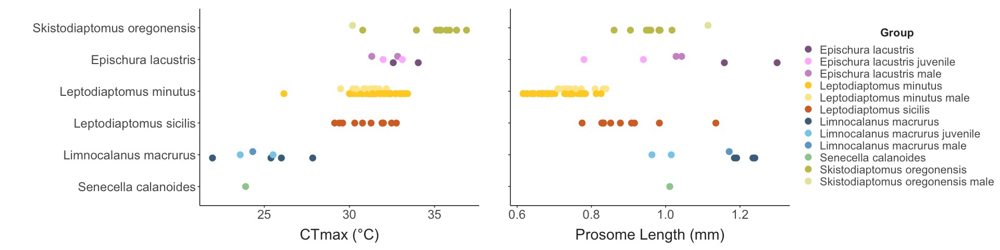
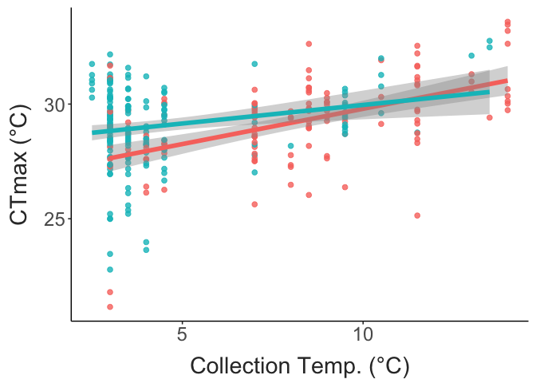

Seasonality in Lake Champlain Copepod Thermal Limits
================
2023-05-31

- <a href="#temperature-variation"
  id="toc-temperature-variation">Temperature Variation</a>
- <a href="#trait-variation" id="toc-trait-variation">Trait Variation</a>
  - <a href="#variation-with-temperature"
    id="toc-variation-with-temperature">Variation with temperature</a>
- <a href="#trait-correlations" id="toc-trait-correlations">Trait
  Correlations</a>

``` r
### To Do 

# Pull residuals from CTmax ~ temperature model, and examine the relationship with fecundity
```

## Temperature Variation

## Trait Variation

``` r

ctmax_plot = full_data %>% 
  mutate( #sp_name = str_replace(sp_name, pattern = " ",
  #                              replacement = "\n"),
         sp_name = fct_reorder(sp_name, ctmax, mean)) %>% 
  ggplot(aes(y = sp_name, x = ctmax)) + 
  geom_point(aes(colour= sp_name_sub),
             position = position_dodge(width = 0.3),
             size = 4) + 
  scale_colour_manual(values = species_cols) + 
  xlab(NULL) + 
  labs(y = "",
       x = "CTmax (°C)",
       colour = "Group") + 
  theme_matt() + 
  theme(legend.position = "none")

size_plot = full_data %>% 
  mutate(sp_name = fct_reorder(sp_name, ctmax, mean)) %>% 
  ggplot(aes(y = sp_name, x = size)) + 
  geom_point(aes(colour= sp_name_sub),
             position = position_dodge(width = 0.3),
             size = 4) + 
  scale_colour_manual(values = species_cols) + 
  labs(x = "Prosome Length (mm)",
       y = "", 
       colour = "Group") + 
  guides(color = guide_legend(ncol = 1)) +
  theme_matt(base_size = ) + 
  theme(legend.position = "right",
        axis.text.y = element_blank(),
        plot.margin = margin(0, 0, 0, 0,"cm"))

trait_plot = ctmax_plot + size_plot
trait_plot
```



``` r
full_data %>%  
  drop_na(fecundity) %>%  
  ggplot(aes(x = fecundity, fill = sp_name_sub)) + 
  facet_wrap(.~sp_name_sub, ncol = 1) + 
  geom_histogram(binwidth = 2) + 
  scale_fill_manual(values = species_cols) + 
  labs(x = "Fecundity (# Eggs)") +
  theme_matt_facets() + 
  theme(legend.position = "none")
```


### Variation with temperature

``` r
ctmax_temp = ggplot(full_data, aes(x = collection_temp, y = ctmax, colour = sp_name_sub)) + 
  geom_point(size = 3) + 
  labs(x = "Collection Temperature (°C)", 
       y = "CTmax (°C)",
       colour = "Group") + 
  scale_colour_manual(values = species_cols) + 
  theme_matt() + 
  theme(legend.position = "right")

size_temp = ggplot(full_data, aes(x = collection_temp, y = size, colour = sp_name_sub)) + 
  geom_point(size = 3) + 
  labs(x = "Collection Temperature (°C)", 
       y = "Length (mm)",
       colour = "Group")  + 
  scale_colour_manual(values = species_cols) + 
  theme_matt() + 
  theme(legend.position = "right")

wt_temp = ggplot(full_data, aes(x = collection_temp, y = warming_tol, colour = sp_name_sub)) + 
  geom_point(size = 3) + 
  labs(x = "Collection Temperature (°C)", 
       y = "Warming Tolerance (°C)",
       colour = "Group")  + 
  scale_colour_manual(values = species_cols) + 
  theme_matt() + 
  theme(legend.position = "right")

eggs_temp = ggplot(full_data, aes(x = collection_temp, y = fecundity, colour = sp_name_sub)) + 
  geom_point(size = 3) + 
  labs(x = "Collection Temperature (°C)", 
       y = "Fecundity (# Eggs)",
       colour = "Group")  + 
  scale_colour_manual(values = species_cols) + 
  theme_matt() + 
  theme(legend.position = "right")

ggarrange(ctmax_temp, size_temp, wt_temp, eggs_temp, 
          common.legend = T, legend = "right")
```



``` r
ggplot(full_data, aes(x = days_in_lab, y = ctmax, colour = sp_name_sub)) + 
  facet_wrap(sp_name_sub~.) + 
  geom_point(size = 4) + 
  geom_smooth(method = "lm", se = F, linewidth = 2) + 
  scale_x_continuous(breaks = c(0:3)) + 
  labs(x = "Days in lab", 
       y = "CTmax (°C)") + 
  scale_colour_manual(values = species_cols) + 
  theme_matt_facets() + 
  theme(legend.position = "none")
```


## Trait Correlations

``` r
ggplot(full_data, aes(x = size, y = ctmax, colour = sp_name_sub)) + 
  geom_smooth(method = "lm", se = F, linewidth = 2) + 
  geom_point(size = 4) + 
  labs(x = "Length (mm)", 
       y = "CTmax (°C)") + 
  scale_colour_manual(values = species_cols) + 
  theme_matt() + 
  theme(legend.position = "right")
```


``` r
ggplot(full_data, aes(x = size, y = fecundity, colour = sp_name_sub)) + 
  geom_smooth(method = "lm", se = F, linewidth = 2) + 
  geom_point(size = 4) + 
  labs(x = "Prosome length (mm)", 
       y = "Fecundity (# Eggs)") + 
  scale_colour_manual(values = species_cols) + 
  theme_matt() + 
  theme(legend.position = "right")
```


``` r
ggplot(full_data, aes(x = ctmax, y = fecundity, colour = sp_name_sub)) + 
  geom_smooth(method = "lm", se = F, linewidth = 2) + 
  geom_point(size = 4) + 
  labs(x = "CTmax (°C)", 
       y = "Fecundity (# Eggs)") + 
  scale_colour_manual(values = species_cols) + 
  theme_matt() + 
  theme(legend.position = "right")
```


