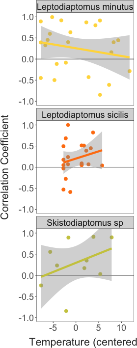
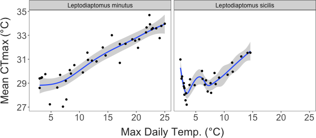

Seasonality in Lake Champlain Copepod Thermal Limits
================
2025-08-23

- [Copepod Collection](#copepod-collection)
- [Temperature Variability](#temperature-variability)
- [Trait Variation](#trait-variation)
  - [Variation with temperature](#variation-with-temperature)
  - [Sex and stage variation in thermal
    limits](#sex-and-stage-variation-in-thermal-limits)
  - [Trait Correlations and
    Trade-offs](#trait-correlations-and-trade-offs)
- [Other patterns in variation](#other-patterns-in-variation)
- [Distribution Lag Non-Linear Model (DLNM
  approach)](#distribution-lag-non-linear-model-dlnm-approach)
- [Miscellany](#miscellany)

## Copepod Collection

Copepods were collected at approximately weekly intervals from Lake
Champlain (Burlington Fishing Pier). Plankton was collected from the top
3 meters using a 250 um mesh net.

``` r
# # Lake Champlain near Burlington, VT
# siteNumber = "04294500"
# ChamplainInfo = readNWISsite(siteNumber)
# parameterCd = "00010"
# startDate = "2023-01-01"
# endDate = "2024-5-20"
# #statCd = c("00001", "00002","00003", "00011") # 1 - max, 2 - min, 3 = mean
# 
# # Constructs the URL for the data wanted then downloads the data
# url = constructNWISURL(siteNumbers = siteNumber, parameterCd = parameterCd,
#                        startDate = startDate, endDate = endDate, service = "uv")
# 
# raw_temps = importWaterML1(url, asDateTime = T) %>%
#   mutate("date" = as.Date(dateTime),
#          "hour" = hour(dateTime)) %>%
#   select(dateTime, tz_cd, date, hour, degC = X_00010_00000)
# 
# temp_data =  raw_temps %>%
#   select(date, hour, "temp" = degC)
# 
# write.csv(temp_data, file = "./Output/Data/champlain_temps.csv", row.names = F)
```

Collections began in late May 2023. Several gaps are present, but
collections have continued at roughly weekly intervals since then.
Copepods from 48 collections were used to make a total of 1312 thermal
limit measurements. Over this time period, collection temperatures
ranged from 2.5 to 26.5°C.

There is substantial variation in thermal limits across the species
collected. There is also some degree of variation within the species,
with thermal limits increasing slightly during the summer.

``` r
## Daily values for the period examined by dataset
collection_conditions = temp_data %>%
  ungroup() %>% 
  group_by(date) %>% 
  summarise(mean_temp = mean(temp),
            med_temp = median(temp),
            var_temp = var(temp), 
            min_temp = min(temp), 
            max_temp = max(temp)) %>% 
  mutate("range_temp" = max_temp - min_temp,
         date = as.Date(date)) %>% 
  ungroup() %>%  
  filter(date >= (min(as.Date(full_data$collection_date)) - 7)) %>% 
  left_join(unique(select(full_data, collection_date, collection_temp)), by = join_by(date == collection_date))

## Mean female thermal limits for each species, grouped by collection
species_summaries = full_data %>%  
  #filter(sex == "female") %>% 
  group_by(sp_name, collection_date, collection_temp) %>%  
  summarise("mean_ctmax" = mean(ctmax),
            "sample_size" = n(),
            "ctmax_st_err" = (sd(ctmax) / sqrt(sample_size)),
            "ctmax_var" = var(ctmax), 
            "mean_size" = mean(size),
            "size_st_err" = (sd(size) / sqrt(sample_size)),
            "size_var" = var(size)) %>%  
  ungroup() %>% 
  complete(sp_name, collection_date) %>% 
  arrange(desc(sample_size))

adult_summaries = full_data %>%  
  filter(sex == "female") %>% 
  group_by(sp_name, collection_date, collection_temp) %>%  
  summarise("mean_ctmax" = mean(ctmax),
            "sample_size" = n(),
            "ctmax_st_err" = (sd(ctmax) / sqrt(sample_size)),
            "ctmax_var" = var(ctmax), 
            "mean_size" = mean(size),
            "size_st_err" = (sd(size) / sqrt(sample_size)),
            "size_var" = var(size)) %>%  
  ungroup() %>% 
  complete(sp_name, collection_date) %>% 
  arrange(desc(sample_size))


tseries_data = full_data %>% 
  mutate(sp_name = fct_reorder(sp_name, ctmax, .desc = T))

ggplot() + 
  geom_line(data = collection_conditions, 
            aes(x = as.Date(date), y = mean_temp),
            colour = "black", 
            linewidth = 1) + 
  geom_point(data = filter(tseries_data, species != "osphranticum_labronectum"), 
             aes(x = as.Date(collection_date), y = ctmax, colour = sp_name),
             size = 1.5, shape = 16, alpha = 0.9,
             position = position_jitter(width = 0, height = 0)) + 
    geom_point(data = filter(tseries_data, species == "osphranticum_labronectum"), 
             aes(x = as.Date(collection_date), y = ctmax, colour = sp_name),
             size = 2, shape = 16, alpha = 0.9,
             position = position_jitter(width = 0, height = 0)) + 
  scale_colour_manual(values = species_cols) + 
  guides(colour = guide_legend(override.aes = list(alpha = 1, size = 5))) + 
  labs(x = "Date", 
       y = "Temperature (°C)", 
       colour = "Species",
       size = "Sample Size") + 
  theme_matt() + 
  theme(legend.position = "right", 
        axis.text.x = element_text(angle = 320, hjust = 0, vjust = 0.5))
```


``` r

lake_temps = ggplot() + 
  geom_line(data = collection_conditions, 
            aes(x = as.Date(date), y = mean_temp),
            colour = "black", 
            linewidth = 1) + 
  labs(x = "Date", 
       y = "Temperature (°C)", 
       colour = "Species",
       size = "Sample Size") + 
  theme_matt() + 
  theme(legend.position = "right")
```

Temperatures observed at the time of collection closely resembled the
maximum daily temperature from the temperature sensor data. Maximum
temperature was used as a proxy instead of mean temperature as
collections were usually made during afternoons or early evenings, just
following the warmest part of the day.

``` r
collection_conditions %>% 
  drop_na(collection_temp) %>%  
  ggplot(aes(x = max_temp, y = collection_temp)) + 
  geom_abline(intercept = 0, slope = 1,
              linewidth = 1, colour = "grey") + 
  geom_point(size = 3) +
  scale_x_continuous(breaks = c(5,15,25)) + 
  scale_y_continuous(breaks = c(5,15,25)) + 
  labs(x = "Max. Temp. from Sensor (°C)",
       y = "Collection Temp. (°C)") + 
  theme_matt()
```


Size also varied, but primarily between rather than within species.

``` r
ggplot() + 
  geom_vline(data = unique(select(full_data, collection_date)), 
             aes(xintercept = as.Date(collection_date)),
             colour = "grey90",
             linewidth = 1) + 
  geom_line(data = collection_conditions, 
            aes(x = as.Date(date), y = mean_temp),
            colour = "black", 
            linewidth = 2) + 
  # geom_errorbar(data = species_summaries,
  #               aes(x = as.Date(collection_date), 
  #                   ymin = mean_ctmax - ctmax_st_err, ymax = mean_ctmax + ctmax_st_err,
  #                   colour = sp_name),
  #               position = position_dodge(width = 1),
  #               width = 5, linewidth = 1) + 
  geom_point(data = adult_summaries, 
             aes(x = as.Date(collection_date), y = mean_size * 40, colour = sp_name, size = sample_size),
             position = position_dodge(width = 1)) + 
  scale_colour_manual(values = species_cols) + 
  scale_y_continuous(
    name = "Temperature", # Features of the first axis
    sec.axis = sec_axis(~./40, name="Prosome Length (mm)"), # Add a second axis and specify its features
    breaks = c(0,5,10,15,20,25,30)
  ) + 
  labs(x = "Date", 
       y = "Temperature (°C)", 
       colour = "Species") + 
  theme_matt() + 
  theme(legend.position = "right")
```


``` r
sample_dates_plot = full_data %>%  
  filter(sp_name != "Osphranticum labronectum") %>% 
  mutate(sp_name = as.factor(sp_name),
         sp_name = fct_reorder(sp_name, ctmax)) %>% 
  ggplot(aes(x = lubridate::as_date(collection_date), 
             y = sp_name, fill = sp_name)) + 
  # geom_vline(xintercept = as_date(
  #   c("2023-05-01",
  #     "2023-09-01",
  #     "2024-01-01",
  #     "2024-05-01")),
  #   colour = "grey",
  #   linewidth = 1) + 
  geom_density_ridges(bandwidth = 30,
                      jittered_points = TRUE, 
                      point_shape = 21,
                      point_size = 1,
                      point_colour = "grey30",
                      point_alpha = 0.8,
                      alpha = 0.8,
                      position = position_points_jitter(
                        height = 0.1, width = 0)) + 
  scale_fill_manual(values = species_cols) + 
  scale_x_date(date_breaks = "3 months",
               date_labels = "%b") + 
  coord_cartesian(xlim = lubridate::as_date(c("2023-06-08", "2024-05-08"))) + 
  labs(x = "Day of Year", 
       y = "Species") + 
  theme_matt() + 
  #theme_ridges(grid = T) + 
  theme(legend.position = "none",
        axis.text.x = element_text(angle = 270, hjust = 0, vjust = 0.5))
```

The samples captured the broad seasonal changes in calanoid copepod
community composition in the lake. We note, however, that rare species
(e.g. *Senecella* and *Limnocalanus*) were often preferentially sampled,
so are over-represented in the data set.

Throughout the season, the prevalence of various unidentified pathogens
also varied, with very little infection observed during the Winter and
Spring.

``` r
pathogen_cols = c("no" = "grey95", "cloudy" = "honeydew3", "spot" = "antiquewhite3", "other" = "tomato3")

full_data %>% 
  select(collection_date, dev_eggs, pathogen, lipids, sp_name, sex) %>% 
  group_by() %>% 
  filter(sex != "juvenile") %>% 
  group_by(collection_date) %>% 
  count(pathogen) %>% 
  filter(pathogen != "uncertain") %>% 
  pivot_wider(id_cols = "collection_date", 
              names_from = pathogen, 
              values_from = n,
              values_fill = 0) %>% 
  mutate(total = sum(no, cloudy, spot, other)) %>% 
  pivot_longer(cols = c(no, cloudy, spot, other),
               names_to = "pathogen", 
               values_to = "count") %>% 
  mutate(percent = count/total,
         collection_date = lubridate::as_date(collection_date),
         pathogen = fct_relevel(pathogen, "no", "cloudy", "spot", "other")) %>% 
  ggplot(aes(x = collection_date, y = percent, fill = pathogen)) + 
  geom_area() + 
  scale_fill_manual(values = pathogen_cols) + 
  scale_y_continuous(breaks = c(0,1)) + 
  labs(x = "Collection Date", 
       y = "Proportion", 
       fill = "Pathogen") + 
  theme_minimal(base_size = 20) + 
  theme(panel.grid = element_blank(),
        axis.ticks = element_line())
```


The transparent bodies of these copepods also allowed us to examine
seasonal patterns in lipid reserves and in the production of eggs.
Maturing oocytes are visible in female copepods before they are
released. There was no strong seasonal cycle in the production of these
eggs in any species, and instead, females were reproductively active
throughout their respective seasons of occurence.

``` r
dev_eggs_cols = c("no" = "grey95", "yes" = "lightblue3")

full_data %>% 
  select(collection_date, dev_eggs, pathogen, lipids, sp_name, sex) %>% 
  group_by(sp_name) %>% 
  filter(sex != "juvenile") %>% 
  group_by(sp_name, collection_date) %>% 
  count(dev_eggs) %>% 
  filter(dev_eggs != "uncertain") %>% 
  pivot_wider(id_cols = c("collection_date", "sp_name"), 
              names_from = dev_eggs, 
              values_from = n,
              values_fill = 0) %>% 
  mutate(total = sum(no, yes)) %>% 
  pivot_longer(cols = c(no, yes),
               names_to = "dev_eggs", 
               values_to = "count") %>% 
  mutate(percent = count/total,
         collection_date = lubridate::as_date(collection_date),
         dev_eggs = fct_relevel(dev_eggs, "no", "yes")) %>% 
  ungroup() %>% 
  complete(collection_date, nesting(sp_name, dev_eggs), fill = list(percent = 1)) %>% 
  mutate(percent = if_else(is.na(total) & dev_eggs == "yes", 0, percent)) %>% 
  ggplot(aes(x = collection_date, y = percent, fill = dev_eggs)) + 
  facet_wrap(sp_name~., ncol = 1) + 
  geom_area() + 
  scale_fill_manual(values = dev_eggs_cols) + 
  scale_y_continuous(breaks = c(0,1)) + 
  labs(x = "Collection Date", 
       y = "Proportion", 
       fill = "Developing \nEggs") + 
  theme_minimal(base_size = 20) + 
  theme(panel.grid = element_blank(),
        axis.ticks = element_line())
```


The presence of lipids varied across species, with only *L. minutus*,
*L. sicilis*, and *Limnocalanus* regularly possessing lipid stores.

``` r
lipid_cols = c("no" = "grey95", "yes" = "sienna2")

full_data %>% 
  select(collection_date, dev_eggs, pathogen, lipids, sp_name, sex) %>% 
  group_by(sp_name) %>% 
  filter(sex != "juvenile") %>% 
  group_by(sp_name, collection_date) %>% 
  count(lipids) %>% 
  filter(lipids != "uncertain") %>% 
  pivot_wider(id_cols = c("collection_date", "sp_name"), 
              names_from = lipids, 
              values_from = n,
              values_fill = 0) %>% 
  mutate(total = sum(no, yes)) %>% 
  pivot_longer(cols = c(no, yes),
               names_to = "lipids", 
               values_to = "count") %>% 
  mutate(percent = count/total,
         collection_date = lubridate::as_date(collection_date),
         lipids = fct_relevel(lipids, "no", "yes")) %>% 
  ungroup() %>% 
  complete(collection_date, nesting(sp_name, lipids), fill = list(percent = 1)) %>% 
  mutate(percent = if_else(is.na(total) & lipids == "yes", 0, percent)) %>% 
  ggplot(aes(x = collection_date, y = percent, fill = lipids)) + 
  facet_wrap(sp_name~., ncol = 1) + 
  geom_area() + 
  scale_fill_manual(values = lipid_cols) + 
  scale_y_continuous(breaks = c(0,1)) + 
  labs(x = "Collection Date", 
       y = "Proportion", 
       fill = "Lipids\nPresent") + 
  theme_minimal(base_size = 20) + 
  theme(panel.grid = element_blank(),
        axis.ticks = element_line())
```


## Temperature Variability

Lake Champlain is highly seasonal, with both average temperatures and
temperature variability changing throughout the year. These patterns in
the experienced thermal environment may drive the observed variation in
copepod thermal limits. However, the time period affecting copepod
thermal limits is unknown. Depending the on the duration of time
considered, there are large changes in the experienced environment, in
particular regarding the temperature range and variance. Consider for
example three time periods: the day of collection, one week prior to
collection, and four weeks prior to collection. While the overall
pattern is similar, we can see that, unsurprisingly, considering longer
periods of time results in larger ranges and slightly changes the
pattern of variance experienced.

``` r
## Defining the function to get predictor values for periods of different lengths
get_predictors = function(daily_values, raw_temp, n_days){
  prefix = str_replace_all(xfun::numbers_to_words(n_days), pattern = " ", replacement = "-")
  
  mean_values = daily_values %>% 
    ungroup() %>% 
    mutate(mean_max = slide_vec(.x = max_temp, .f = mean, .before = n_days, .complete = T),
           mean_min = slide_vec(.x = min_temp, .f = mean, .before = n_days, .complete = T),
           mean_range = slide_vec(.x = range_temp, .f = mean, .before = n_days, .complete = T)) %>% 
    select(date, mean_max, mean_min, mean_range) %>% 
    rename_with( ~ paste(prefix, "day", .x, sep = "_"), .cols = c(-date))
  
  period_values = raw_temp %>% 
    mutate(mean = slide_index_mean(temp, i = date, before = days(n_days), 
                                   na_rm = T),
           max = slide_index_max(temp, i = date, before = days(n_days), 
                                 na_rm = T),
           min = slide_index_min(temp, i = date, before = days(n_days),
                                 na_rm = T),
           med = slide_index_dbl(temp, .i = date, .before = days(n_days), 
                                 na_rm = T, .f = median),
           var = slide_index_dbl(temp, .i = date, .before = days(n_days), 
                                 .f = var),
           range = max - min) %>%  
    select(-temp) %>%  
    distinct() %>% 
    rename_with( ~ paste(prefix, "day", .x, sep = "_"), .cols = c(-date))%>% 
    inner_join(mean_values, by = c("date")) %>%  
    drop_na()
  
  return(period_values)
}
```

Organisms are unlikely to acclimate instantaneously to changes in
temperature. To explore the potential temporal window these copepods are
responding to, we examined the correlation between thermal limits and
summaries of the thermal environment over different periods of time. For
each species (inclusive of all sexes and stages), we examined the
correlation between CTmax and one of nine representations of the thermal
environment calculated for periods of time from 1 to 60 days before
collection. These parameters include the overall maximum, minimum,
median, and mean temperature for the period of time, the temperature
range and variance during this time, and the mean daily temperature
maximum, minimum, and range. We also examined the correlation between
CTmax and the temperature recorded at the time of collection.

Shown below are the correlation coefficients for these relationships.
Each facet shows the relationship for a different parameter, plotted
against the duration of the time period before collection.

``` r
corr_vals %>% 
  mutate(parameter = fct_relevel(parameter, c("min", "max", "range",
                                              "mean", "med", "var",
                                              "mean_min", "mean_max", "mean_range"))) %>% 
  ggplot(aes(x = duration, y = correlation, colour = sp_name)) + 
  facet_wrap(.~parameter) + 
  geom_hline(yintercept = 0) + 
  geom_point(size = 0.9) + 
  geom_line(linewidth = 1.5) + 
  scale_colour_manual(values = species_cols) + 
  labs(x = "Duration (days)",
       y = "Correlation", 
       colour = "Species") + 
  theme_matt_facets()
```


This table contains the top three factors for each species (based on
correlation coefficient).

Shown here is a graphical summary of the duration of the best predictors
for each species. Note that for the two Leptodiaptomids, collection
temperature had the largest correlation coefficient so duration is zero.
This representation highlights that there is variation across the
community not only in the potential driver (e.g. minimum vs. maximum
temperatures) but also in the duration of time. This variation is not
grouped by season (the winter and summer communities both have
representative species apparently responding to short and long
durations).

``` r
duration_plot = corr_vals %>%  
  filter(sig == "Sig.") %>% 
  drop_na(correlation) %>% 
  group_by(sp_name) %>%
  arrange(desc(correlation)) %>% 
  slice_head(n = 1) %>% 
  ungroup() %>% 
  mutate("num" = row_number(), 
         sp_name = fct_reorder(sp_name, duration, .fun = mean, .desc = T)) %>% 
  arrange(sp_name) %>% 
  select("Species" = sp_name, "Predictor" = parameter, "Duration" = duration, "Correlation" = correlation, num) %>% 
  ggplot(aes(x = Species, y = Duration, fill = Predictor, group = num)) + 
  geom_bar(stat = "identity", width = 0.5, position = position_dodge(width = 0.6),
           colour = "black") + 
  scale_fill_manual(values = c("coll_temp" = "black", "max" = "white", "min" = "grey")) + 
  labs(x = "", 
       y = "Duration \n(days)") + 
  theme_matt() + 
  theme(axis.text.x = element_blank())
```

``` r
correlation_coef_plot = corr_vals %>%  
  filter(sig == "Sig." | parameter == "coll_temp") %>% 
  drop_na(correlation) %>% 
  group_by(sp_name) %>%
  filter(parameter == "coll_temp" | correlation == max(correlation)) %>% 
  arrange(sp_name, parameter) %>% 
  mutate("num" = row_number()) %>% 
  select("Species" = sp_name, "Predictor" = parameter, "Duration" = duration, "Correlation" = correlation, num) %>% 
  mutate(Predictor = if_else(Predictor == "coll_temp", Predictor, "best")) %>% 
  ungroup() %>% 
  mutate(Species = fct_reorder(Species, Duration, .fun = max, .desc = T)) %>% 
  ggplot(aes(x = Species, y = Correlation, fill = Predictor, group = num)) + 
  geom_bar(stat = "identity", width = 0.5, position = position_dodge(width = 0.6),
           colour = "black") + 
  labs(y = "Correlation \nCoefficient",
       fill = "Correlate") +
  scale_fill_manual(values = c("coll_temp" = "black", "best" = "white")) + 
  scale_y_continuous(breaks = c(0, 1), limits = c(0,1)) +
  theme_matt() + 
  theme(axis.text.x = element_text(angle = 300, hjust = 0, vjust = 0.5))

ggarrange(duration_plot, correlation_coef_plot, nrow = 2, legend = "right", labels = "AUTO",
          heights = c(0.4, 0.6))
```


## Trait Variation

Shown below are the clutch size distributions for the three diaptomiid
species, which produce egg sacs that allow for easy quantification of
fecundity.

``` r
full_data %>%  
  drop_na(fecundity) %>%  
  ggplot(aes(x = fecundity, fill = sp_name_sub)) + 
  facet_wrap(.~sp_name_sub, ncol = 1) + 
  geom_histogram(binwidth = 2) + 
  scale_fill_manual(values = species_cols) + 
  labs(x = "Fecundity (# Eggs)") +
  theme_matt_facets() + 
  theme(legend.position = "none")
```


One of the main aims of this project is to examine the patterns and
processes driving variation in upper thermal limits across these species
of copepods.

### Variation with temperature

We expect one of the primary drivers of copepod thermal limits to be
temperature, as individuals acclimate to seasonal changes. Shown below
are the seasonal patterns of when copepods were included in CTmax
measurements (a proxy for the season of occurrence), and thermal limits
for each species plotted against the temperature at the time of
collection. We generally see an increase in thermal limits with
increasing collection temperature.

``` r
sp_ctmax_temp = full_data %>% 
  filter(sp_name != "Osphranticum labronectum") %>% 
  mutate(sp_name = as.factor(sp_name),
         sp_name = fct_reorder(sp_name, ctmax, .desc = T)) %>% 
  ggplot(aes(x = collection_temp, y = ctmax, colour = sp_name)) + 
  facet_wrap(sp_name~.) + 
  geom_smooth(method = "lm", se = F, linewidth = 1.5, colour = "grey30") + 
  geom_point(size = 2, alpha = 0.4) + 
  labs(x = "Collection Temp. (°C)", 
       y = "CTmax (°C)") + 
  scale_colour_manual(values = species_cols) + 
  theme_matt() + 
  theme(legend.position = "none")
```

The interaction between seasonal changes in temperature and the
acclimation of thermal limits likely affects vulnerability of each
species to warming. Shown below are warming tolerance values for each
species, calculated as the difference between individual CTmax and the
temperature at the time of collection. All species maintained some
degree of buffer between environmental temperatures and upper thermal
limits, but *L. minutus* appears to approach its upper thermal limit
during the warmest collections during the summer.

Also shown below is the relationship between fecundity (the number of
eggs contained in a clutch) for the three diaptomid species. For the two
Leptodiaptomus species, there is no relationship between clutch size and
temperature, while there appears to be a general increase in clutch size
with temperature in the Skistodiaptomus species.

``` r

wt_temp = full_data %>% 
  filter(sp_name != "Osphranticum labronectum") %>% 
  ggplot(aes(x = collection_temp, y = warming_tol, colour = sp_name)) + 
  geom_point(size = 3,
             alpha = 0.3) + 
  geom_smooth(method = "lm", linewidth = 3) +
  labs(x = "Collection Temperature (°C)", 
       y = "Warming Tolerance (°C)",
       colour = "Species")  + 
  ylim(0,30) + 
  scale_colour_manual(values = species_cols) + 
  theme_matt() + 
  theme(legend.position = "none")

eggs_temp = full_data %>% 
  filter(sp_name != "Osphranticum labronectum") %>% 
  ggplot(aes(x = collection_temp, y = fecundity, colour = sp_name)) + 
  geom_point(size = 3,
             alpha = 0.3) + 
  geom_smooth(method = "lm", linewidth = 3) +
  labs(x = "Collection Temperature (°C)", 
       y = "Fecundity (# Eggs)",
       colour = "Species")  + 
  scale_colour_manual(values = species_cols) + 
  theme_matt() + 
  theme(legend.position = "right")

ggarrange(wt_temp, eggs_temp, 
          common.legend = T, legend = "right", labels = "AUTO")
```


``` r
# Copepods spent several days in lab during experiments. Shown below are the CTmax residuals (taken from a model of CTmax against collection temperature) plotted against the time spent in lab before measurements were made. Individual regressions are shown for the residuals against days in lab for each collection. We can see clearly that thermal limits are fairly stable over time. 


# ggplot(ctmax_resids, aes(x = days_in_lab, y = resids, colour = sp_name, group = collection_date)) + 
#   facet_wrap(sp_name~.) + 
#   geom_point(size = 4, alpha = 0.5) + 
#   geom_smooth(method = "lm", se = F, linewidth = 1) + 
#   #scale_x_continuous(breaks = c(0:5)) + 
#   labs(x = "Days in lab", 
#        y = "CTmax Residuals") + 
#   scale_colour_manual(values = species_cols) + 
#   theme_matt_facets() + 
#   theme(legend.position = "none")
```

``` r

model_data = full_data %>%  
  drop_na(size, ctmax) %>%  
  filter(sp_name != "Osphranticum labronectum") %>% 
  mutate(temp_cent = scale(collection_temp, center = T, scale = F),
         size_cent = scale(size, center = T, scale = F))

minimal.model = lme4::lmer(data = model_data,
                           ctmax ~ sp_name + sex + temp_cent +
                             (1|days_in_lab))

full.model = lme4::lmer(data = model_data,
                        ctmax ~ sp_name*sex*temp_cent +
                          (1|days_in_lab))

drop1(full.model, test = "Chisq")
## Single term deletions
## 
## Model:
## ctmax ~ sp_name * sex * temp_cent + (1 | days_in_lab)
##                       npar    AIC    LRT Pr(Chi)  
## <none>                     5280.1                 
## sp_name:sex:temp_cent   10 5281.0 20.887  0.0219 *
## ---
## Signif. codes:  0 '***' 0.001 '**' 0.01 '*' 0.05 '.' 0.1 ' ' 1

performance::test_performance(minimal.model, full.model)
## Name          |   Model |    BF | df | df_diff |   Chi2 |      p
## ----------------------------------------------------------------
## minimal.model | lmerMod |       | 11 |         |        |       
## full.model    | lmerMod | 0.001 | 38 |   27.00 | 180.70 | < .001
## Models were detected as nested (in terms of fixed parameters) and are compared in sequential order.
performance::check_model(full.model)
```


``` r

car::Anova(full.model, type = "III")
## Analysis of Deviance Table (Type III Wald chisquare tests)
## 
## Response: ctmax
##                          Chisq Df Pr(>Chisq)    
## (Intercept)           4619.014  1  < 2.2e-16 ***
## sp_name                344.724  5  < 2.2e-16 ***
## sex                     51.233  2  7.495e-12 ***
## temp_cent               53.731  1  2.299e-13 ***
## sp_name:sex             10.611 10    0.38866    
## sp_name:temp_cent       39.512  5  1.873e-07 ***
## sex:temp_cent           31.961  2  1.147e-07 ***
## sp_name:sex:temp_cent   20.616 10    0.02393 *  
## ---
## Signif. codes:  0 '***' 0.001 '**' 0.01 '*' 0.05 '.' 0.1 ' ' 1

sp_ctmax = emmeans::emmeans(full.model, specs = "sp_name") %>% 
  data.frame() %>% 
  select(sp_name, "species_ctmax" = emmean)

model_coefs = emmeans::emtrends(full.model, var = "temp_cent", specs = "sp_name") %>% 
  data.frame() %>% 
  inner_join(sp_ctmax) 

ctmax_resids = model_data %>% 
  mutate(resids = residuals(full.model))

#write.csv(model_coefs, "Output/Data/ARR_data.csv")
```

``` r
arr_combined = synth_arr %>%
  filter(measure == "upper" & mean_lim > 20) %>% 
  select("group" = genus, arr, mean_lim) %>% 
  mutate("dataset" = "synthesis") %>% 
  bind_rows(
    select(model_coefs, "group" = sp_name, 'arr' = temp_cent.trend, 'mean_lim' = species_ctmax)
  ) %>% 
  mutate(dataset = if_else(is.na(dataset), "new data", "synthesis"),
         group = fct_reorder(group, arr, .desc = T))


ggplot(arr_combined, aes(x = mean_lim, y = arr)) + 
  geom_smooth(method = "lm", se = F, 
              linewidth = 2, colour = "grey30") + 
  geom_point(data = filter(arr_combined, dataset != "new data"), 
             size = 3, colour = "black", shape = 1, stroke = 1.4) + 
  geom_point(data = filter(arr_combined, dataset == "new data"),
             aes(colour = group), 
             size = 4.5) + 
  scale_colour_manual(values = species_cols) + 
  labs(x = "Thermal Limit", 
       y = "ARR", 
       colour = "Species") +
  theme_matt() + 
  theme(legend.position = "right")
```


### Sex and stage variation in thermal limits

Previous sections have generally lumped juvenile, female, and male
individuals together. There may be important stage- or sex-specific
differences in CTmax though. For all species but Osphranticum, we have
measurements for individuals in different stages and of different sexes.

``` r
sex_sample_sizes = full_data %>%  
  group_by(sp_name, sex) %>%  
  summarise(num = n()) %>%  
  pivot_wider(id_cols = sp_name,
              names_from = sex, 
              values_from = num,
              values_fill = 0) %>% 
  select("Species" = sp_name, "Juvenile" = juvenile, "Female" = female, "Male" = male)

knitr::kable(sex_sample_sizes, align = "c")
```

|         Species          | Juvenile | Female | Male |
|:------------------------:|:--------:|:------:|:----:|
|   Epischura lacustris    |    37    |   45   |  20  |
|  Leptodiaptomus minutus  |    12    |  273   |  39  |
|  Leptodiaptomus sicilis  |    31    |  356   |  95  |
|  Limnocalanus macrurus   |    4     |   43   |  39  |
| Osphranticum labronectum |    0     |   1    |  0   |
|   Senecella calanoides   |    13    |   21   |  8   |
|    Skistodiaptomus sp    |    15    |  232   |  28  |

Across group comparisons show that there are generally no differences in
thermal limits (represented here as the residuals from a CTmax ~
collection_temp x species linear regression), with the exception of
Senecella males, which may have lower thermal limits (although sample
sizes are very small in this group).

``` r
# ctmax_resids %>% 
#   filter(sp_name != "Osphranticum labronectum") %>% 
#   ggplot(aes(x = sex, y = resids, colour = sp_name)) + 
#   facet_wrap(sp_name~.) + 
#   geom_jitter(width = 0.1, alpha = 0.5) + 
#   geom_boxplot(width = 0.4, fill = NA, colour = "black", 
#                linewidth = 1, outlier.colour = NA) + 
#   scale_colour_manual(values = species_cols) + 
#   theme_matt_facets()
```

``` r
model2_data = model_data %>% 
  filter(sex == "female", 
         pathogen != "uncertain", 
         dev_eggs != "uncertain", 
         lipids != "uncertain") %>% 
  mutate(pathogens = fct_relevel(pathogen, "no", "spot", "cloudy", "other"))

other_factor_model = lmer(data = model2_data, 
                          ctmax~sp_name * collection_temp + dev_eggs + pathogen + lipids + (1|days_in_lab))

drop1(other_factor_model, scope = ~., test = "Chisq")
## Single term deletions
## 
## Model:
## ctmax ~ sp_name * collection_temp + dev_eggs + pathogen + lipids + 
##     (1 | days_in_lab)
##                         npar    AIC     LRT   Pr(Chi)    
## <none>                       3601.6                      
## sp_name                    5 3804.2 212.619 < 2.2e-16 ***
## collection_temp            0 3601.6   0.000              
## dev_eggs                   1 3602.0   2.391    0.1220    
## pathogen                   3 3629.4  33.832 2.149e-07 ***
## lipids                     1 3600.0   0.416    0.5189    
## sp_name:collection_temp    5 3635.7  44.139 2.171e-08 ***
## ---
## Signif. codes:  0 '***' 0.001 '**' 0.01 '*' 0.05 '.' 0.1 ' ' 1

reduced_factors_model = lmer(data = model2_data, 
                          ctmax~sp_name * collection_temp + pathogen + (1|days_in_lab))

performance::check_model(reduced_factors_model)
```


``` r

car::Anova(reduced_factors_model, type = "III")
## Analysis of Deviance Table (Type III Wald chisquare tests)
## 
## Response: ctmax
##                           Chisq Df Pr(>Chisq)    
## (Intercept)             570.328  1  < 2.2e-16 ***
## sp_name                 234.027  5  < 2.2e-16 ***
## collection_temp          72.589  1  < 2.2e-16 ***
## pathogen                 35.282  3  1.062e-07 ***
## sp_name:collection_temp  43.558  5  2.847e-08 ***
## ---
## Signif. codes:  0 '***' 0.001 '**' 0.01 '*' 0.05 '.' 0.1 ' ' 1
```

``` r
emmeans::emmeans(reduced_factors_model, spec = "pathogen") %>% emmeans::contrast(method="trt.vs.ctrl",ref="no") %>% plot() + 
  geom_vline(xintercept = 0) + 
  labs(x = "Difference (°C)", 
       y = "Comparison") + 
    theme_matt()
```


### Trait Correlations and Trade-offs

A relationship between size and upper thermal limits has been suggested
in a wide range of other taxa. Shown below are the measured upper
thermal limits plotted against prosome length. The overall relationship
(inclusive of all species) is shown as the black line in the background.
Regressions for each individual species are also shown. Across the
entire assemblage, there is a strong decrease in thermal limits with
increasing size.

``` r
full_data %>% 
  #filter(sex == "female") %>%  
  ggplot( aes(x = size, y = ctmax, colour = sp_name)) + 
  geom_point(size = 2, alpha = 0.3) + 
  geom_smooth(data = full_data, 
              aes(x = size, y = ctmax),
              method = "lm", 
              colour ="black", 
              linewidth = 2.5) + 
  labs(x = "Length (mm)", 
       y = "CTmax (°C)",
       colour = "Species") + 
  scale_colour_manual(values = species_cols) + 
  theme_matt() + 
  theme(legend.position = "right")
```


Shown here is the relationship for each species individually.

``` r
full_data %>% 
  #filter(sex == "female") %>%  
  group_by(sp_name) %>% filter(n() >2) %>% filter(!str_detect(sp_name, pattern = "kindti")) %>% 
  ggplot( aes(x = size, y = ctmax, colour = sp_name)) + 
  facet_wrap(sp_name~., scales = "free", nrow = 2) + 
  geom_point(size = 2, alpha = 0.8) + 
  geom_smooth(method = "lm", se = F, linewidth = 2) + 
  labs(x = "Length (mm)", 
       y = "CTmax (°C)",
       colour = "Species") + 
  scale_colour_manual(values = species_cols) + 
  theme_matt() + 
  theme(legend.position = "none")
```


Shown below is the relationship between mean size and mean thermal
limits for females of each species. We see that larger species within
the community tend to have a lower thermal limit than smaller species.

``` r
full_data %>% 
  group_by(sp_name, sex) %>% 
  summarize(mean_ctmax = mean(ctmax, na.rm = T),
            mean_size = mean(size, na.rm = T)) %>% 
  #filter(sex == "female") %>% 
  ggplot(aes(x = mean_size, y = mean_ctmax)) + 
  geom_smooth(method = "lm", se = F, linewidth = 2, colour = "black") + 
  geom_point(aes(colour = sp_name, shape = sex),
             size = 5) + 
  labs(x = "Length (mm)", 
       y = "CTmax (°C)",
       colour = "Species") + 
  scale_colour_manual(values = species_cols) + 
  theme_matt() + 
  theme(legend.position = "right")
```


Shown here is the relationship between fecundity and size, showing the
classic pattern of increasing egg production with increasing size.

``` r
size_fecund_plot = ctmax_resids %>%  
  drop_na(fecundity) %>% 
  ggplot(aes(x = size, y = fecundity, colour = sp_name)) + 
  geom_smooth(method = "lm", se = F, linewidth = 2) + 
  geom_point(size = 2, alpha = 0.5) + 
  labs(x = "Prosome length (mm)", 
       y = "Fecundity (# Eggs)",
       colour = "Species") + 
  scale_colour_manual(values = species_cols) + 
  theme_matt() + 
  theme(legend.position = "right")
```

Individuals may also allocate energy to different fitness related
traits, prioritizing reproductive output over environmental tolerance,
for example. Shown below is the relationship between CTmax residuals
(again, controlling for the effects of collection temperature) against
fecundity. We can see clearly that individuals with increased fecundity
are not decreasing thermal limits, suggesting that there is no energetic
trade-off between these traits.

``` r
ctmax_fecund_plot = ctmax_resids %>%  
  drop_na(fecundity) %>% 
  ggplot(aes(x = resids, y = fecundity, colour = sp_name)) + 
  geom_smooth(method = "lm", se = F, linewidth = 2) + 
  geom_point(size = 2, alpha = 0.5) + 
  labs(x = "CTmax Residuals (°C)", 
       y = "Fecundity (# Eggs)",
       colour = "Species") + 
  scale_colour_manual(values = species_cols) + 
  theme_matt() + 
  theme(legend.position = "right")

ggarrange(size_fecund_plot, ctmax_fecund_plot, ncol = 1, common.legend = T, labels = "AUTO", legend = "right")
```


Previous studies have shown that the magnitude of the size-fecundity
correlation may be environmentally-dependent. This is not visible is the
data from these collections.

``` r
corr_data = full_data %>% 
  drop_na(fecundity) %>% 
  filter(sp_name %in% c("Leptodiaptomus sicilis",
                        "Leptodiaptomus minutus", 
                        "Skistodiaptomus sp")) %>%  
  group_by(collection_date, collection_temp, sp_name) %>% 
  summarise(size_fec_corr = cor(size, fecundity),
            n = n(),
            mean_fecundity = mean(fecundity)) %>% 
  filter(n >= 3) %>% 
  ungroup() %>%  
  group_by(sp_name) %>% 
  mutate(temp_cent = scale(collection_temp, scale = F))

ggplot(corr_data, aes(x = temp_cent, y = size_fec_corr, colour = sp_name)) + 
  facet_wrap(sp_name~., nrow = 3) + 
  geom_hline(yintercept = 0) +
  geom_point(size = 3) + 
  geom_smooth(method = "lm", linewidth = 2) + 
  scale_color_manual(values = species_cols) + 
  labs(x = "Temperature (centered)", 
       y = "Correlation Coefficient") + 
  coord_cartesian(ylim = c(-1, 1)) +
  theme_matt_facets() + 
  theme(legend.position = "none")
```



``` r

# ggplot(corr_data, aes(x = size_fec_corr)) +
#     facet_wrap(sp_name~., nrow = 3) +
#   geom_histogram(binwidth = 0.2)
```

## Other patterns in variation

*Leptodiaptomus sicilis* is the most abundant species during the winter.
There was a large shift in the size of mature females towards the end of
December. These large and small individuals are the same species
(confirmed via COI sequencing), suggesting this shift may instead
reflect a transition from one generation to another. This size
difference may be caused by differences in the developmental
environments. For example, individuals developing in January grow up at
very low temperatures, and therefore may reach larger sizes. These
individuals over-summer in deep waters, then re-emerge in October and
produce a new generation. Water temperatures are still fairly high
through November, which results in a generation of smaller individuals.
These individuals mature in time to produce a new generation in January.

``` r
full_data %>%  
  filter(sp_name == "Leptodiaptomus sicilis") %>% 
  filter(sex != "juvenile") %>% 
  group_by(collection_date) %>% 
  mutate(size_center = scale(size, center = T, scale = F)) %>% 
  ggplot(aes(y = factor(collection_date), x = size, fill = collection_temp)) + 
  facet_wrap(sex~.) + 
  geom_density_ridges(bandwidth = 0.04) + 
  geom_vline(xintercept = 0.89) + 
  labs(x = "Size (mm)",
       y = "Date", 
       fill = "Coll. Temp. (°C)") + 
  theme_matt() + 
  theme(legend.position = "right",
        axis.text.y = element_text(size = 12))
```


A similar, but less distinct pattern can be observed in L. minutus
individuals as well.

``` r
full_data %>%  
  filter(sp_name == "Leptodiaptomus minutus") %>% 
  filter(sex != "juvenile") %>% 
  ggplot(aes(y = factor(collection_date), x = size, fill = collection_temp)) + 
  facet_wrap(sex~.) + 
  geom_density_ridges(bandwidth = 0.04) + 
  geom_vline(xintercept = 0.69) + 
  labs(x = "Size (mm)",
       y = "Date", 
       fill = "Coll. Temp. (°C)") + 
  coord_cartesian(xlim = c(0.5,0.9)) + 
  theme_matt() + 
  theme(legend.position = "right",
        axis.text.y = element_text(size = 12))
```


## Distribution Lag Non-Linear Model (DLNM approach)

Distributed lag models examine a response variable, measured at multiple
time points, as a function of the lagged occurrence of some predictor
variable (response y at time t as a function of predictor x(t-lag). This
method utilizes a bi-dimensional dose-lag-response function, which
essentially examines not only the dose effect, but the effect of the
timing of the dose.

``` r
# Run this code, save the product, and then just read in the temp lag data object. Takes too long to run each time this document is knit. 

# lag_temps = temp_data %>%
#   group_by(date, hour) %>%
#   summarize("mean_temp" = mean(temp, na.rm = T)) %>%
#   ungroup() %>%
#   mutate(point_num = row_number())
# 
# uniq_days = length(unique(lag_temps$date))
# 
# g = gam(mean_temp ~ s(point_num, bs="cr", k=uniq_days + 10),
#     method = "REML",
#     data = lag_temps)
# 
# points = seq(1, nrow(lag_temps), length.out = length(lag_temps$hour))
# 
# df.res = df.residual(g)
# 
# pred_temps = predict(g, newdata = lag_temps, type = "response", se.fit = TRUE)
# 
# lag_temps = lag_temps %>%
#   mutate(trend_T = pred_temps$fit,
#          trend_se = pred_temps$se.fit,
#          temp_diff = mean_temp - trend_T)
# 
# write.csv(lag_temps, file = "./Output/Data/lag_temps.csv", row.names = F)
```

``` r

dlnm_data = full_data %>%  
  filter(sex == "female") %>% 
  filter(sp_name %in% c(
    "Leptodiaptomus sicilis",
    "Leptodiaptomus minutus"
  )) %>% 
  select(collection_date, collection_temp, sp_name, ctmax) %>% 
  group_by(collection_date, collection_temp, sp_name) %>%  
  summarise(mean_ctmax = mean(ctmax, na.rm = T),
            sample = n())

temp_data %>% 
  group_by(date) %>% 
  summarise(mean_temp = mean(temp),
            max_temp = max(temp, na.rm = T)) %>% 
  right_join(dlnm_data, by = join_by("date" == "collection_date")) %>% 
  ggplot(aes(x = max_temp, y = mean_ctmax)) + 
  facet_wrap(.~sp_name) + 
  geom_smooth(method = "gam") + 
  geom_point() + 
  labs(x = "Max Daily Temp. (°C)",
       y = "Mean CTmax (°C)") + 
  theme_matt_facets() + 
  theme(strip.text.x = element_text(size = 12))
```



``` r

sp_list = unique(dlnm_data$sp_name)

for(lag_species in sp_list){
  
  dlnm_data_sp = dlnm_data %>% 
    filter(sp_name == lag_species)
  
  # We need to estimate a matrix of exposure histories for each observation. This contains the series of exposures at each lag (l) for each of the n observations, constrained between l0 (minimum lag) and L (max lag). 
  
  dates = dlnm_data_sp$collection_date # For each of these dates, make a vector of the past 30 days (including the day of collection). NOTE: Don't use 'unique' dates here since some collections had multiple species
  
  exp_hist_z = data.frame()
  exp_hist_trend = data.frame()
  
  for(d in dates){
    
    history = lag_temps %>% 
      filter(date <= d & date > d - 10) %>% 
      arrange(desc(date), desc(hour)) %>% 
      mutate(lag = row_number() - 1) %>% 
      select(lag, mean_temp, temp_diff)
    
    z_vec = scale(history$mean_temp)[,1]
    names(z_vec) = history$lag
    
    trend_vec = history$temp_diff
    names(trend_vec) = history$lag
    
    exp_hist_z = bind_rows(exp_hist_z, z_vec)
    exp_hist_trend = bind_rows(exp_hist_trend, trend_vec)
    
  }
  
  #print(max(exp_hist_trend, na.rm = T))
  
  # The cross-basis function from dlnm will use the class of the x parameter to determine what to do. In our case, we need to provide it with the matrix of exposure histories for reach observation (row) and lag (column). 
  
  cb_temps = crossbasis(exp_hist_trend, lag = c(0,dim(exp_hist_trend)[2]-1), 
                        argvar =list(fun="cr",df=3), 
                        arglag=list(fun="cr",df=3,intercept=T))
  
  #summary(cb_temps)
  
  penalized_mat <- cbPen(cb_temps)
  
  #fitting GAM
  lag.gam = gam(data = dlnm_data_sp, 
                mean_ctmax ~ collection_temp + cb_temps, 
                method = "GCV.Cp",
                paraPen=list(cb_temps=penalized_mat))
  
  # summary(lag.gam)
  # AIC(lag.gam)
  
  #estimation of exposures effects
  
  #default plots
  pred_gam_Zs<-crosspred(cb_temps, lag.gam, 
                         cumul=F, cen=0, ci.level = 0.95,
                         at=seq(-4,4, 0.1))
  
  plot(pred_gam_Zs, "contour", main = lag_species, 
              xlab = "Temperature Deviation (°C)", 
              ylab = "Hours before collection")
  
  
  # 
  # plot(pred_gam_Zs, border = 2, cumul=F,
  #       theta=110,phi=20,ltheta=-80)
  
  # plot(pred_gam_Zs, "slices",
  #      var = c(3,-3),
  #      lag = c(1,200),
  #      col = 2)
  # 
}
```


## Miscellany

``` r
run_starts = temp_record %>% 
  group_by(run) %>% 
  filter(minute_passed <= 3) %>% 
  summarise(start_temp = mean(temp_C)) %>% 
  mutate("temp_bin" = cut_number(start_temp, 4),
         temp_bin = case_when(
           temp_bin == "[2.7,9.26]" ~ "[2.7°C - 9.26°C]",
           temp_bin == "(9.26,13.9]" ~ "[9.26°C - 13.9°C]",
           temp_bin == "(13.9,21]" ~ "[13.9°C - 21°C]",
           temp_bin == "(21,30.5]" ~ "[21°C - 30.5°C]"
         ))

ramp_record2 = ramp_record %>% 
  group_by(run, minute_interval) %>% 
  summarise(mean_ramp = mean(ramp_per_minute)) %>% 
  ungroup() %>% 
  left_join(run_starts) %>% 
  mutate(temp_bin = fct_reorder(temp_bin, start_temp, .fun = mean))

ggplot(ramp_record2, aes(x = minute_interval, y = mean_ramp)) + 
  facet_wrap(temp_bin~.) + 
  geom_hline(yintercept = 0.3, colour = "grey") + 
  geom_hline(yintercept = 0.1, colour = "grey") + 
  geom_hex(aes(fill = cut(..count.., c(2, 5, 10, 20, 30, 40, 50))),
           bins = 30) + 
  scale_fill_viridis_d(name="Number of Observations",
                       labels = c("<5", "5-9", "10-19", "20-29", "30-39", "40-50"),
                       option = "mako") + 
  labs(y = "Ramp Rate (deg. C / min.)",
       x = "Time into run (minute)") + 
  theme_matt_facets(base_size = 12)
```


``` r

if(predict_vuln == F){

  knitr::knit_exit()

}
```
